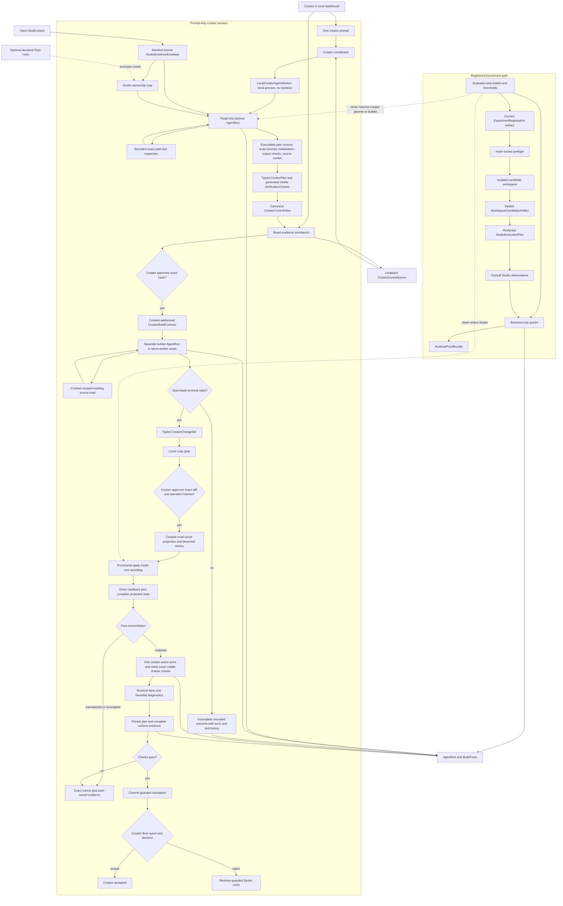
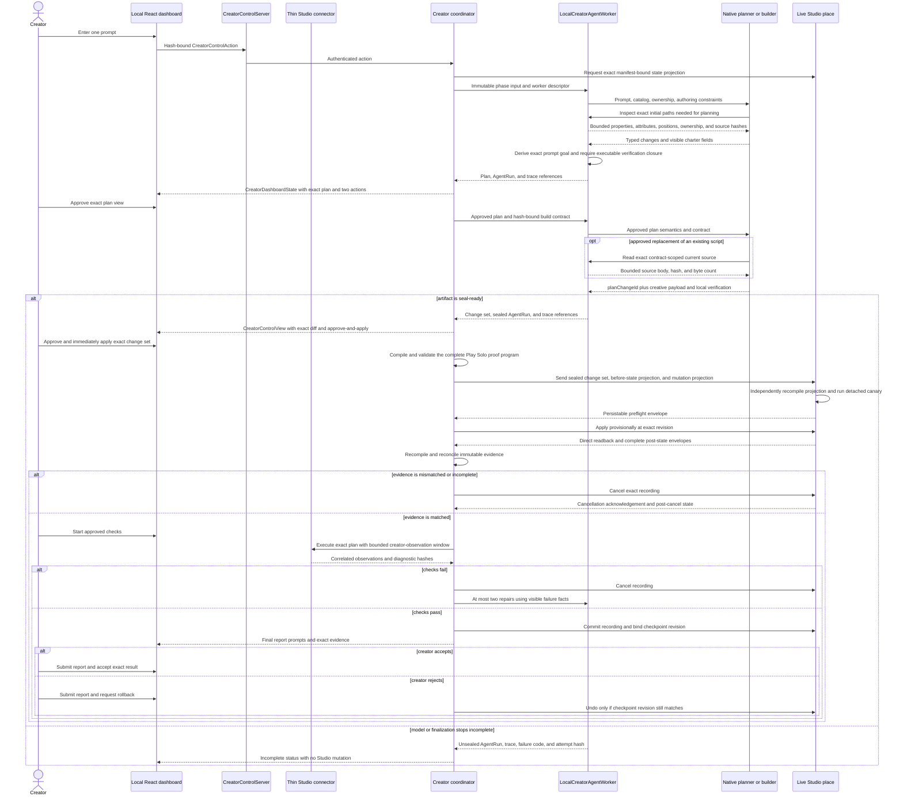
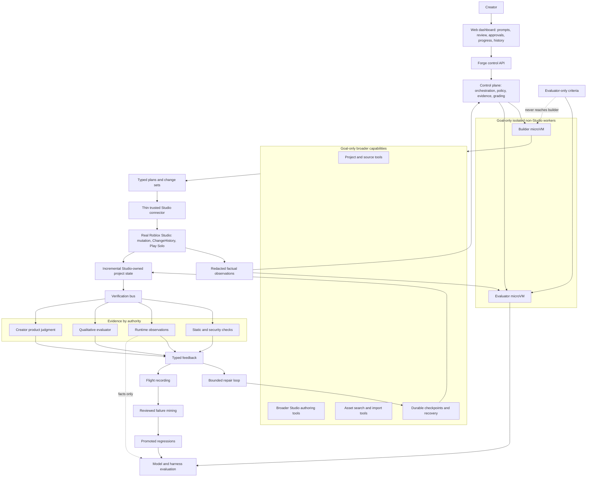

# Forge Architecture

This is the canonical description of Forge's implemented and target architecture. [FORGE.md](FORGE.md) owns the product thesis and invariants, [EVALS.md](EVALS.md) owns claim semantics, [ROADMAP.md](ROADMAP.md) owns demonstrated status and next work, and [RESEARCH.md](RESEARCH.md) indexes historical evidence.

Forge has one current clean-break artifact and message shape. `kind` discriminates unions, while canonical hashes and content-addressed IDs bind exact artifacts, policies, tools, workers, the generated capability manifest, and the authenticated evidence graph. Changing a shape replaces it outright.

## Current implementation

The primary product path is prompt-only and Studio-native, with creator control in a local React dashboard. The creator supplies one prompt against the open place. Forge first produces a read-only plan and fully visible verification charter. Only after the creator approves that exact hash does a separate builder stage a typed change set. Studio remains the only persistent writer.

Registered experiments remain a separate benchmark path. They use file-backed seeds and evaluator-only material to produce scoped evidence; those task JSON files are not product inputs for an ordinary creator session.

The two paths share the native model runtime, Studio bridge, factual observation substrate, and evidence infrastructure. They do not share semantic authority. A creator charter is a visible, creator-approved hypothesis; a benchmark evaluator remains private and may grade only its registered treatment.

### Prompt-only creator sequence

The planner cannot write. It uses bounded read-only Studio inspection before declaring builder dependencies, so property- or relationship-dependent plans need not guess from path/class summaries. Both planner and builder can query at most 20 joined rows at a time from the pinned official Roblox catalog. That lookup returns signatures, type/security/capability metadata, source-file hashes, and the generated Forge disposition; it authorizes source context only and cannot widen the typed mutation manifest. The builder cannot mutate Studio. It may read a source body only for an existing script already bound to an approved `write_source` change. The native runtime checks tool-host completion readiness before accepting a normal model `end_turn`. The local worker always persists the phase `AgentRun` and trace before returning either a sealed artifact or an unsealed terminal outcome to the coordinator. Forge, not the model, derives the plan goal from the immutable creator prompt. Plan steps cover every change exactly once; creates declare their initialization mode; a newly created script commits to complete source in the create operation; every created or moved output has an exact class-aware existence check; and every source-bearing change has a Luau syntax check. `DEFAULT_AGENT_BUDGETS` is the sole fallback policy for creator planning, building, repair, and unoverridden registered agent runs: 32 turns, 256 calls, 128 writes, 16 verifier calls, 32 changed files, 5,000 added and 2,000 removed lines, 1 MiB changed source, 4 MiB tool results, 30 minutes, USD 10, one million input tokens, and 128,000 output tokens. A registered experiment may still bind an explicit budget as evidence; Forge does not select purpose- or fixture-specific defaults.

The approved plan is compiled into a content-addressed `CreatorBuildContract` before the builder's first turn. The plan declares exact initial-state `inspectionPaths` already inspected by the planner; the contract carries those paths plus structural parent/target facts. For each approved change it fixes the change ID, operation ID, kind, exact destination path, parent, name, class, stable identity, and precondition. Forge derives those fields while the model supplies only `planChangeId` and the permitted creative payload.

The dependency-floor `studio-evidence` package owns the closed capability algebra. A normalized `RobloxApiCatalog` is generated from an exact official `Roblox/creator-docs` commit and source-tree hash; it records every documented class/member, datatype/member, enum/item, global, standard library/member, signature, security/capability tag, inheritance edge, and source provenance. `StudioCapabilityCoverageReport` classifies all 9,685 catalog entries exactly once. Its current partition is 209 `authorable`, 16 `observable_only`, 7,986 `source_only`, and 1,474 `unsupported`. `source_only` means a nondeprecated entry is available as official Luau authoring context but has no typed transaction or behavioral proof route. Deprecated, hidden/NotScriptable, and security-gated entries remain searchable but restricted. This report is exhaustive accountability, not mutation authority. The separately generated canonical manifest enables 33 coherent classes and 183 distinct properties only where the writer/readback/preflight/projection/comparator proof is complete; inherited applicability accounts for the 209 authorable coverage rows. Deterministic generation emits TypeScript validation/compilation plus bounded Luau dispatch and shared canonicalization vectors, and fails on upstream drift, stale output, duplicate or unclassified entries, or any missing proof leg. Reflection checks only these curated rows under the plugin's current security context and cannot expand them. Every manifest property carries its catalog type identity, declaring class, and a closed reflection expectation with required engine/storage and Luau script types plus an enum or Instance constraint when applicable. The connector emits raw `EngineType`, `ScriptType`, `EnumType`, and `InstanceType` dimensions plus owner, inheritance, serialization, and permissions without grading them. One pure backend verifier compares every required dimension independently. Numeric catalog types such as `float`, `double`, `int`, and `int64` retain their exact `EngineType` while sharing the Luau `ScriptType` `number`; class references require `RefType`/`Instance` plus `InstanceType`; enums require `Enum`/`EnumItem` plus `EnumType`; and datatype aliases such as `CoordinateFrame`/`CFrame` and `Rect2D`/`Rect` remain explicit. A missing required dimension is `incomplete`, while a contradictory present dimension is `rejected`; bounded structured findings retain an authorized raw artifact. Tagged, length-delimited evidence material normalizes floats and integers, negative zero, RGB8 colors, compound datatypes, bounded sequences, enums, stable class-constrained Instance references (including an explicit class-bound nil value), UTF-8, and explicit presence independently of JSON key order or language number formatting. Catalog namespaces remain distinct: a datatype can never be enabled through a same-named enum route.

Every edit-mode and Play Solo observation is a `StudioEvidenceEnvelope` bound to one `StudioEvidenceProjection`. A fact is exactly `observed`, `absent`, `unavailable`, or `read_error`; omission is never interpreted. Project-state projections close a bounded inventory and require every manifest-applicable fact for each discovered instance. `StudioStateRevision` separates exact evidence provenance from comparable state identity: `projectionHash` binds the precise request, while `stateDomainHash` covers only project, requirements, and scope, and `stateHash` covers the manifest, that domain, and canonical facts. Approval/session bindings, projection IDs, bounds, purpose labels, timestamps, and allowed-delta authority therefore cannot fabricate state drift. Complete evidence in different domains is never equal because the domain participates in the state hash. A complete mutation projection is recompiled independently by the connector from the sealed change set and complete before-state evidence. The pre-Apply projection, envelope, and revision are persisted in an immutable attempt before any drift classification. Detached canaries occur before ChangeHistory; then provisional mutation, direct object readback, and complete after-state evidence occur inside one recording. Pure reconciliation permits only the evidence-derived allowed state delta. Only complete contrary facts produce `mismatched`; all missing or invalid evidence produces `incomplete`.

The creator verification charter is also compiled before any place mutation. Runtime targets and calls are canonicalized by dependency—resolution before observation—rather than by unrelated identifier spelling, then validated against the manifest, evidence projection, execution budget, and explicit observation window. The single generated Studio policy applies to creator verification, registered evaluation, canaries, and the fixed runner: at most 128 operations, 16,384 projected facts, 64 runtime targets, 128 runtime calls, 128 samples per series, five minutes of execution, 512 KiB of runtime results, 2,048 project-state instances, and 8 MiB of project-state evidence. Creator interaction checks reserve a 90-second observation window inside that common ceiling. After matched provisional readback establishes the exact post-apply revision, Forge materializes and persists the revision-bound plan before exposing `Start Approved Checks`; the click executes that already-validated artifact and cannot be the first point at which the proof program is compiled.

The only current private creator store is `.forge/creator`; there is no legacy reader, migration, or alternate storage shape. Deleting `.forge` is a deliberate hard reset performed only while the control process is stopped, and first use creates a fresh current store. Bundles reference the exact creator request, manifests, pairing attestations, projections, envelopes, reconciliations, mutation attempts, execution plans, creator reports, AgentRuns, and traces through root-relative `ArtifactReference`s. There is no auxiliary prompt sidecar whose lifecycle can diverge from the session bundle. A failed detached canary is retained as an incomplete attempt with exact before-state and failure facts; it is replayable only to the explicit absence of a mutation verdict. A mid-batch execution failure is likewise retained without a verdict only after its same-call cancellation, complete final state, and durable receipt are stored. The in-flight transaction cursor contains references only—including an immutable execution-failure reference—and is persisted before a recording may open or while a receipt remains unacknowledged. On every load, Forge verifies regular-file and symlink safety, canonical bytes, hashes, and graph bindings. Provider-free mutation replay validates and recompiles against the immutable manifest and build-policy snapshot stored for that attempt, not whichever manifest happens to be current after later capability growth; live authoring always uses the current generated manifest. It then regrades readback and the allowed state delta and reproduces reconciliation status and failure-fact hashes. Verification replay additionally requires a linked exactly replayable `matched` mutation. AgentRun and trace artifacts carry real root, provider-turn, and tool-call intervals. Final judgment is an immutable creator-authority `CreatorReviewReport`, never a source of machine claims.

Restart is fail-closed. Interrupted worker phases become `incomplete / control_process_interrupted`; any phase that might own a recording becomes `recovery_required`. Creator control views are ephemeral, so after restart the coordinator reconstructs their detail from the durable session, approvals, transaction cursor, mutation attempts, verification records, and failure binding. A terminal or recovery view may never fall back to a generic ready message: it must state the proven interruption boundary, the evidence that does or does not exist, the prohibited automatic actions, and whether the only valid next step is recovery or a fresh request. Plugin settings are treated as a restricted external JSON store: transaction keys contain no punctuation, every phase writes a fresh immutable snapshot, and Forge immediately reads back the exact recording/finalization binding before crossing the next Studio boundary. The opening intent must be durable before `TryBeginRecording`, and Studio's returned opaque recording ID must replace that intent durably before the first place operation. The connector never automatically commits or cancels on startup, unpair, unload, or transport loss.

Every new pairing must complete a creator-transaction inventory before Forge may start another request or provider call. The generated connector identity hashes the capability manifest, current protocol source, plugin project configuration, and every authored plugin source file; generated output is excluded to avoid a circular identity. The bridge therefore rejects a stale runtime executor—not merely a stale protocol declaration—before creating a session, and the plugin pauses automatic pairing after a deterministic client rejection instead of flashing through accepted/rejected sessions. The connector reports exactly `none`, `open`, `not_open`, or `unknown`. This gate is project-level, so deleting or resetting the coordinator session store cannot orphan a plugin cursor and bypass recovery. `open` permits only the dashboard's hash-bound creator cancellation; `unknown` remains blocked. For `not_open`, the coordinator first verifies and immutably stores the exact project-state projection, complete authoritative envelope, opaque recording binding, and recovery record. It may then acknowledge those exact hashes. The connector rechecks `ChangeHistoryService:IsRecordingInProgress`, clears only its matching durable cursor, makes no Studio mutation, and returns an exact acknowledgement that the coordinator also stores before releasing the project. A matching interrupted session ends `incomplete`; it is never resumed or finalized. Settled commit/cancel receipts remain durably replayed until the coordinator acknowledges their persisted evidence graph. Inbound processing errors are surfaced as fail-closed pairing state rather than terminating the control plane.

`formal/CreatorMutationTransaction.tla` models approval, projection, preflight, recording, provisional apply, persistence, verification, finalization, duplicates, stale messages, loss, restart, and creator-authorized recovery. The pinned TLA+ 1.7.4 tool is checked offline during `npm test`; invariants prohibit recording without exact approval/preflight, advancement on stale replies, matching unavailable facts, automatic restart mutation, commit from mismatch/recovery, or checkpoint/review without acknowledged commit.

### Current implementation inventory

| Boundary              | Concrete implementation                                                             | Public identity or command                                                                                                                                                                                                                  | Current status                                                                                                                                                                                                |
| --------------------- | ----------------------------------------------------------------------------------- | ------------------------------------------------------------------------------------------------------------------------------------------------------------------------------------------------------------------------------------------- | ------------------------------------------------------------------------------------------------------------------------------------------------------------------------------------------------------------- |
| Identity discipline   | contracts, `studio-evidence`, and canonical hashing                                  | one current shape; `kind`, content-addressed IDs, generated manifest/build/projection hashes                                                                                                                                                 | Implemented; clean-break readers only                                                                                                                                                                         |
| API accountability    | pinned catalog compiler, coverage generator, `studio-evidence/catalog`               | `roblox-api-catalog:check`, `studio-evidence:check`, `forge studio api-status`, `forge studio capabilities`                                                                                                                                  | Implemented; 9,685/9,685 class/datatype/enum/global/library entries classified, exact source/catalog/coverage drift fails offline checks                                                                        |
| Prompt-only contracts | `packages/creator-session`                                                          | `CreatorSession`, executable `CreatorPlan`, `VerificationCharter`, `CreatorBuildContract`, `CreatorChangeSet`                                                                                                                               | Implemented and locally tested; planner inspection, contract-scoped source reads, exact prompt goal, initialization, step coverage, output checks, source syntax, and plan-bound builder contract fail closed |
| Worker seam           | `creator-session/worker.ts`, `agent-runtime`                                        | `CreatorAgentWorker`; bound `local_process / none` descriptor in AgentRun and harness evidence                                                                                                                                              | Implemented with `LocalCreatorAgentWorker`; sealed and unsealed phase outcomes persist; microVM worker unimplemented                                                                                          |
| Creator orchestration | `creator-session/coordinator.ts`                                                    | `forge creator ...`; canonical `CreatorControlView`                                                                                                                                                                                         | Implemented and fake-runtime tested; fail-closed restart classification and one active session per paired Studio project                                                                                      |
| Studio authority      | generated Luau dispatch plus `StudioAuthoring.luau`                                 | manifest-bound preflight, provisional apply, direct readback, commit/cancel/recovery receipts                                                                                                                                               | Implemented; no automatic restart mutation                                                                                                                                                                    |
| Creator control/UI    | `packages/creator-control`, `dashboard`, `plugin/src/Forge/Runtime.luau`            | standalone loopback API and local evidence workbench over canonical `CreatorControlView`; authenticated catalog/capability explorer; thin connector in Studio                                                                               | Implemented and locally tested; the dashboard owns prompts, review, consent, evidence, progress, history, and read-only capability accountability                                                            |
| Local checks          | `luau-toolchain`, `verifier`                                                        | `forge.verify` and creator `forge.verify` tool                                                                                                                                                                                              | Implemented                                                                                                                                                                                                   |
| Studio evidence       | `studio-evidence`, `studio-protocol`, `studio-bridge`, `studio-runtime`, plugin     | one projection/envelope/fact algebra for project state, mutation, reflection, runtime, and diagnostics                                                                                                                                      | Implemented with explicit presence, 33 proof-closed classes, 183 distinct writable properties, five bounded runtime capabilities, and generated TS/Luau closure                                             |
| Registered benchmarks | `experiments`, `agent-runtime`, `proofs`                                            | experiment CLI plus caller-supplied registration and proof artifacts                                                                                                                                                                        | Current contracts implemented and covered by synthetic treatment regressions; predecessor live evidence remains historical                                                                                    |
| Evidence              | `artifact-store`, creator mutation/verification replay, `agent-runtime`, `flight-recorder` | immutable graph, provider-free mutation and verification replay, runtime-owned tool evidence, exact intervals, creator reports                                                                                                           | Implemented, locally tested, and exercised by the accepted Door Control run; both recorded outcomes replay exactly                                                                                             |
| Demo place seeds      | `examples/status-beacon`, `examples/door-control`, `examples/orbital-freight-airlock` | solution-free buildable seeds with no task/evaluator JSON                                                                                                                                                                                 | Status Beacon is historical predecessor evidence; Door Control completed the current proof; Orbital Freight Airlock is the next interconnected client/server proof                                             |

## Why there is no dual writer

Forge does not merge concurrent Rojo and Studio edits. During a creator session, Studio is the only persistent writer. Optional `--external-rojo-root` declarations mark matching Studio subtrees read-only; they are exclusion zones, not a second write channel. The default prompt-only user supplies no project JSON or ownership manifest.

Registered benchmarks still require a seed, evaluator, thresholds, and treatment identity, but those inputs are caller-supplied rather than retained as product examples. That is experimental scaffolding, not the intended creator experience.

## Earlier harness correction

The historical MovingPlatform trial lacked provider-visible source roots and remains `incomplete`. The corrected file-backed builder exposes canonical candidate-relative roots before the first model request. Its regression recomputes and verifies the orientation content hash, ordered tool-description hash, and harness configuration identity instead of copying those derived values into documentation.

Historical AgentRuns, registrations, candidates, proofs, canaries, and traces remain unchanged. Clean-break current readers do not pretend those predecessor artifacts are current.

## Long-term goal

The destination is a creator-facing, long-horizon Studio harness. The dashboard and local control entry are implemented; the isolation, broader tools, verification bus, and learning nodes below remain goal-only claims.

MicroVMs are a future isolation boundary for model/tool execution, local analysis, and evaluator code. This follows the useful agent/agent-code separation described by Fly's Firecracker-based [agent execution architecture](https://fly.io/ai-agents/). They cannot replace the real-Studio proof worker: Roblox engine behavior, Play Solo diagnostics, ChangeHistory, and plugin permissions must still be observed in Roblox Studio through the plugin-security [`StudioTestService`](https://create.roblox.com/docs/reference/engine/classes/StudioTestService). Session tokens and mutation authority therefore stay at the control-plane/connector boundary rather than entering isolated workers. Public Fly material associates Lemonade with Fly, but does not disclose Lemonade's private Roblox execution topology; Forge does not infer a product contract from a customer logo.

### Horizon comparison

| Concern             | Current                                                                                                                                    | Near-term evidence task                                                 | Goal                                                                 |
| ------------------- | ------------------------------------------------------------------------------------------------------------------------------------------ | ----------------------------------------------------------------------- | -------------------------------------------------------------------- |
| User input          | One dashboard prompt; optional explicit Rojo exclusion roots; read-only API coverage explorer                                             | Exercise one non-Door authoring group in a user-run Studio proof        | Conversational long-horizon intent                                  |
| Planning            | Exact prompt-derived goal; typed executable changes and initialization; generated machine-check prose; separate read-only plan and builder | Improve plans from the next distinct live proof without adding hidden criteria | Revised plans across durable checkpoints                       |
| Authoring           | 33 proof-closed classes, 183 distinct properties, attributes, source, compound codecs, and stable Instance references                      | Prove the smallest new coherent group in Studio before expanding assets | Broader typed Studio and asset tools                                 |
| Verification        | Replayable manifest/projection/envelope grading, five bounded runtime primitives, diagnostics, matched mutation prerequisite, and creator report | Add one fixed factual primitive only when a concrete prompt needs it | Verification bus with adversarial and qualitative signals           |
| Ownership           | Studio single writer; declared Rojo roots read-only; stable references require exact Studio-owned identity                              | Exercise graph-reference readback and cancellation in a live proof      | Automatic ownership discovery without concurrent writers            |
| Execution isolation | Bound local-process worker descriptor; no isolation                                                                                        | Keep capability work on the existing local worker boundary              | MicroVM builder/evaluator workers plus separate real-Studio workers |
| Product UI          | Local React dashboard with catalog/disposition/attestation/proof exploration over the standalone control API; thin Studio connector       | Validate explorer clarity with the next user-run proof                  | Cloud identity and multi-user collaboration                         |
| Learning            | New AgentRuns/traces preserve real intervals; pinned upstream drift and unclassified API entries fail CI; purged historical identifiers remain documentary only | Promote only reviewed live failures into focused regressions | Reviewed failure mining and regression evaluation                   |

## Invariants

- Creator requests, observed facts, platform policies, agent hypotheses, creator-approved charters, evaluator criteria, and benchmark oracles remain distinct authorities.
- Hidden evaluator bodies never reach a creator planner or builder. Studio receives data plans and typed change sets, never evaluator assertions or arbitrary callbacks.
- Studio is the sole persistent creator-session writer. Every mutation requires an exact approved artifact hash, a current revision match, and fixed plugin interpretation.
- Model providers remain replaceable one-turn transports; `ForgeNativeAgentRuntime` owns iteration, tools, budgets, and stopping.
- The coordinator owns workflow legality through `CreatorControlView`; neither the plugin nor the dashboard infers legal actions from status text.
- Studio tokens and mutation authority remain outside `CreatorAgentWorker`; changing from the bound local-process worker to an isolated worker changes evidence identity.
- A local or creator check establishes only its modeled property. Backend benchmark grading remains separate from factual observation and creator satisfaction.
- Obsolete mechanic compilers, PatchSets, provider-owned loops, mechanic-specific Studio harnesses, and deleted packages are not part of the architecture.
