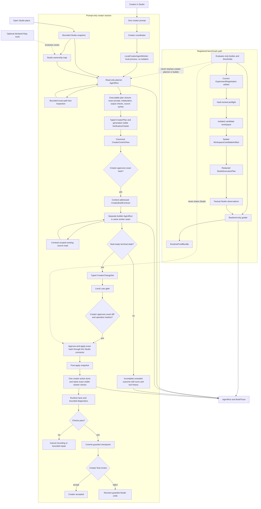
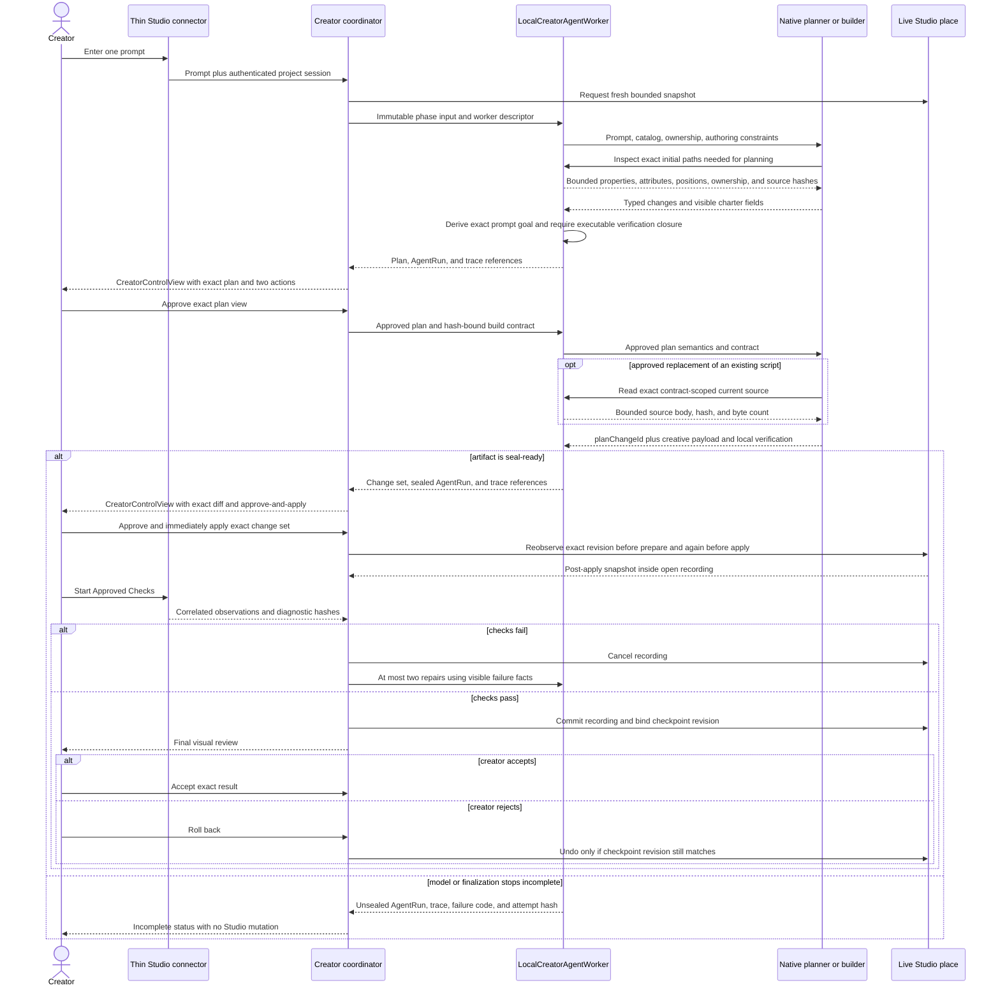
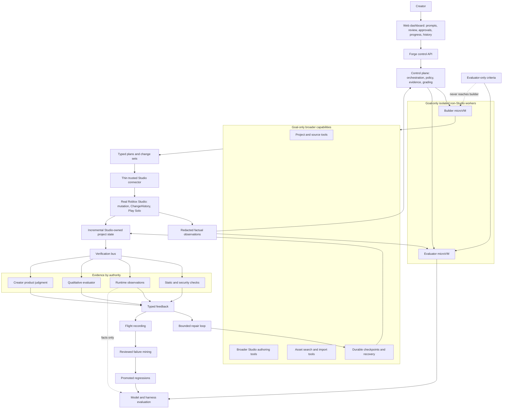

# Forge Architecture

This is the canonical description of Forge's implemented and target architecture. [FORGE.md](FORGE.md) owns the product thesis and invariants, [EVALS.md](EVALS.md) owns claim semantics, [ROADMAP.md](ROADMAP.md) owns demonstrated status and next work, and [RESEARCH.md](RESEARCH.md) indexes historical evidence.

Forge has one current clean-break artifact and message shape. `kind` discriminates unions, while canonical hashes and content-addressed IDs bind exact artifacts, policies, tools, workers, capability sets, and the authenticated evidence graph. Changing a shape replaces it outright.

## Current implementation

The primary product path is prompt-only and Studio-native. The creator supplies one prompt against the open place. Forge first produces a read-only plan and fully visible verification charter. Only after the creator approves that exact hash does a separate builder stage a typed change set. Studio remains the only persistent writer.

Registered experiments remain a separate benchmark path. They use file-backed seeds and evaluator-only material to produce scoped evidence; those task JSON files are not product inputs for an ordinary creator session.

The two paths share the native model runtime, Studio bridge, factual observation substrate, and evidence infrastructure. They do not share semantic authority. A creator charter is a visible, creator-approved hypothesis; a benchmark evaluator remains private and may grade only its registered treatment.

### Prompt-only creator sequence

The planner cannot write. It uses a bounded read-only inspection tool before declaring builder dependencies, so property- or relationship-dependent plans need not guess from path/class summaries. The builder cannot mutate Studio. It may read a source body only for an existing script already bound to an approved `write_source` change. The native runtime checks tool-host completion readiness before accepting a normal model `end_turn`. The local worker always persists the phase `AgentRun` and trace before returning either a sealed artifact or an unsealed terminal outcome to the coordinator. Forge, not the model, derives the plan goal from the immutable creator prompt. Plan steps cover every change exactly once; creates declare their initialization mode; a newly created script commits to complete source in the create operation; every created or moved output has an exact class-aware existence check; and every source-bearing change has a Luau syntax check.

The approved plan is compiled into a content-addressed `CreatorBuildContract` before the builder's first turn. The plan declares exact initial-snapshot `inspectionPaths` already inspected by the planner for relationships, placement, integration, or preservation; the contract carries those paths plus structural parent/target facts. The approved plan and complete contract are model-visible. The contract is persisted by ID and hash in the builder `AgentRun`, trace, and creator-session history. For each approved change it fixes the change ID, operation ID, kind, exact destination path, parent, name, class, stable identity, and precondition; it also includes exact property, attribute, removal, source, and UTF-8 limits. Forge derives those fields when staging operations. The model supplies only `planChangeId` and the permitted creative payload. Model-facing properties are natural JSON primitives, vectors, colors, and position/rotation CFrames; Forge resolves those shapes against the contract, canonicalizes numeric values to Studio floats and colors to deterministic 8-bit channels before creator review, and converts them into tagged `StudioValue` data for the trusted Studio boundary. Post-apply reconciliation therefore compares the approved canonical storage value to the observed storage value rather than comparing an unrepresentable input decimal. A move may atomically carry allowlisted property and attribute changes, and source replacement may atomically carry attribute changes, avoiding multiple conflicting operations on one stable target. A rejected stage returns field-path-specific validation plus structured expected-versus-received fields and the applicable allowlist, and the runtime records rejected batches as evidence. Live budget admission occurs before tool execution; repeated identical no-progress submissions or three varied consecutive all-failed batches terminate as `incomplete` rather than spending the turn budget on guesses. The same property, attribute, explicit `removedAttributes`, source, and UTF-8 rules are enforced before staging and by Studio. Allowlisted service roots and supported container parents are explicit initial-snapshot facts; every create or move parent must be one of those facts and remain Studio-writable. Class-aware existence resolution accepts only explicit safe service roots, while spatial capabilities remain `Workspace`-only and `BasePart`-only. The plugin accepts only canonical typed operations over allowlisted classes, properties, attributes, and service roots. It recollects the complete bounded observation at prepare and apply and rejects either boundary if the revision changed. It rejects arbitrary callbacks, expressions, generic property access, terrain, assets, externally declared Rojo roots, stale revisions, mismatched stable identities, oversized source, and unbounded deletion.

The private creator bundle retains a bounded revision-to-observation history. On every load, Forge re-materializes the plan, every build contract, and every change set from the exact approved observation and rejects a graph that cannot be reproduced. AgentRun and trace locators carry their persisted content hashes and trace build key; terminal control views expose those evidence references while allowing a new prompt to start a new identity.

### Current implementation inventory

| Boundary              | Concrete implementation                                                             | Public identity or command                                                                                                                                                                                                                  | Current status                                                                                                                                                                                                |
| --------------------- | ----------------------------------------------------------------------------------- | ------------------------------------------------------------------------------------------------------------------------------------------------------------------------------------------------------------------------------------------- | ------------------------------------------------------------------------------------------------------------------------------------------------------------------------------------------------------------- |
| Identity discipline   | contracts and canonical hashing                                                     | one current shape; `kind`, content-addressed IDs, descriptor hashes, capability-set ID/hash                                                                                                                                                 | Implemented; clean-break readers only                                                                                                                                                                         |
| Prompt-only contracts | `packages/creator-session`                                                          | `CreatorSession`, executable `CreatorPlan`, `VerificationCharter`, `CreatorBuildContract`, `CreatorChangeSet`                                                                                                                               | Implemented and locally tested; planner inspection, contract-scoped source reads, exact prompt goal, initialization, step coverage, output checks, source syntax, and plan-bound builder contract fail closed |
| Worker seam           | `creator-session/worker.ts`, `agent-runtime`                                        | `CreatorAgentWorker`; bound `local_process / none` descriptor in AgentRun and harness evidence                                                                                                                                              | Implemented with `LocalCreatorAgentWorker`; sealed and unsealed phase outcomes persist; microVM worker unimplemented                                                                                          |
| Creator orchestration | `creator-session/coordinator.ts`                                                    | `forge creator ...`; canonical `CreatorControlView`                                                                                                                                                                                         | Implemented and fake-runtime tested; plan review exposes prompt binding, initialization commitments, output-check coverage, and creator-only judgments                                                        |
| Studio authority      | `plugin/src/Forge/StudioAuthoring.luau`                                             | canonical message envelope plus exact capability-set ID/hash                                                                                                                                                                                | Implemented typed prepare/apply/commit/cancel/guarded undo                                                                                                                                                    |
| Creator UI            | `plugin/src/Forge/Runtime.luau`, `CreatorUiState.luau`                              | one coordinator-authorized primary and secondary action; separate experiment/canary evaluation action                                                                                                                                       | Implemented; no current mutation has yet been demonstrated                                                                                                                                                    |
| Local checks          | `luau-toolchain`, `verifier`                                                        | `forge.verify` and creator `forge.verify` tool                                                                                                                                                                                              | Implemented                                                                                                                                                                                                   |
| Studio observation    | `studio-protocol`, `studio-bridge`, `studio-capabilities`, `studio-runtime`, plugin | content-addressed `StudioCapabilitySet`; safe-service class-aware resolve, Workspace BasePart positions, bounded diagnostics                                                                                                                | Implemented; the earlier substrate was demonstrated historically                                                                                                                                              |
| Registered benchmarks | `experiments`, `agent-runtime`, `proofs`                                            | experiment CLI, current registration and proof artifacts                                                                                                                                                                                    | Current contracts implemented; Vertical Shuttle evidence used predecessor identities                                                                                                                          |
| Evidence              | `agent-runtime`, `flight-recorder`, private creator bundles                         | authenticated graph of revision-bound observation history, AgentRun sealed/unsealed outcomes, content-bound build traces/contracts, rejected-batch/no-progress and budget-admission evidence, verification records, hashes, and trace links | Implemented and locally tested; no fresh live creator demonstration claimed                                                                                                                                   |
| Demo place seed       | `examples/status-beacon`                                                            | one buildable place seed, no task/evaluator JSON                                                                                                                                                                                            | Implemented; consumed sessions remain historical evidence, not current validation                                                                                                                             |

## Why there is no dual writer

Forge does not merge concurrent Rojo and Studio edits. During a creator session, Studio is the only persistent writer. Optional `--external-rojo-root` declarations mark matching Studio subtrees read-only; they are exclusion zones, not a second write channel. The default prompt-only user supplies no project JSON or ownership manifest.

The JSON under registered examples exists because a benchmark must preregister a seed, evaluator, thresholds, and treatment identity. That is experimental scaffolding, not the intended creator experience.

## Earlier harness correction

The historical MovingPlatform trial lacked provider-visible source roots and remains `incomplete`. The corrected file-backed builder exposes canonical candidate-relative roots before the first model request. Its regression recomputes and verifies the orientation content hash, ordered tool-description hash, and harness configuration identity instead of copying those derived values into documentation.

Historical AgentRuns, registrations, candidates, proofs, canaries, and traces remain unchanged. Clean-break current readers do not pretend those predecessor artifacts are current.

## Long-term goal

The destination is a creator-facing, long-horizon Studio harness. Goal-only nodes below are not implemented claims.

MicroVMs are a future isolation boundary for model/tool execution, local analysis, and evaluator code. They cannot replace the real-Studio proof worker: Roblox engine behavior, Play Solo diagnostics, ChangeHistory, and plugin permissions must still be observed in Roblox Studio. Session tokens and mutation authority therefore stay at the control-plane/connector boundary rather than entering isolated workers.

### Horizon comparison

| Concern             | Current                                                                                                                                    | Near-term evidence task                                                 | Goal                                                                 |
| ------------------- | ------------------------------------------------------------------------------------------------------------------------------------------ | ----------------------------------------------------------------------- | -------------------------------------------------------------------- |
| User input          | One Studio prompt; optional explicit Rojo exclusion roots                                                                                  | One fresh Status Beacon Luna creator session                            | Conversational long-horizon intent                                   |
| Planning            | Exact prompt-derived goal; typed executable changes and initialization; generated machine-check prose; separate read-only plan and builder | Validate corrected plan clarity and approval UX in Studio               | Revised plans across durable checkpoints                             |
| Authoring           | Typed instances, selected Part/Prompt properties, attributes, and Script source                                                            | Demonstrate one apply/verify/review flow                                | Broader typed Studio and asset tools                                 |
| Verification        | Luau gate, class-aware existence, BasePart position facts, bounded subtree digest, diagnostics, creator review                             | Preserve exact pass, rejection, or setup failure without retry          | Verification bus with adversarial and qualitative signals            |
| Ownership           | Studio single writer; declared Rojo roots read-only                                                                                        | Confirm task JSON is unnecessary after place creation                   | Automatic ownership discovery without concurrent writers             |
| Execution isolation | Bound local-process worker descriptor; no isolation                                                                                        | Observe the complete phase boundary locally                             | MicroVM builder/evaluator workers plus separate real-Studio workers  |
| Product UI          | Temporary thin plugin and CLI consume `CreatorControlView`                                                                                 | Validate one-primary/one-secondary flow                                 | Web dashboard over the same control API; plugin only connects Studio |
| Learning            | AgentRuns and traces preserve sealed and unsealed model phases; historical experiment evidence remains immutable                           | Run a fresh creator session without retrying the consumed prior session | Reviewed failure mining and regression evaluation                    |

## Invariants

- Creator requests, observed facts, platform policies, agent hypotheses, creator-approved charters, evaluator criteria, and benchmark oracles remain distinct authorities.
- Hidden evaluator bodies never reach a creator planner or builder. Studio receives data plans and typed change sets, never evaluator assertions or arbitrary callbacks.
- Studio is the sole persistent creator-session writer. Every mutation requires an exact approved artifact hash, a current revision match, and fixed plugin interpretation.
- Model providers remain replaceable one-turn transports; `ForgeNativeAgentRuntime` owns iteration, tools, budgets, and stopping.
- The coordinator owns workflow legality through `CreatorControlView`; neither the plugin nor a future dashboard infers legal actions from status text.
- Studio tokens and mutation authority remain outside `CreatorAgentWorker`; changing from the bound local-process worker to an isolated worker changes evidence identity.
- A local or creator check establishes only its modeled property. Backend benchmark grading remains separate from factual observation and creator satisfaction.
- Obsolete mechanic compilers, PatchSets, provider-owned loops, mechanic-specific Studio harnesses, and deleted packages are not part of the architecture.
