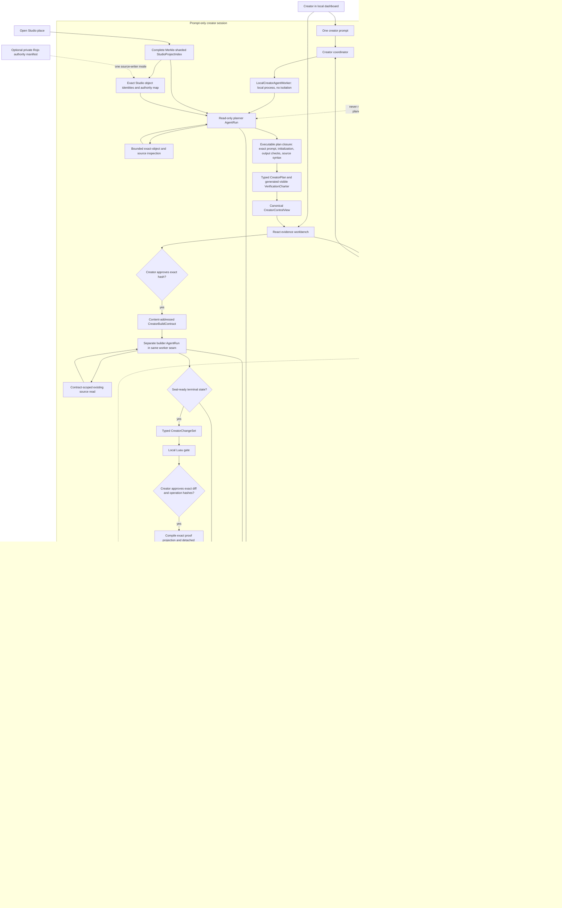
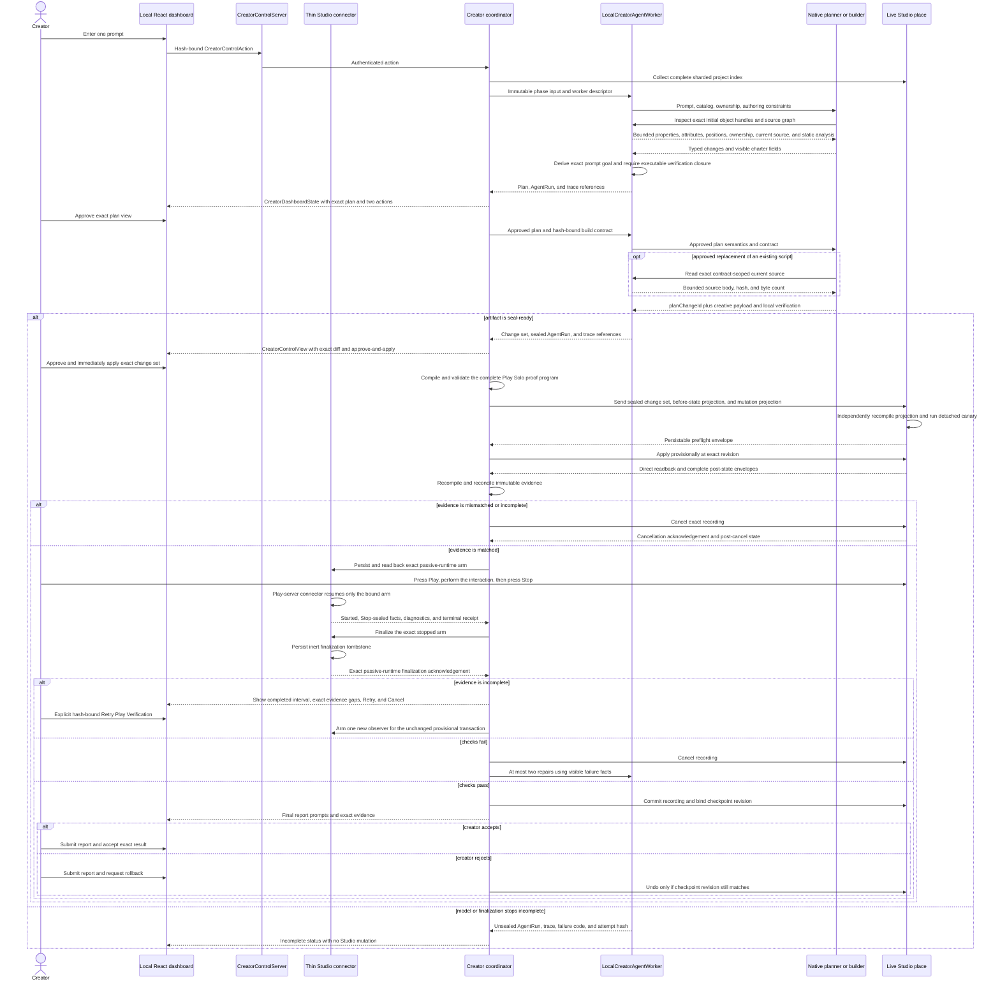

# Forge Architecture

This is the canonical description of Forge's implemented and target architecture. [FORGE.md](FORGE.md) owns the product thesis and invariants, [EVALS.md](EVALS.md) owns claim semantics, [ROADMAP.md](ROADMAP.md) owns demonstrated status and next work, and [RESEARCH.md](RESEARCH.md) indexes historical evidence.

Forge has one current clean-break artifact and message shape. `kind` discriminates unions, while canonical hashes and content-addressed IDs bind exact artifacts, policies, tools, workers, the generated capability manifest, and the authenticated evidence graph. Changing a shape replaces it outright.

## Current implementation

The primary product path is prompt-only and Studio-native, with creator control in a local React dashboard. The creator supplies one prompt against the open place. Forge first produces a read-only plan and fully visible verification charter. Only after the creator approves that exact hash does a separate builder stage a typed change set. The open Studio document owns ordinary model/property work. An explicitly opted-in Rojo map additionally marks exact mapped source paths that may use the guarded filesystem writer. The sealed plan, build contract, and change set derive one writer from their exact targets; a mixed-authority batch is rejected before approval.

Every paired connector receives one opaque-object identity epoch derived from tagged, length-delimited project-index canonical material over the exact Studio session ID, paired project ID, and connector build hash. TypeScript and Luau hash that same material and share generated vectors. No endpoint may substitute JSON encoding or delimiter concatenation, and changing any of the three bindings invalidates every `studio_ephemeral` handle. Project-index projections and the connector registry must therefore agree by construction before collection begins.

Project indexing is cooperative and terminating. Every declared root produces at least one shard, but an absent or empty root uses a one-shot empty-shard cursor that cannot repeat. Shard admission uses the exact incremental length of the tagged canonical material instead of repeatedly rematerializing a growing shard. Collection, canonical materialization, and transport encoding yield at bounded intervals and recheck the detector epoch and indexing deadline so a large valid place cannot monopolize Studio's plugin thread. Transport JSON uses a buffered encoder with an explicit empty-object marker; semantic hashes remain based on the tagged, length-delimited canonical form. Generated project-property metadata is a canonical ordered sequence, separate from the name-keyed writer lookup. Every indexed instance whose class is in the observation manifest must declare exactly that class's complete applicable property-name set and a class-valid canonical value for every declared property. Missing, extra, duplicate, unsorted, or invalid property coverage makes the index incomplete before reconciliation; it can never be converted into a mutation mismatch.

Project-index collection and publication are separate authority boundaries. The connector reads a whole capture against one detector epoch; a callback during that read discards the attempt and restarts the whole read under the same overall resource deadline. Once the read completes at a stable epoch, its canonical shards, revision, and capture hash are immutable historical evidence. Transport has a separate bounded deadline and never consults mutable detector state, so a delayed engine callback cannot retroactively invalidate already-captured bytes merely because a larger place takes longer to stream. After transport, the capture becomes the connector's current command gate only if the detector epoch is still unchanged. Otherwise it remains valid transaction evidence, the durably queued dirty notice blocks progress, and the host obtains a fresh complete capture before Play or finalization. A transaction notice received before direct post-Apply state exists remains an unadjudicated barrier; Forge never compares it with the unrelated pre-Apply snapshot or fabricates an incomplete verdict.

Registered experiments remain a separate benchmark path. They use file-backed seeds and evaluator-only material to produce scoped evidence; those task JSON files are not product inputs for an ordinary creator session.

The two paths share the native model runtime, Studio bridge, factual observation substrate, and evidence infrastructure. They do not share semantic authority. A creator charter is a visible, creator-approved hypothesis; a benchmark evaluator remains private and may grade only its registered treatment.

### Prompt-only creator sequence

The planner cannot write. Before proposing source-bearing work it explores the immutable `StudioSourceIndex` with bounded search, paged reads, symbols, references, and static require traversal. Forge—not the model—seals the exact returned ranges and graph closure as `CreatorSourceConsultation`; all such results remain `static_analysis`. The host executes only verified pinned Rojo 7.7.0 and Luau LSP 1.63.0 binaries. LSP work is bounded to one 30-second session, five seconds per request, 1 MiB messages, 200 symbols, 200 references per symbol, and 1,024 returned reference rows. Dynamic or unresolved requires are not guessed. Both planner and builder may query the pinned official Roblox catalog, but catalog results cannot widen the mutation manifest. The builder cannot mutate Studio and may read only the approved consultation closure. Existing-source work is `edit_source`: sorted, non-overlapping UTF-8 byte edits bound to the consulted before hash. Forge materializes the complete candidate, verifies its final hash and byte count, and presents the exact diff. The native runtime retains its bounded completion-repair and progress-token semantics, and the local worker persists every sealed or unsealed phase outcome. `DEFAULT_AGENT_BUDGETS` remains the sole fallback for agent work; complete Studio indexing is governed separately by the persisted `CreatorResourcePolicy`.

Repeated-rejection identity is equally exact: it binds the call payload, canonical rejection-result hashes, and current host epoch. An accepted state transition clears both rejected and executed repetition history, including when state content later cycles to an earlier hash. The same model call with materially changed validation feedback is not called an identical loop. Planner tool metadata also exposes cross-field constraints such as the exact generated position-series capacity formula before the first proposal.

The approved plan is compiled into a content-addressed `CreatorBuildContract` before the builder's first turn. The plan declares exact initial object handles already inspected by the planner; the contract carries the closed `StudioObjectIdentity`, display path/class preconditions, and exact parent handle. A parent is either an indexed instance identity or a manifest-declared engine container—never a name lookup. For each approved change the contract fixes the change ID, operation ID, kind, destination, parent, class, enrollment, and precondition. Targeting an ephemeral existing object authorizes one deterministic `_forgeStableId` enrollment inside the same visible ChangeHistory recording; cancellation rolls that metadata change back with the rest. Forge derives all authority-bearing fields while the model supplies only `planChangeId` and the permitted creative payload. Staging is a virtual proposal map keyed by `planChangeId`, not an append-only mutation log: a later valid proposal atomically replaces the current value, a rejected replacement preserves it, and every accepted replacement invalidates the local gate.

Creator Luau verification analyzes the projected post-change DataModel, not a flat collection of temporary files. Forge compiles generated engine-owned authoring containers, bound initial instances, and staged create/move/delete/update/source operations into an exact temporary Rojo topology, mounts every staged Script/LocalScript/ModuleScript at its approved logical Studio path, and then runs the official syntax plus Roblox-aware type tiers. Exact source bodies from unchanged Studio scripts are materialized as host-private dependency files, including move/delete rebasing, but only staged candidate files are analyzer entry points and only their source is model-writable. This preserves both newly staged and pre-existing module resolution without widening model source authority. Before diagnostics reach the model or local-gate hash, Forge replaces temporary paths with logical Studio paths and includes the exact range, bounded analyzer message, `planChangeId`, and operation ID. Repeated verification of unchanged staged state therefore has stable issue identities and enough information for an atomic source replacement.

The dependency-floor `studio-evidence` package owns the closed capability algebra. A normalized `RobloxApiCatalog` is generated from an exact official `Roblox/creator-docs` commit and source-tree hash; it records every documented class/member, datatype/member, enum/item, global, standard library/member, signature, security/capability tag, inheritance edge, and source provenance. `StudioCapabilityCoverageReport` classifies all 9,685 catalog entries exactly once. Its current partition is 635 `authorable`, 16 `observable_only`, 7,509 `source_only`, and 1,525 `unsupported`. `source_only` means a nondeprecated entry is available as official Luau authoring context but has no typed transaction or behavioral proof route. Deprecated, hidden/NotScriptable, and security-gated entries remain searchable but restricted. This report is exhaustive accountability, not mutation authority. The separately generated canonical manifest enables 33 coherent classes and 364 property applications from 248 distinct catalog declarations only where the writer/readback/preflight/projection/comparator proof is complete; enum closure and inherited applicability account for the 635 authorable coverage rows. The manifest carries an `evidenceContractHash` over the generator and TypeScript evidence/project-index algebra, so changing a projection, canonicalization, or revision hash domain necessarily creates a new manifest identity. Selection is generated from the catalog for each policy-selected class group and supported codec family, with content-bearing asset identifiers and structural `Name`/`Parent` excluded explicitly. Restricted enum types cannot enter the writer through an otherwise enabled inherited property. It also owns a sorted, parent-closed `authoringContainers` topology for engine-created parents: every allowed service root and the fixed `StarterPlayerScripts`/`StarterCharacterScripts` containers. Those rows authorize only the parent relation; they never enter the mutable project inventory or grant property/source authority. Any other parent must be an exact Studio-document-owned identity/path/class anchor in the complete initial index, but its class need not be authorable because containment and mutation are separate authorities. Generated Luau preflight resolves every used container and checks its exact class before recording and again at apply. Deterministic generation emits TypeScript validation/compilation plus bounded Luau dispatch and shared canonicalization vectors, and fails on upstream drift, stale output, duplicate or unclassified entries, malformed container topology, a manifest/coverage mismatch, or any missing proof leg. Reflection checks only these curated property rows under the plugin's current security context and cannot expand them. Every manifest property carries its catalog type identity, declaring class, and a closed reflection expectation with required engine/storage and Luau script types plus an enum or Instance constraint when applicable. The connector emits raw `EngineType`, `ScriptType`, `EnumType`, and `InstanceType` dimensions plus owner, inheritance, serialization, and permissions without grading them. One pure backend verifier compares every required dimension independently. Numeric catalog types such as `float`, `double`, `int`, and `int64` retain their exact `EngineType` while sharing the Luau `ScriptType` `number`; class references require `RefType`/`Instance` plus `InstanceType`; enums require `Enum`/`EnumItem` plus `EnumType`; and datatype aliases such as `CoordinateFrame`/`CFrame` and `Rect2D`/`Rect` remain explicit. A missing required dimension is `incomplete`, while a contradictory present dimension is `rejected`; bounded structured findings retain an authorized raw artifact. Tagged, length-delimited evidence material normalizes floats and integers, negative zero, RGB8 colors, compound datatypes, bounded sequences, enums, stable class-constrained Instance references (including an explicit class-bound nil value), UTF-8, and explicit presence independently of JSON key order or language number formatting. Catalog namespaces remain distinct: a datatype can never be enabled through a same-named enum route.

Exact mutation and Play observations use `StudioEvidenceEnvelope` bound to one `StudioEvidenceProjection`. A fact is exactly `observed`, `absent`, `unavailable`, or `read_error`; omission is never interpreted. For an exact projection, complete means every required key appears once in canonical order and every result is authoritative `observed` or `absent`. It deliberately does not mean the result matched the expected status or value. Expected comparison occurs only in pure reconciliation or grading, so a wrong value or absent required instance is complete, replayable mismatch evidence. `unavailable`, `read_error`, missing, duplicate, extra, misordered, or misbound facts are incomplete. Whole-project truth never uses that envelope: only a complete `StudioProjectIndexManifest` and all independently verified shard/source leaves can produce a `StudioProjectRevision`. Each manifested node carries explicit property coverage produced from the same generated ordered metadata used by the host validator; an empty or partial coverage set for a manifested class is incomplete observation, never evidence that approved properties disappeared. A complete mutation projection is recompiled independently by the connector from the sealed change set and retained before-index graph. It contains proof requirements, not a second project-delta allowlist; pure reconciliation derives the only allowed Merkle delta from the approved operations. A parent delete follows exact index identity edges and projects structural absence for opaque descendants without granting their classes property-write authority. Detached canaries occur before ChangeHistory; then provisional mutation, direct object readback, and a complete after-index occur inside one recording. The automated gate serializes host-produced projections into the production Luau recompiler so the two runtimes cannot be tested only against separate fixtures.

The creator verification charter is compiled before mutation. Exact mutation/runtime checks still use `StudioEvidenceEnvelope`, but whole-project truth has one path only: `StudioProjectIndexProjection` → complete `StudioProjectEvidenceShard` and `StudioSourceBlobChunk` sets → `StudioProjectIndexManifest` → `StudioProjectRevision`. Leaves contain at most 512 nodes or 4 MiB canonical JSON; transport chunks are at most 256 KiB. The default policy permits 1,048,576 instances, 1 GiB aggregate index material, 128 MiB per source blob, and ten minutes. Missing, duplicate, reordered, extra, or tampered leaves cannot form a revision. Runtime observation remains bounded by the generated manifest and normal Stop defines its authoritative endpoint.

Ordinary solo Play creates distinct Edit, Play Server, and Play Client data models, so creator verification never relies on an Edit-data-model `RunState` callback surviving the transition. The Play Server connector instance is the sole runtime evidence producer: it validates and resumes the persisted arm, installs bounded diagnostics plus `DirectRuntimeObserver`, performs its first reads, and only then emits the exact request-bound start. Generated manifest result dispatch resolves targets synchronously, reads one-shot identity/property/position facts directly, and samples all series concurrently through one `RunService.Heartbeat` connection. `LogService.MessageOut` supplies bounded warning/error diagnostics only; no Script, source string, print prefix, output parser, or place-object IPC exists. Stop disconnects sampling, seals the actual in-memory prefix, and persists a terminal receipt before transport. The Edit connector does not guess that Play ended. After the backend has validated the exact terminal evidence, it sends `FinalizePassiveRuntimeEval`; only the matching Edit-side arm/receipt may transition to a readback-verified inert finalization tombstone, and `PassiveRuntimeEvalFinalized` is required before grading can advance. The tombstone can replay only that deterministic acknowledgement, never the observer. Duplicate deterministic lifecycle messages are inert. Plan acceptance and post-Stop finalization have normal bounded connector timeouts, but waiting for the creator to press Play has no transport timeout. Creator verification never calls `ExecutePlayModeAsync`, starts or stops Studio, or interprets normal Stop as failure. Programmatic registered evaluations and canaries use the same direct observer under the separate `StudioTestService` lifecycle.

The current passive handoff is a clean-break `ForgePassiveRuntimeDirectV2` setting with `ForgePassiveCreatorRuntimeDirectV2` bodies. The incompatible V1 key has no reader. A malformed current-version setting cannot pair, replay, finalize, or produce a gameplay claim automatically, but it also cannot deadlock transaction recovery permanently: the connector exposes one explicit **Discard invalid receipt & recover** creator action. That action refuses valid evidence, clears only the invalid passive setting with readback, and then pairs read-only so the independent ChangeHistory recording inventory determines whether recovery is required. It never commits, cancels, retries Play, or clears a creator recording.

Runtime evidence incompleteness is non-destructive and visible. A short but valid series prefix captured at creator Stop is an observed fact and is graded as captured; an absent projected target is authoritative complete evidence and can fail the charter. Only unavailable/read-error, missing, duplicate, extra, invalid-order, or invalid-binding evidence is incomplete. Forge persists that draft, leaves the already-matched provisional recording open, moves to `awaiting_verification_retry`, and shows the completed interval, observed/absent/unavailable/error counts, diagnostics, immutable artifact, and exact gaps. The only actions are a view-hash-bound **Retry Play Verification** or **Cancel Changes**. Retry binds the incomplete draft, matched mutation attempt, stopped/finalized receipt, revision, and exact open recording before arming once. There is no automatic re-arm path.

The only current private creator store is `.forge/creator`; there is no legacy reader, migration, or alternate storage shape. Deleting `.forge` is a deliberate hard reset performed only while the control process is stopped, and first use creates a fresh current store. Bundles reference the exact creator request, manifests, pairing attestations, projections, envelopes, reconciliations, mutation attempts, execution plans, creator reports, AgentRuns, and traces through root-relative `ArtifactReference`s. There is no auxiliary prompt sidecar whose lifecycle can diverge from the session bundle. Observation history is chronological, not a set: consecutive identical captures are a no-op, while A → B → A records all three authoritative boundaries and leaves the rollback state as the current tail. A failed detached canary is retained as an incomplete attempt with exact before-state and failure facts; it is replayable only to the explicit absence of a mutation verdict. A mid-batch execution failure is likewise retained without a verdict only after its same-call cancellation, complete final state, and durable receipt are stored. The in-flight transaction cursor contains references only—including an immutable execution-failure reference—and is persisted before a recording may open or while a receipt remains unacknowledged. On every load, Forge verifies regular-file and symlink safety, canonical bytes, hashes, and graph bindings. If a process stopped after a settled mutation attempt was persisted but before the session tail advanced, startup replays that attempt and advances only local metadata to its persisted final state; it never repeats the Studio operation or provider work. Provider-free mutation replay validates and recompiles against the immutable manifest and build-policy snapshot stored for that attempt, not whichever manifest happens to be current after later capability growth; live authoring always uses the current generated manifest. It then regrades readback and the allowed state delta and reproduces reconciliation status and failure-fact hashes. Verification replay additionally requires a linked exactly replayable `matched` mutation. AgentRun and trace artifacts carry real root, provider-turn, and tool-call intervals. Final judgment is an immutable creator-authority `CreatorReviewReport`, never a source of machine claims.

Restart is fail-closed. Interrupted worker phases become `incomplete / control_process_interrupted`; any phase that might own a recording becomes `recovery_required`. Creator control views are ephemeral, so after restart the coordinator reconstructs their detail from the durable session, approvals, transaction cursor, mutation attempts, verification records, and failure binding. A terminal or recovery view may never fall back to a generic ready message: it must state the proven interruption boundary, the evidence that does or does not exist, the prohibited automatic actions, and whether the only valid next step is recovery or a fresh request. Plugin settings are treated as a restricted external JSON store: three mutation keys plus the single current passive-runtime key are punctuation-free, every phase writes a fresh immutable snapshot, and Forge immediately reads back the exact recording/finalization binding before crossing the next Studio boundary. A clean-break connector ignores removed key names outright. Settled notification-only metadata from a different manifest may be discarded without calling Studio because it cannot represent an open recording. A possibly open recording cursor is never discarded or reinterpreted: pairing fails closed while preserving the cursor unless its manifest is the current generated contract and its exact persisted project-index graph is available. Recovery messages, observations, cancellation, and acknowledgement all require that same current manifest. Installing a new manifest while a transaction may be open is therefore prohibited; recover it with its exact connector build first. The opening intent must be durable before `TryBeginRecording`, and Studio's returned opaque recording ID must replace that intent durably before the first place operation. The connector never automatically commits or cancels on startup, unpair, unload, or transport loss.

Every new pairing must complete a creator-transaction inventory before Forge may start another request or provider call. That inventory is a product, not one status bit: a connector may have a possibly active recording cursor and may separately retain an unacknowledged settled finalization receipt. The generated connector identity hashes the capability manifest, current protocol source, the host coordinator/bridge/runtime/source-transport participants, plugin project configuration, and every authored plugin source file; generated output is excluded to avoid a circular identity. The bridge therefore rejects a stale host/connector transaction implementation—not merely a stale protocol declaration—before creating a session. The local CLI also hashes every compiled runtime input into `dist/runtime-build-manifest.json` and refuses startup when `dist` no longer corresponds to the checked-out source. A retained receipt is reported first and suppresses an independent recording-`none` report until the receipt is acknowledged. Forge immutably stores that exact receipt before sending its acknowledgement; after consuming it, the plugin performs a fresh scan and correlates the resulting `none`, `open`, `not_open`, or `unknown` report to the acknowledgement request. An uncorrelated or stale `none` can never release a receipt obligation. Request correlation is not lifetime ownership: the coordinator snapshots whether an exact local finalization waiter exists at message delivery, so a late request-bound receipt whose waiter timed out or failed is recovered and acknowledged centrally instead of being ignored forever. All inbound creator-protocol messages are serialized per Studio session, so async artifact persistence cannot reorder a replay, acknowledgement, and later inventory report even if transport deliveries overlap. Approval checks inventory before consuming the control view, and Apply checks it again before preparing or opening a recording, closing the review-to-command race. Each source-bearing transaction moves every immutable blob through a request-bound `receiving → accepted` state machine: chunks and the reconstructed body are verified before the one-way transition, duplicate completion is rejected, and only an accepted body from that exact request may reach `Prepare`. A missing acknowledgement is an incomplete preflight attempt. Abandoned preflight/source state is mutation-free and may be replaced by a later request, including a source-free request; recording state is never cleared by that replacement. Prepare, detached preflight, and the immediate pre-recording guard retain the same authoritative pre-Apply capture and require its external-change detector epoch to remain exact, without emitting redundant index streams. The request ID carries only the later receipt-bound post-state stream, preventing a valid earlier capture from being mistaken for post-mutation evidence. Plugin errors are correlated to that exact request and cannot poison another live transaction. This gate is project-level, so deleting or resetting the coordinator session store cannot orphan plugin transaction state and bypass recovery. `open` permits only the dashboard's hash-bound creator cancellation; `unknown` remains blocked. For `not_open`, the coordinator first verifies and immutably stores the exact complete project-index graph, opaque recording binding, and recovery record. It may then acknowledge those exact hashes. The connector rechecks `ChangeHistoryService:IsRecordingInProgress`, clears only its matching durable cursor, makes no Studio mutation, and returns an exact acknowledgement that the coordinator also stores before releasing the project. A matching interrupted session ends `incomplete`; it is never resumed or finalized. Settled commit/cancel receipts remain durably replayed until this acknowledgement-correlated evidence graph closes. Inbound processing errors are surfaced as fail-closed pairing state rather than terminating the control plane; a command failure before a recording can open records a replayable incomplete mutation attempt and terminates the session rather than leaving an apparently live `preflighting` session.

Change presentation and current-state display have deliberately different
baselines. Exact reviewed operations are always projected from the immutable
pre-mutation capture bound to their change set or mutation attempt. After a
provisional Apply, the current index is shown separately and is never fed back
into the operation-precondition compiler. Artifact persistence and semantic
Studio transitions also form a one-way error boundary around presentation and
delivery: once a fact is durable, failure to render a view, notify an SSE peer,
or deliver a deferred acknowledgement cannot revise it or synthesize a second
verdict. Detached coordinator tasks and HTTP request/socket callbacks terminate
inside non-throwing supervisors. A lost state-changing browser response is an
ambiguous delivery outcome; the dashboard performs one canonical read-only
refresh and never resubmits the action automatically.

Command transport has its own evidence boundary. `/poll` returns a retained canonical command plus its SHA-256 rather than destructively dequeuing it. The plugin verifies those bytes before decoding, caches an exact bounded `StudioCommandSettled` receipt before transport, and reports either `executed` or `rejected`; an identical redelivery replays that terminal settlement without rerunning the handler, while a same-ID/different-body delivery is rejected. The bridge removes the exact queue head for either disposition, resolves or immediately rejects its sender waiter, and never routes the transport receipt through semantic subscribers. New clients begin at the session's advertised base cursor so pairing attestation and transaction inventory cannot be skipped, and cursor expiry is an explicit resynchronization failure. A settlement proves only the command handler's terminal transport disposition—its classification and diagnostic detail never establish Studio state. Semantic Prepare, preflight, mutation, recovery, and finalization messages remain the sole evidence for those claims.

The project coordinator also fences asynchronous work with a monotonic authority epoch per paired project. Connector replacement and confirmed external Studio state changes advance that epoch. A raw hierarchy/property/attribute/Script Editor/ChangeHistory notification is deliberately only an advisory dirty signal: while no transaction can own a recording it immediately blocks stale authority and requires refresh, but while an exact creator recording may exist it first triggers a serialized read-only index confirmation against the last authoritative transaction revision. An identical complete revision produces an immutable no-change confirmation and clears the advisory signal; a changed or incomplete capture enters recovery. This prevents delayed Forge-caused callbacks from revoking a valid transaction without allowing a notification to serve as revision proof. Plugin-side attribution is equally exact: only a matching object, field or source hash, expected state, and opaque recording identifier can consume a Forge event; there is no broad writer-active or time-window suppression. Every continuation rechecks its authority after awaited indexing, artifact persistence, and connector calls before publishing a bundle or sending the next command, so an older Apply task cannot overwrite `refresh_required` or `recovery_required`. Source transfer, Prepare, and detached preflight have distinct immutable failure phases. None can own a recording; recording recovery begins only after the durable opening-intent boundary.

ChangeHistory finalization is explicitly two-step in the current V6 plugin store. The connector persists and reads back `finalization_intent` with the exact action, ordinary-versus-recovery kind, displaced action for recovery cancellation, expected current project-index manifest/revision, and detector epoch. One shared closure primitive rechecks that durable gate immediately before one `FinishRecording` call, then requires `ChangeHistoryService:IsRecordingInProgress(recordingId)` to return the boolean `false`; only that exact result may produce `finalization_finished`. A restart with an intent never repeats the original action or mints a settled receipt: it reports exact `open`, `not_open`, or `unknown` recovery state from the opaque recording ID. A recovery cancellation is a separately creator-authorized intent that preserves the displaced action as immutable provenance. After closure, a fresh complete index and finalization receipt remain required, and the receipt is retained until the host durably acknowledges it and receives an acknowledgement-correlated transaction inventory.

`formal/CreatorMutationTransaction.tla` models the semantic mutation lifecycle. `formal/BridgeCommandDelivery.tla` separately checks retained at-least-once command delivery, exact acknowledgement, response loss, replay, conflicts, and restart. `formal/RecordingFinalization.tla` checks durable finalization intent, the non-atomic `FinishRecording` gap, receipt persistence, and restart recovery. `formal/ProjectIndexPublication.tla` checks the stable-read, immutable-transport, dirty-barrier, fresh-confirmation, and finalization cut described above. The pinned TLA+ tool checks those models together with the project-index and Rojo-authority models offline during `npm test`; their invariants prohibit duplicate Studio effects, recording without exact approval/preflight, advancement on stale replies, matching unavailable facts, invalidating captured evidence during transport, adjudicating a dirty hint without a transaction baseline, automatic retry or restart mutation, commit from mismatch/recovery, and checkpoint/review without acknowledged commit.

### Current implementation inventory

| Boundary              | Concrete implementation                                                                    | Public identity or command                                                                                                                                    | Current status                                                                                                                                                                                                |
| --------------------- | ------------------------------------------------------------------------------------------ | ------------------------------------------------------------------------------------------------------------------------------------------------------------- | ------------------------------------------------------------------------------------------------------------------------------------------------------------------------------------------------------------- |
| Identity discipline   | contracts, `studio-evidence`, and canonical hashing                                        | one current shape; `kind`, content-addressed IDs, generated manifest/build/projection hashes                                                                  | Implemented; clean-break readers only                                                                                                                                                                         |
| API accountability    | pinned catalog compiler, coverage generator, `studio-evidence/catalog`                     | `roblox-api-catalog:check`, `studio-evidence:check`, `roblox-api-coverage:check`, `forge studio api-status`, `forge studio capabilities`                      | Implemented; 9,685/9,685 class/datatype/enum/global/library entries classified, exact source/catalog/coverage drift fails offline checks                                                                      |
| Prompt-only contracts | `packages/creator-session`                                                                 | `CreatorSession`, executable `CreatorPlan`, `VerificationCharter`, `CreatorBuildContract`, `CreatorChangeSet`                                                 | Implemented and locally tested; planner inspection, contract-scoped source reads, exact prompt goal, initialization, step coverage, output checks, source syntax, and plan-bound builder contract fail closed |
| Worker seam           | `creator-session/worker.ts`, `agent-runtime`                                               | `CreatorAgentWorker`; bound `local_process / none` descriptor in AgentRun and harness evidence                                                                | Implemented with `LocalCreatorAgentWorker`; sealed and unsealed phase outcomes persist; microVM worker unimplemented                                                                                          |
| Creator orchestration | `creator-session/coordinator.ts`                                                           | `forge creator ...`; canonical `CreatorControlView`                                                                                                           | Implemented and fake-runtime tested; fail-closed restart classification and one active session per paired Studio project                                                                                      |
| Studio authority      | generated Luau dispatch plus `StudioAuthoring.luau`                                        | manifest-bound preflight, provisional apply, direct readback, commit/cancel/recovery receipts                                                                 | Implemented; no automatic restart mutation                                                                                                                                                                    |
| Creator control/UI    | `packages/creator-control`, `dashboard`, `plugin/src/Forge/Runtime.luau`                   | standalone loopback API and local evidence workbench over canonical `CreatorControlView`; authenticated catalog/capability explorer; thin connector in Studio | Implemented and locally tested; the dashboard owns prompts, review, consent, evidence, progress, history, and read-only capability accountability                                                             |
| Local checks          | `luau-toolchain`, `verifier`                                                               | `forge.verify` and creator `forge.verify` tool                                                                                                                | Implemented                                                                                                                                                                                                   |
| Studio evidence       | `studio-evidence`, `studio-protocol`, `studio-bridge`, `studio-runtime`, plugin            | one projection/envelope/fact algebra for exact mutation/runtime facts, plus one sharded project-index graph for whole-project truth                           | Implemented with explicit presence, 33 proof-closed classes, 370 catalog-derived writable property applications, five bounded runtime capabilities, and generated TS/Luau closure                             |
| Registered benchmarks | `experiments`, `agent-runtime`, `proofs`                                                   | experiment CLI plus caller-supplied registration and proof artifacts                                                                                          | Current contracts implemented and covered by synthetic treatment regressions; predecessor live evidence remains historical                                                                                    |
| Evidence              | `artifact-store`, creator mutation/verification replay, `agent-runtime`, `flight-recorder` | immutable graph, provider-free mutation and verification replay, runtime-owned tool evidence, exact intervals, creator reports                                | Implemented and locally tested; the Door Control ledger is documentary predecessor evidence whose backing store was deliberately removed                                                                      |
| Demo place seeds      | `examples/status-beacon`, `examples/door-control`, `examples/orbital-freight-airlock`      | solution-free buildable seeds with no task/evaluator JSON                                                                                                     | Status Beacon and Door Control are historical evidence; Orbital Freight Airlock is the next interconnected client/server proof                                                                                |

## Why there is no dual writer

Forge does not merge concurrent Rojo and Studio edits. A creator service may
accept one private `--project-authority <manifest.json>` declaration; it is
validated as a `ProjectAuthorityManifest` before startup and binds exact Studio
roots plus an optional Rojo project file and source roots. Forge generates the
map only through the verified pinned Rojo 7.7.0 `sourcemap` command; a manifest
cannot supply a map or executable. A change set has exactly one writer: a Studio
transaction or a guarded Rojo source transaction, never both.
The default prompt-only user supplies no project JSON or ownership manifest.

Registered benchmarks still require a seed, evaluator, thresholds, and treatment identity, but those inputs are caller-supplied rather than retained as product examples. That is experimental scaffolding, not the intended creator experience.

## Earlier harness correction

The historical MovingPlatform trial lacked provider-visible source roots and remains `incomplete`. The corrected file-backed builder exposes canonical candidate-relative roots before the first model request. Its regression recomputes and verifies the orientation content hash, ordered tool-description hash, and harness configuration identity instead of copying those derived values into documentation.

Historical AgentRuns, registrations, candidates, proofs, canaries, and traces remain unchanged. Clean-break current readers do not pretend those predecessor artifacts are current.

## Long-term goal

The destination is a creator-facing, long-horizon Studio harness. The dashboard and local control entry are implemented; the isolation, broader tools, verification bus, and learning nodes below remain goal-only claims.

MicroVMs are a future isolation boundary for model/tool execution, local analysis, and evaluator code. This follows the useful agent/agent-code separation described by Fly's Firecracker-based [agent execution architecture](https://fly.io/ai-agents/). They cannot replace the real-Studio proof worker: Roblox engine behavior, Play diagnostics, ChangeHistory, and plugin permissions must still be observed in Roblox Studio. Creator-driven verification uses the plugin-security [`RunService`](https://create.roblox.com/docs/reference/engine/classes/RunService) lifecycle; programmatic registered evaluations may use [`StudioTestService`](https://create.roblox.com/docs/reference/engine/classes/StudioTestService). Session tokens and mutation authority therefore stay at the control-plane/connector boundary rather than entering isolated workers. Public Fly material associates Lemonade with Fly, but does not disclose Lemonade's private Roblox execution topology; Forge does not infer a product contract from a customer logo.

### Horizon comparison

| Concern             | Current                                                                                                                                                         | Near-term evidence task                                                        | Goal                                                                |
| ------------------- | --------------------------------------------------------------------------------------------------------------------------------------------------------------- | ------------------------------------------------------------------------------ | ------------------------------------------------------------------- |
| User input          | One dashboard prompt; optional verified Rojo mapping adapter with per-change-set writer selection; read-only API coverage explorer                              | Exercise one non-Door authoring group in a user-run Studio proof               | Conversational long-horizon intent                                  |
| Planning            | Exact prompt-derived goal; typed executable changes and initialization; generated machine-check prose; separate read-only plan and builder                      | Improve plans from the next distinct live proof without adding hidden criteria | Revised plans across durable checkpoints                            |
| Authoring           | 33 proof-closed classes, 370 catalog-derived property applications, attributes, source, compound codecs, and exact class-constrained Instance references        | Prove the smallest new coherent group in Studio before expanding assets        | Broader typed Studio and asset tools                                |
| Verification        | Replayable manifest/projection/envelope grading, five bounded runtime primitives, diagnostics, matched mutation prerequisite, and creator report                | Add one fixed factual primitive only when a concrete prompt needs it           | Verification bus with adversarial and qualitative signals           |
| Ownership           | One declared writer per change set: Studio document or guarded mapped Rojo source; connector-issued identities require exact current index evidence             | Exercise graph-reference readback and cancellation in a live proof             | Automatic ownership discovery without concurrent writers            |
| Execution isolation | Bound local-process worker descriptor; no isolation                                                                                                             | Keep capability work on the existing local worker boundary                     | MicroVM builder/evaluator workers plus separate real-Studio workers |
| Product UI          | Local React dashboard with catalog/disposition/attestation/proof exploration over the standalone control API; thin Studio connector                             | Validate explorer clarity with the next user-run proof                         | Cloud identity and multi-user collaboration                         |
| Learning            | New AgentRuns/traces preserve real intervals; pinned upstream drift and unclassified API entries fail CI; purged historical identifiers remain documentary only | Promote only reviewed live failures into focused regressions                   | Reviewed failure mining and regression evaluation                   |

## Invariants

- Creator requests, observed facts, platform policies, agent hypotheses, creator-approved charters, evaluator criteria, and benchmark oracles remain distinct authorities.
- Hidden evaluator bodies never reach a creator planner or builder. Studio receives data plans and typed change sets, never evaluator assertions or arbitrary callbacks.
- Every change set selects exactly one persistent writer: the Studio document transaction or an explicitly opted-in guarded Rojo source transaction. Every mutation requires an exact approved artifact hash, a current authority/revision match, and fixed interpreter semantics. Forge never merges the two writers.
- Model providers remain replaceable one-turn transports; `ForgeNativeAgentRuntime` owns iteration, tools, budgets, and stopping.
- The coordinator owns workflow legality through `CreatorControlView`; neither the plugin nor the dashboard infers legal actions from status text.
- Studio tokens and mutation authority remain outside `CreatorAgentWorker`; changing from the bound local-process worker to an isolated worker changes evidence identity.
- A local or creator check establishes only its modeled property. Backend benchmark grading remains separate from factual observation and creator satisfaction.
- Obsolete mechanic compilers, PatchSets, provider-owned loops, mechanic-specific Studio harnesses, and deleted packages are not part of the architecture.
