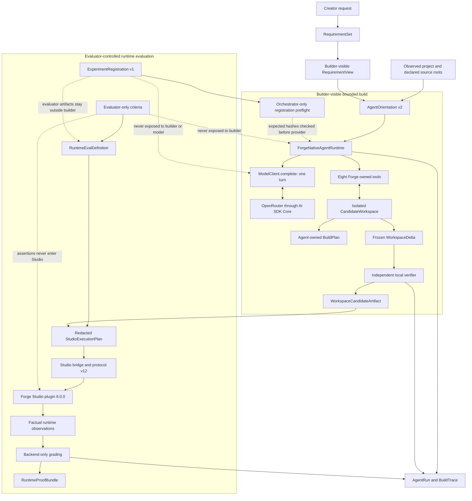
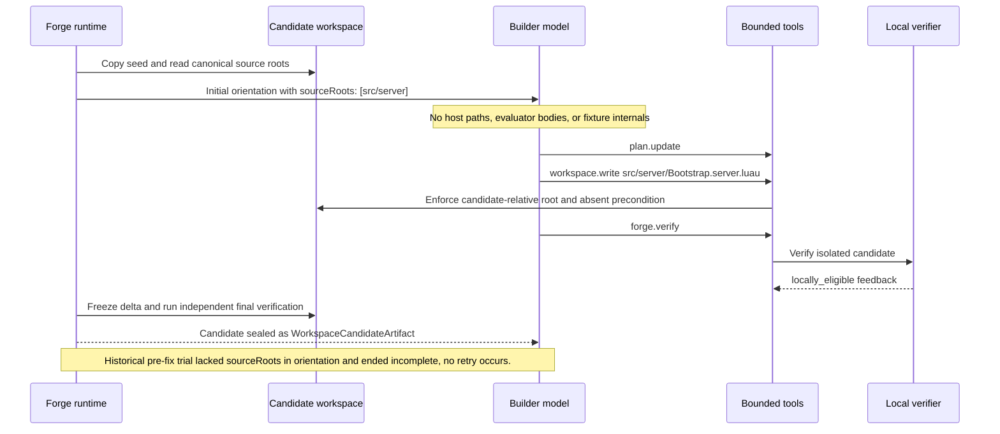
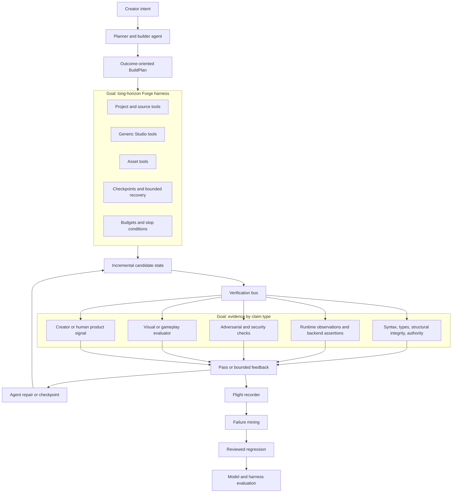

# Forge Architecture

This is the canonical architecture document for Forge. It separates the implemented system from an immediate, completed harness correction and the longer-term product direction. [FORGE.md](FORGE.md) defines the thesis and non-goals; [EVALS.md](EVALS.md) defines what the system may claim; [ROADMAP.md](ROADMAP.md) records demonstrated evidence and next work.

## Status legend

- **Implemented** means the boundary exists in the current repository.
- **Demonstrated** means a local test or creator-run Studio canary established the stated evidence; it does not imply a broader claim.
- **Goal** means an intended architecture component that is not implemented or authorized as current behavior.

## Current implementation

The current build path begins with scoped authority, gives the builder only sanitized facts and bounded capabilities, then independently verifies and seals a candidate. Runtime evaluation is a separate, evaluator-controlled path: Studio observes facts, and backend code grades them.

The builder receives the canonical, sorted `orientation.content.sourceRoots` facts before its first turn. It may use them only as candidate-relative prefixes for `workspace.write`; the workspace still enforces traversal, symlink, extension, stale-hash, absent-file, and budget protections.

### Current implementation inventory

| Boundary | Implementation | Entry point or evidence object | Status |
| --- | --- | --- | --- |
| Requirement authority | `semantic-authority`, `semantic-map`, `context-compiler` | `RequirementSet`, `RequirementView`, `AgentOrientation` | Implemented |
| Bounded build loop | `agent-runtime` | `forge agent build`, `HarnessConfiguration`, `AgentRun`, `BuildPlan`, `WorkspaceDelta` | Implemented |
| Registered experimental treatment | `experiments` | `forge experiment register`, `ExperimentRegistration`, `forge experiment build` | Implemented; the frozen Vertical Shuttle registration yielded one locally eligible candidate and one exact registered runtime verdict |
| One-turn model transport | `model-client` | `ModelClient.complete`, isolated OpenRouter AI SDK Core adapter | Implemented |
| Local eligibility | `verifier`, `luau-toolchain` | `forge verify`, `VerificationReport` | Implemented |
| Sealed candidate | `agent-runtime` | `WorkspaceCandidateArtifact` | Implemented |
| Runtime observation | `studio-protocol`, `studio-bridge`, `studio-capabilities`, `studio-runtime`, plugin | `forge studio bridge`, protocol v12, plugin 8.0.0 | Implemented; bounded capability canary and one exact Vertical Shuttle evaluation demonstrated factual observations |
| Runtime grading and proof | `studio-capabilities`, `studio-runtime`, `proofs`, `flight-recorder` | `forge experiment evaluate`, `RuntimeProofBundle`, `BuildTrace` | Implemented; one exact Vertical Shuttle verdict is `runtime_verified`; no MovingPlatform candidate runtime verdict exists |

## Harness correction from the consumed trial

The sole MovingPlatform model trial is preserved as `incomplete / agent_failure`; it is not retried or reinterpreted. The regression below demonstrates the correction with a fake provider and a dedicated empty-root fixture, not with a model or Studio run.

The deterministic regression records these identities for the corrected empty-root treatment:

- orientation content hash: `292532c19fd966796c62c6af4ef0e4d6ebd298c9e3bd645ad197064424d1ffbd`;
- ordered tool-description hash: `b84ebc2580666fb7c8711d9d81ad08525b72b9b1ad2b29641d92ef9df0a72d8b`;
- harness configuration: `harness_configuration_9c8fa37507f13c2a7f8aa837` / `9c8fa37507f13c2a7f8aa837167bf668ba5f48a9608a8229480de75028731f98`.

## Long-term product goal

The goal is a longer-horizon Forge harness, not a return to a mechanic compiler. The components below are architectural targets only; none grants a present capability, changes the semantic-authority boundary, or authorizes new model or Studio runs.

The verification bus preserves the existing authority model: deterministic checks establish only modeled properties, runtime systems return observations rather than verdicts, qualitative assessment remains distinct from deterministic grading, and creator satisfaction remains a product signal rather than an engine fact.

## Horizon comparison

| Concern | Current implementation | Immediate correction | Goal |
| --- | --- | --- | --- |
| Builder context | Sanitized requirements, project facts, and canonical source roots | Demonstrated with an empty source root | Richer bounded project, Studio, asset, and checkpoint capabilities |
| Agent loop | Native Forge-owned multi-turn runtime with one-turn transport | Same runtime identity with corrected capability disclosure | Longer-horizon, outcome-oriented iterative work |
| Verification | Local verifier plus three generic runtime observation capabilities | Local candidate sealing is regression-tested | Verification bus spanning deterministic, runtime, adversarial, qualitative, and human signals |
| Runtime authority | Plugin returns bounded facts; backend grades | No Studio run performed | Same separation retained as capabilities broaden |
| Learning loop | Build traces, preserved failures, and hash-locked registrations | Vertical Shuttle is prepared as a new registered treatment | Failure mining and reviewed regression-driven model/harness experiments |

## Architectural invariants

- The evaluated unit is model plus harness plus tools plus environment plus evaluator configuration.
- Forge owns turn control, tool dispatch, workspace access, budgets, stopping, final local verification, and evidence; providers remain one-turn transports.
- A registered experiment binds its task, seed, source roots, implementation snapshot, model transport, budgets, evaluator configuration, orientation, tool descriptions, and harness configuration before its first provider envelope. Its private evaluator artifacts never enter builder context.
- Builder-visible inputs never include evaluator bodies, benchmark oracles, hidden thresholds, runner source, secrets, or private runtime observations.
- Studio executes canonical data plans through fixed trusted code and returns factual observations only; no arbitrary Luau, callbacks, expressions, or property access enter the plugin boundary.
- `eligible`, `locally_eligible`, `rejected`, `incomplete`, and `runtime_verified` retain the meanings defined in [EVALS.md](EVALS.md).
- Obsolete mechanic compilers, PatchSets, provider-owned loops, mechanic-specific Studio harnesses, and deleted packages are not part of this architecture.
