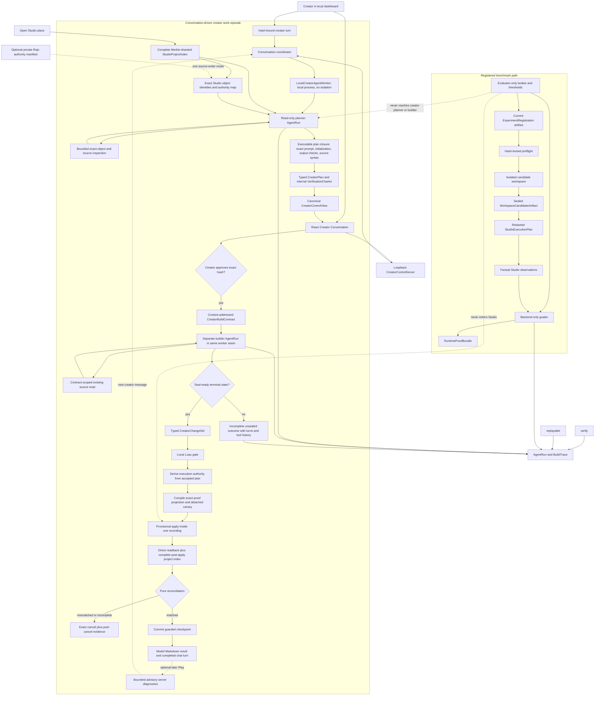
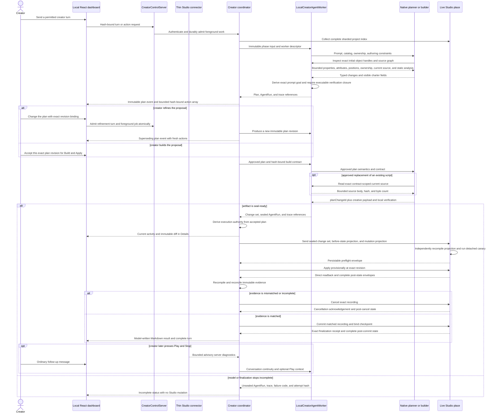

# Forge Architecture

This is the canonical description of Forge's implemented and target architecture. [FORGE.md](FORGE.md) owns the product thesis and invariants, [EVALS.md](EVALS.md) owns claim semantics, [ROADMAP.md](ROADMAP.md) owns demonstrated status and next work, and [RESEARCH.md](RESEARCH.md) indexes historical evidence.

Forge has one current clean-break artifact and message shape. `kind` discriminates unions, while canonical hashes and content-addressed IDs bind exact artifacts, policies, tools, workers, the generated capability manifest, and the authenticated evidence graph. Changing a shape replaces it outright.

## Current implementation

The primary product path is conversation-first and Studio-native, with creator
control in a local React dashboard. A hash-bound creator turn begins new work,
clarification, plan refinement, or a follow-up only when its current
`CreatorControlView` permits that turn. Forge first produces a read-only plan
and an internal verification charter. Accepting that exact plan authorizes a
separate builder to stage, check, and automatically apply its typed change set.
The host derives execution authority from the accepted plan; it never records
a fictional creator approval of an unseen diff. Matched edits commit before the
model-written Markdown result appears. Play is optional context for later turns. The open Studio
document owns ordinary model/property work. An explicitly opted-in Rojo map
additionally marks exact mapped source paths that may use the guarded filesystem
writer. The sealed plan, build contract, and change set derive one writer from
their exact targets; a mixed-authority batch is rejected before approval.

The model-facing planner accepts one compact authoring format. Existing targets
use inspected `objectId` handles; create and move parents use an observed handle
or declared engine container. Forge resolves exact identities, ownership,
classes, paths, and initialization. Newly planned objects cannot parent other
planned objects. Steps bind local change IDs, and additional checks use one
discriminator. Forge generates required existence and Luau syntax checks before
approval. Existing-source consultation and dependency-closure requirements remain
mandatory. Builder property references likewise use inspected handles; immutable
contracts retain the resolved evidence. Full evidence is stored separately from
the concise model-facing steps, checks, inspection paths, and shared policies.

Plan publication and Build share approval-independent preparation validation,
including target shape, sealed class policies, and inspection bounds. A failure
before dispatch records a preparation diagnostic without inventing an AgentRun,
provider receipt, or terminal journal. The conversation presents that original
cause and offers Retry build only for an approved plan with no mutation history.
Retry uses a fresh execution slot and rechecks the current project, capability
manifest, connector epoch, and open recordings. Changed authority requires a
fresh plan and approval; unavailable preparation remains a preparation failure.

Planning source-analysis failures use the same preparation binding and retain
their original code, full diagnostic, and reserved execution identity through
restart. A never-dispatched preparation failure has no AgentRun or provider
journal. Private source staging gives synthetic Rojo containers explicit Folder
classes. Whole-project semantic collection is bounded separately from query
pagination: 16,384 symbols, 4,096 references per symbol, and 65,536 reference
rows; overflow remains incomplete with a resource-exhausted classification.

Terminal conversation messages are identified by episode, session ID, project
revision, and outcome content. Finalization acknowledgement and cleanup changes
to the session hash cannot publish that same result again. The timeline applies
the same identity to repeated events while preserving the immutable evidence.

The native runtime preserves an otherwise valid rejected assistant batch,
opaque continuation, and matching tool-error messages without executing any
rejected tool. Malformed IDs and unknown tools use bounded standalone feedback
instead of invalid provider message pairs. Three repetitions of the same
normalized failure without accepted host progress stop work. Completed host
outcomes end the phase immediately, without another model request. Search and
child queries support bounded batches; source counts and revision-bound cursors
remain explicit. The exact creator request is rendered once, separately from
history, preferences, and observed facts.

Provider-neutral usage retains nullable reasoning and cache counts. Each journal
request records UTF-8 sizes for system instructions, conversation, tool schemas,
and tool results; these are request-size measurements, not estimated token usage.
Activity details aggregate those sizes, request count, elapsed time, and reported
usage. Medium reasoning and the 20-minute response deadline remain unchanged.
Tool calls may carry a bounded public `activity` sentence describing the feature-level
goal. The host removes that presentation field before dispatch. Each inline activity
disclosure reads this explicit summary, never reasoning blocks or opaque continuation payloads,
and adds no separate inference request. Missing summaries retain a plain phase label,
not a copy of the last tool operation. Public assistant commentary is rendered as Markdown.
Each job is anchored after its admitting creator event sequence (not its earlier job-creation timestamp) and beside its own result; completed projections are cached
by immutable job hash. Expanding a disclosure reveals steps and usage in document flow;
Escape closes a focused disclosure while drafting elsewhere leaves it open. A light text sweep
runs only during active work, with a static reduced-motion presentation. Host-owned
Apply and finalization have their own status and do not imply a model request.
Optional Play diagnostics never keep a foreground job running.

Staged Studio candidates use a host-owned strict Luau analysis configuration in
their temporary approved topology. Source bytes and diagnostic line numbers are
unchanged; the gate no longer silently defaults unannotated drafts to nonstrict
analysis. Builders review API usage, numeric validation, replay/rate-limit
behavior, and cancellation before the final verification call, and batch
related edits in one atomic `studio.stage({changes: [...]})` call. Each batch
validates every payload, source budget, target and property policy before publishing
any draft operation or source blob; invalid entries leave the previous draft intact.
One combined diagnostic review follows the accepted batch. New scripts use `source`;
existing scripts use consulted UTF-8 `sourceEdits`. Static eligibility still does not
prove gameplay.

Before committing a matched Apply, the transaction owner drains advisory Studio
notifications with complete current-index confirmations under its existing lock.
An unchanged confirmation permits the original exact finalization; drift or an
incomplete read revokes authority and retains recovery. A queued notification alone
is not classified as a transport failure. The connector still checks its durable
manifest, revision and detector gate immediately before finalization.

Chat scrolling follows explicit reading intent. Upward navigation or expanding a
disclosure pauses following immediately, including near the bottom; returning to
the exact bottom or using Jump to latest resumes it. Content resize follows only
while attached. Positioned viewport and scroll containers keep hidden accessibility
labels inside the chat instead of extending the outer page.

`studio.patch_source` repairs an already staged new or existing script using its
exact current source hash and non-overlapping 1-based line ranges. Each edit gives
`startLine`, `deleteCount`, and complete replacement lines. All ranges refer to the same
original draft; no text searching, fuzzy matching, or earlier patch format is accepted.
`studio.read_draft` returns numbered, hash-bound pages without dropping source. The host
materializes a new immutable source blob under unchanged approved structural authority,
preserves staged properties, enforces byte/write budgets, and invalidates the local gate.
A rejected patch leaves the prior draft untouched. The pinned analyzer cannot resolve
casts in require paths; instructions and exact diagnostics direct the builder to inferred
GetService/WaitForChild chains while preserving shared modules and strict checking.
GUI inspection exposes collapsed fixed-size containers as layout advice; this is not a
claim of rendered client correctness.

Once all approved changes have been staged, every write receipt carries local
diagnostics with exact source hashes and numbered excerpts around all error locations.
This feedback does not seal a build: the model still reviews requirements and supplies
its final Markdown summary to `forge.verify`. Validation is reused only for the identical
complete operation set; unavailable tooling is retried. Any accepted write invalidates
the final gate. Property rules are deduplicated across classes in the model view while
the full sealed policy remains authoritative; no property, constraint, or source rule is removed.
Machine-check fields are shown once without their redundant generated prose.

Roblox hierarchy paths are presented as `Workspace.Airlock.OuterDoor`, with bracket
notation for names that cannot be Luau identifiers. Canonical slash-delimited evidence
paths and exact tool arguments remain internal identities; display strings never resolve
objects or authorize edits. User messages, source code, filesystem paths and URLs retain
their original bytes.

Conversation snapshots distinguish `applying`, `finalizing`, and `completed`.
Both append and reload enforce the same episode progression before publishing a head.
Exact committed mutation receipts recover completion without requiring a Play verdict.
`completed` means the accepted plan was built and applied, not creator acceptance or
Studio verification of gameplay. The builder supplies the final Markdown summary in
its successful local-gate call; no additional inference is purchased to restate it.

`studio.patch_properties` changes only named fields of an existing staged create or
update, guarded by the complete operation hash. Other properties, attributes, and
source remain intact. Full staging explicitly replaces the complete proposal.

Long conversations use automatic model-written compaction through the native runtime.
At a conservative 96 KiB history-input threshold, whole older messages are summarized
in bounded chunks; recent messages remain verbatim. There is no twenty-message cutoff.
Each immutable handoff binds its exact history prefix, predecessor, selected model,
execution journal, usage, and timing. Restart reuses that checkpoint. Failed compaction
does not advance the prefix or discard history. Summaries are agent context and never
become creator instructions, mutation approval, or observed evidence. Full original
events remain in the conversation store. This provider-neutral implementation does
not claim support for OpenAI encrypted compaction items.

The plugin listens quietly for optional Play Server errors and warnings. At Stop it
persists at most 32 bounded log entries; the Edit connector forwards an idempotent
project/build-bound receipt. The last indexed revision is labelled as a baseline,
not proof that the actual played scene was unchanged. The next creator request may
include the latest observations as untrusted advisory data. No model run, repair,
pass/fail judgment, or foreground waiting message is triggered by Play.

Before accepting, the creator may change or reject the plan. Refinement supersedes
the proposal and requires acceptance of the new exact plan. After completion, ordinary
follow-up messages continue in the same conversation; a new plan is required for new edits.

Every paired connector receives one opaque-object identity epoch derived from tagged, length-delimited project-index canonical material over the exact Studio session ID, paired project ID, and connector build hash. TypeScript and Luau hash that same material and share generated vectors. No endpoint may substitute JSON encoding or delimiter concatenation, and changing any of the three bindings invalidates every `studio_ephemeral` handle. Project-index projections and the connector registry must therefore agree by construction before collection begins.

The paired project ID itself is derived by one generated authority recipe used
by pairing, heartbeat identity adoption, Link/Fork, the bridge, and conversation
controls. An unlinked local identity always includes the exact pairing session;
linked local identity and published universe/place identity retain their durable
scope. Read-only heartbeat adoption cannot change an unchanged identity's epoch.
Link/Fork controls bind that epoch, so a control from an earlier pairing cannot
authorize a new connector.

Rejected Link/Fork commands carry exact command-bound
`StudioProjectIdentityRejectionEvidence`. Only an observed approved before-identity,
empty identity-transaction inventory, and proven absence of any recording release
the exact pending reservation. Open/unknown/unavailable observations retain
recovery authority; stale or duplicate settlements cannot release another
operation. The immutable identity job stores bounded readable diagnostics and
the complete rejected command/settlement. Explicit retry is legal only after
this no-effect proof or an undispatched job; old pairing inventory is not proof
of an ambiguous command's outcome. Technical details can retrieve verified
identity-job artifacts before any conversation exists, and a failure card stays
visible even when it has no legal action.

Project indexing is cooperative and terminating. Every declared root produces at least one shard, but an absent or empty root uses a one-shot empty-shard cursor that cannot repeat. Shard admission uses the exact incremental length of the tagged canonical material instead of repeatedly rematerializing a growing shard. Collection, canonical materialization, and transport encoding yield at bounded intervals and recheck the detector epoch and indexing deadline so a large valid place cannot monopolize Studio's plugin thread. Transport JSON uses a buffered encoder with an explicit empty-object marker; semantic hashes remain based on the tagged, length-delimited canonical form. Generated project-property metadata is a canonical ordered sequence, separate from the name-keyed writer lookup. Every indexed instance whose class is in the observation manifest must declare exactly that class's complete applicable property-name set and a class-valid canonical value for every declared property. Missing, extra, duplicate, unsorted, or invalid property coverage makes the index incomplete before reconciliation; it can never be converted into a mutation mismatch.

Project-index collection and publication are separate authority boundaries. The connector reads a whole capture against one detector epoch; a callback during that read discards the attempt and restarts the whole read under the same overall resource deadline. Once the read completes at a stable epoch, its canonical shards, revision, and capture hash are immutable historical evidence. Transport has a separate bounded deadline and never consults mutable detector state, so a delayed engine callback cannot retroactively invalidate already-captured bytes merely because a larger place takes longer to stream. After transport, the capture becomes the connector's current command gate only if the detector epoch is still unchanged. Otherwise it remains valid transaction evidence, the durably queued dirty notice blocks progress, and the host obtains a fresh complete capture before Play or finalization. A transaction notice received before direct post-Apply state exists remains an unadjudicated barrier; Forge never compares it with the unrelated pre-Apply snapshot or fabricates an incomplete verdict.

### Creator Conversation presentation boundary

`packages/creator-conversation` owns the clean-break durable presentation
records: a project conversation, creator/agent turns, work-episode snapshots,
events, plan revisions, creator-authority memory revisions, citations, jobs,
and hash-bound control views. It is an append-only immutable artifact chain per
conversation. Each append materializes all immutable bodies and the linking
commit before atomically replacing one private head file. That head binds the
exact latest commit; every load walks the predecessor hashes to sequence one
and rejects a cycle, skipped sequence, altered snapshot, or mismatched related
record. No historical session UI shape or compatibility reader participates.

The conversation coordinator is a presentation/control adapter over
`CreatorSessionCoordinator`, which remains the sole Studio action authority.
The lower coordinator derives `CreatorTransactionControlView` and its bounded
transaction actions (including their primary/secondary intents); the
conversation coordinator maps that state to durable events and the browser-safe
public `CreatorControlView`. Browser actions carry the public view's ID/hash
and an exact authorizing action instance; a card cannot make an action legal by
rendering a button. Event attachments reference only sealed artifacts.
Host-issued planner citation handles become source-range or project-fact
citations with exact revision/hash provenance, and the host—not a provider—
writes the bounded next-turn context artifact.

The current dashboard groups independent conversations under Studio projects.
Conversation IDs identify chats, while linked/published identity identifies the
place; a hash-bound New conversation action creates a chat without changing
Studio or calling a model. Each chat has separate turns, decisions, and evidence.
Explicit preferences share the original project conversation's memory authority,
exposed through a dedicated settings control view. They enter every chat's bounded
context, while another chat's turns and evidence do not. Project-scoped control
cache invalidation prevents stale admission when another chat owns unfinished work.

The React surface has a project sidebar, scrolling chat, anchored composer,
one-click Project settings modal, and lazy Technical Details sheet. Internal
turn kinds remain protocol data; the composer automatically uses the current
permitted kind. The journal-derived activity read model shows completed tool
steps and the current phase without exposing provider reasoning. A service
interval emits invalidations only while foreground work exists. It uses one module-level
`useSyncExternalStore` store and one SSE invalidation stream; the sheet can
show event bindings, citation targets, and raw JSON for attached artifacts. It
does not reintroduce the former workbench as a second route.

Work admission is durable, but execution is foreground-only. A
`CreatorWorkJob` reserves a globally unique, immutable `AgentExecutionSlot`
before each provider-bearing planner, builder, or repair phase. The slot binds
one AgentRun and the journal ID derived exactly from that run; it cannot be
reassigned after a restart. Its append-only `AgentExecutionJournal` records
hash-linked `request_intent`, `response_received`, `batch_validated`,
`tool_completed`, and `terminal` boundaries with exact host state.

Jobs run only in the live local creator service, not a daemon or detached
worker. Restart reads the journal, never synthesizes an intent: no head is
`never_dispatched` and permits an explicit fresh **Resume work** run; a
`request_intent` without `response_received`, or a `tool_execution_intent`
without matching `tool_completed`, remains `outcome_unknown` and permits an
explicit fresh **Retry work** run. A fully persisted provider response with
all tool completions and no pending execution intent instead permits an
explicit **Resume work** that consumes that exact response/tool boundary in the
same reserved AgentRun and journal, without re-dispatching the response or
reconstructing opaque provider continuation. A terminal journal may finish
only deterministic already-persisted local publication. No restart, journal
load, or stale/duplicate input can automatically dispatch a provider, Apply,
commit, cancel, rollback, or Play arm.

Model selection is a sealed, host-owned five-entry registry: `Muse Spark 1.3`
(`meta/muse-spark-1.3-contributor`), `GLM 5.3 Flash`
(`z-ai/glm-5.3-flash`), `DeepSeek V4 Flash`
(`deepseek/deepseek-v4-flash-0731`), `GPT-5.6 Luna`
(`openai/gpt-5.6-luna`, the default), and `Gemini 3.8 Flash`
(`google/gemini-3.8-flash`). Every entry requires tools and disables
model/provider fallback. Catalog evidence controls availability; an unavailable
choice is rejected rather than replaced, and an accepted agent turn requires
the response to attribute the requested model and a serving provider exactly.

Provider tool definitions explicitly set `strict: false` on the HTTP wire so
Forge's optional fields retain omission semantics. The pinned OpenRouter SDK
does not forward the AI SDK per-tool strict flag, so the transport supplies the
same named schemas through its call-level provider passthrough. Forge still
validates each complete batch and enforces exact parent selectors and
revision-bound pagination locally. Failed conversational work retains the
runtime failure code and a bounded explanation from its immutable AgentRun;
live activity derives failed-step details from the execution journal. Planning
remains read-only and must produce an answer, clarification, or reviewed plan
before the separate build and Studio approval actions.

Activity summaries share the browser contract's 240-byte UTF-8 limit, including
tool errors and multilingual queries. Structured diagnostics expose their short
message; complete payloads stay in the journal. Settings and project-navigation
actions never force internal job events into the transcript. Outcome publication
checks artifact hashes against the artifact store's exact canonical bytes
(including the newline), while attachment IDs and semantic hashes come from the
sealed outcome body. Artifact-file identity and semantic record identity remain
distinct.

The transcript presents one plan with concise implementation steps and a collapsible
human review guide. Machine checks stay in the canonical plan and Details, outside
the visible plan summary. A plan outcome's agent-turn record remains durable but is
not rendered a second time beside its plan revision. Action receipts without a
creator report and internal activity records stay out of the transcript; any
current action on a hidden record retains its exact authority in the current
action area. Project notices coalesce across intervening activity records.
One header Details entry exposes an event selector for all loaded evidence;
message ellipses, citation buttons, run-detail buttons, and settings shortcuts
do not create duplicate routes to that sheet. Long messages expand in place.
Timestamps show local time for today and a date for other days.

Browser presentation preferences (conversation pins, sidebar visibility, and
send-shortcut choice) live in one current local-storage format and do not enter
project memory or model context. Drafts and unresolved request bodies use one
tab-scoped session-storage format. Restoring a draft never dispatches work;
retrying an unresolved request reuses its exact body and idempotency key. The
coordinator still determines every available action. A provisional project-link
control view selects its own provisional conversation instead of binding to an
older project's transcript, preferences, or activity after a Studio restart.

Creator-facing model prose is instructed and rendered as GitHub-flavored
Markdown. The renderer disables raw HTML and external image loading and keeps
code copying separate from workflow actions. Markdown formatting does not alter
the typed plan, contract, tool input, staged source, or property-value formats.

Builder context references each applicable property policy once by an index.
Expanding those references reproduces every sealed contract change exactly;
the stored contract and its hashes are unchanged by this model-facing view.
Staging failures retain field names, the change ID, and correction guidance,
without echoing source bodies or a second copy of the complete contract. The
journal still records the original input. Generated authoring policy enables
the Font codec for current `FontFace` properties, without reviving deprecated
`Font` aliases.

Generation now requires every implemented codec to have an API-type mapping,
and every eligible property in an enabled class to have a codec or an explicit
authority exclusion. An uncovered type fails the build instead of silently
shrinking authoring support. ContentId strings and modern Content URI objects
share canonical URI evidence but have distinct native conversion and reflection
contracts; empty content is a valid cleared asset. Object-backed and opaque
content cannot be serialized as URI evidence. Offline plugin checks round-trip
every codec through Lune's Roblox datatypes and exercise every content property.
These checks do not replace native Studio reflection and transaction evidence.

The connector's property-change detector follows the same generated property
set as project indexing, plus indexed name, parent, source, and tag changes.
Unindexed camera movement and derived UI geometry cannot dirty a plan. All
hierarchy, attribute, and recording checks remain in force. Repeated notices
during one refresh preserve the pre-invalidation status instead of replacing
it with `refresh_required`; a complete unchanged refresh can terminate and
publishes an explicit up-to-date result.

Studio identity uses a separate protocol rather than the authoring manifest.
The reserved `_forgeProjectId` lives on `Workspace`, whose attributes survive
Roblox place serialization; root DataModel attributes do not. There is one
current storage location and no old-location reader.
For a local place, an absent `_forgeProjectId` can be **Link**ed to a fresh
Forge project ID and an observed ID can be **Fork**ed to a different one, each
through a host-issued exact-state ChangeHistory transaction with direct
readback, receipt, acknowledgement, and recovery cursor. Saving a linked local
place under another name carries the copied ID until the creator explicitly
forks it. A published place instead derives identity from its exact universe and
place IDs; an embedded local ID never silently continues into that published
conversation. Link, Fork, and the local-to-published continuity choice are all
explicit, hash-bound creator actions; none is inferred from a filename or
connector heartbeat.

Project and conversation display names are separate workspace metadata. The
authenticated rename endpoint resolves a known conversation to its existing
project identity, then atomically saves the cosmetic label in
`creator/workspace-labels.json`. Renaming never changes Studio identity, the
place filename, conversation hashes, approvals, or model context. Project labels
are shared by all conversations with that exact project ID. The sidebar edits
these labels inline, while prompt input grows automatically from one line to a
bounded height. Public activity and individual tool steps expand in place;
private provider continuations are not dashboard presentation data.

Pairing may prepare an empty starting conversation for the currently open place.
That automatic entry appears only while its project is paired, until an explicit
Link/Fork receipt, creator action, work, or display name retains it in the workspace.
Switching places therefore cannot leave unused background pairings as phantom
sidebar projects. The projection preserves all immutable records and never groups
different project IDs by filename. A stale selection of an unused entry resolves
to the current project instead.

This boundary is presentation-ready, not Studio-demonstrated. Node, dashboard,
plugin-module, and formal tests exercise the contracts and synthetic paths but
make no provider request or Studio action. One creator-run Studio canary must
exercise pairing, conversation continuity, a permitted action, and the
transaction/Play boundary before any claim that this new shell has completed a
live end-to-end path.

Registered experiments remain a separate benchmark path. They use file-backed seeds and evaluator-only material to produce scoped evidence; those task JSON files are not product inputs for an ordinary creator session.

The two paths share the native model runtime, Studio bridge, factual observation substrate, and evidence infrastructure. They do not share semantic authority. A creator charter is a visible, creator-approved hypothesis; a benchmark evaluator remains private and may grade only its registered treatment.

### Conversation-driven creator sequence

The planner cannot write. Before proposing source-bearing work it explores the immutable `StudioSourceIndex` with bounded search, paged reads, symbols, references, and static require traversal. Forge—not the model—seals the exact returned ranges and graph closure as `CreatorSourceConsultation`; all such results remain `static_analysis`. The host executes only verified pinned Rojo 7.7.0 and Luau LSP 1.63.0 binaries. LSP work is bounded to one 30-second session, five seconds per request, 1 MiB messages, 200 symbols, 200 references per symbol, and 1,024 returned reference rows. Dynamic or unresolved requires are not guessed. Both planner and builder may query the pinned official Roblox catalog, but catalog results cannot widen the mutation manifest. The builder cannot mutate Studio and may read only the approved consultation closure. Existing-source work is `edit_source`: sorted, non-overlapping UTF-8 byte edits bound to the consulted before hash. Forge materializes the complete candidate, verifies its final hash and byte count, and presents the exact diff. The native runtime retains its bounded completion-repair and progress-token semantics, and the local worker persists every sealed or unsealed phase outcome. `DEFAULT_AGENT_BUDGETS` remains the sole fallback for agent work; complete Studio indexing is governed separately by the persisted `CreatorResourcePolicy`.

Repeated-rejection identity is equally exact: it binds the call payload, canonical rejection-result hashes, and current host epoch. An accepted state transition clears both rejected and executed repetition history, including when state content later cycles to an earlier hash. The same model call with materially changed validation feedback is not called an identical loop. Planner tool metadata also exposes cross-field constraints such as the exact generated position-series capacity formula before the first proposal.

The approved plan is compiled into a content-addressed `CreatorBuildContract` before the builder's first turn. The plan declares exact initial object handles already inspected by the planner; the contract carries the closed `StudioObjectIdentity`, display path/class preconditions, and exact parent handle. A parent is either an indexed instance identity or a manifest-declared engine container—never a name lookup. For each approved change the contract fixes the change ID, operation ID, kind, destination, parent, class, enrollment, and precondition. Targeting an ephemeral existing object authorizes one deterministic `_forgeStableId` enrollment inside the same visible ChangeHistory recording; cancellation rolls that metadata change back with the rest. Forge derives all authority-bearing fields while the model supplies only `planChangeId` and the permitted creative payload. Staging is a virtual proposal map keyed by `planChangeId`, not an append-only mutation log: a later valid proposal atomically replaces the current value, a rejected replacement preserves it, and every accepted replacement invalidates the local gate.

Creator Luau verification analyzes the projected post-change DataModel, not a flat collection of temporary files. Forge compiles generated engine-owned authoring containers, bound initial instances, and staged create/move/delete/update/source operations into an exact temporary Rojo topology, mounts every staged Script/LocalScript/ModuleScript at its approved logical Studio path, and then runs the official syntax plus Roblox-aware type tiers. Exact source bodies from unchanged Studio scripts are materialized as host-private dependency files, including move/delete rebasing, but only staged candidate files are analyzer entry points and only their source is model-writable. This preserves both newly staged and pre-existing module resolution without widening model source authority. Before diagnostics reach the model or local-gate hash, Forge replaces temporary paths with logical Studio paths and includes the exact range, bounded analyzer message, `planChangeId`, and operation ID. Repeated verification of unchanged staged state therefore has stable issue identities and enough information for an atomic source replacement.

The dependency-floor `studio-evidence` package owns the closed capability algebra. A normalized `RobloxApiCatalog` is generated from an exact official `Roblox/creator-docs` commit and source-tree hash; it records every documented class/member, datatype/member, enum/item, global, standard library/member, signature, security/capability tag, inheritance edge, and source provenance. `StudioCapabilityCoverageReport` classifies all 9,685 catalog entries exactly once. Its current partition is 840 `authorable`, 18 `observable_only`, 7,302 `source_only`, and 1,525 `unsupported`. `source_only` means a nondeprecated entry is available as official Luau authoring context but has no typed transaction or behavioral proof route. Deprecated, hidden/NotScriptable, and security-gated entries remain searchable but restricted. This report is exhaustive accountability, not mutation authority. The separately generated canonical manifest enables 47 coherent classes and 630 property applications from 370 distinct catalog declarations only where the writer/readback/preflight/projection/comparator proof is complete; enum closure and inherited applicability account for the 840 authorable coverage rows. The manifest carries an `evidenceContractHash` over the generator and TypeScript evidence/project-index algebra, so changing a projection, canonicalization, or revision hash domain necessarily creates a new manifest identity. Selection is generated from the catalog for each policy-selected class group and supported codec family, including URI content and modern `Content` objects, with structural `Name`/`Parent` and engine-owned security capabilities excluded explicitly. Restricted enum types cannot enter the writer through an otherwise enabled inherited property. It also owns a sorted, parent-closed `authoringContainers` topology for engine-created parents: every allowed service root and the fixed `StarterPlayerScripts`/`StarterCharacterScripts` containers. Those rows authorize only the parent relation; they never enter the mutable project inventory or grant property/source authority. Any other parent must be an exact Studio-document-owned identity/path/class anchor in the complete initial index, but its class need not be authorable because containment and mutation are separate authorities. Generated Luau preflight resolves every used container and checks its exact class before recording and again at apply. Deterministic generation emits TypeScript validation/compilation plus bounded Luau dispatch and shared canonicalization vectors, and fails on upstream drift, stale output, duplicate or unclassified entries, malformed container topology, a manifest/coverage mismatch, or any missing proof leg. Reflection checks only these curated property rows under the plugin's current security context and cannot expand them. Every manifest property carries its catalog type identity, declaring class, and a closed reflection expectation with required engine/storage and Luau script types plus an enum or Instance constraint when applicable. The connector emits raw `EngineType`, `ScriptType`, `EnumType`, and `InstanceType` dimensions plus owner, inheritance, serialization, and permissions without grading them. One pure backend verifier compares every required dimension independently. Numeric catalog types such as `float`, `double`, `int`, and `int64` retain their exact `EngineType` while sharing the Luau `ScriptType` `number`; class references require `RefType`/`Instance` plus `InstanceType`; enums require `Enum`/`EnumItem` plus `EnumType`; and datatype aliases such as `CoordinateFrame`/`CFrame` and `Rect2D`/`Rect` remain explicit. A missing required dimension is `incomplete`, while a contradictory present dimension is `rejected`; bounded structured findings retain an authorized raw artifact. Tagged, length-delimited evidence material normalizes floats and integers, negative zero, RGB8 colors, compound datatypes, bounded sequences, enums, stable class-constrained Instance references (including an explicit class-bound nil value), UTF-8, and explicit presence independently of JSON key order or language number formatting. Catalog namespaces remain distinct: a datatype can never be enabled through a same-named enum route.

Exact mutation and Play observations use `StudioEvidenceEnvelope` bound to one `StudioEvidenceProjection`. A fact is exactly `observed`, `absent`, `unavailable`, or `read_error`; omission is never interpreted. For an exact projection, complete means every required key appears once in canonical order and every result is authoritative `observed` or `absent`. It deliberately does not mean the result matched the expected status or value. Expected comparison occurs only in pure reconciliation or grading, so a wrong value or absent required instance is complete, replayable mismatch evidence. `unavailable`, `read_error`, missing, duplicate, extra, misordered, or misbound facts are incomplete. Whole-project truth never uses that envelope: only a complete `StudioProjectIndexManifest` and all independently verified shard/source leaves can produce a `StudioProjectRevision`. Each manifested node carries explicit property coverage produced from the same generated ordered metadata used by the host validator; an empty or partial coverage set for a manifested class is incomplete observation, never evidence that approved properties disappeared. A complete mutation projection is recompiled independently by the connector from the sealed change set and retained before-index graph. It contains proof requirements, not a second project-delta allowlist; pure reconciliation derives the only allowed Merkle delta from the approved operations. A parent delete follows exact index identity edges and projects structural absence for opaque descendants without granting their classes property-write authority. Detached canaries occur before ChangeHistory; then provisional mutation, direct object readback, and a complete after-index occur inside one recording. The automated gate serializes host-produced projections into the production Luau recompiler so the two runtimes cannot be tested only against separate fixtures.

The creator verification charter is compiled before mutation. Exact mutation/runtime checks still use `StudioEvidenceEnvelope`, but whole-project truth has one path only: `StudioProjectIndexProjection` → complete `StudioProjectEvidenceShard` and `StudioSourceBlobChunk` sets → `StudioProjectIndexManifest` → `StudioProjectRevision`. Leaves contain at most 512 nodes or 4 MiB canonical JSON; transport chunks are at most 256 KiB. The default policy permits 1,048,576 instances, 1 GiB aggregate index material, 128 MiB per source blob, and ten minutes. Missing, duplicate, reordered, extra, or tampered leaves cannot form a revision. Runtime observation remains bounded by the generated manifest and normal Stop defines its authoritative endpoint.

Ordinary solo Play creates distinct Edit, Play Server, and Play Client data models, so creator verification never relies on an Edit-data-model `RunState` callback surviving the transition. The Play Server connector instance is the sole runtime evidence producer: it validates and resumes the persisted arm, installs bounded diagnostics plus `DirectRuntimeObserver`, performs its first reads, and only then emits the exact request-bound start. Generated manifest result dispatch resolves targets synchronously, reads one-shot identity/property/position facts directly, and samples all series concurrently through one `RunService.Heartbeat` connection. `LogService.MessageOut` supplies bounded warning/error diagnostics only; no Script, source string, print prefix, output parser, or place-object IPC exists. Stop disconnects sampling, seals the actual in-memory prefix, and persists a terminal receipt before transport. The Edit connector does not guess that Play ended. After the backend has validated the exact terminal evidence, it sends `FinalizePassiveRuntimeEval`; only the matching Edit-side arm/receipt may transition to a readback-verified inert finalization tombstone, and `PassiveRuntimeEvalFinalized` is required before grading can advance. The tombstone can replay only that deterministic acknowledgement, never the observer. Duplicate deterministic lifecycle messages are inert. Plan acceptance and post-Stop finalization have normal bounded connector timeouts, but waiting for the creator to press Play has no transport timeout. Creator verification never calls `ExecutePlayModeAsync`, starts or stops Studio, or interprets normal Stop as failure. Programmatic registered evaluations and canaries use the same direct observer under the separate `StudioTestService` lifecycle.

The current passive handoff is a clean-break `ForgePassiveRuntimeDirectV2` setting with `ForgePassiveCreatorRuntimeDirectV2` bodies. The incompatible V1 key has no reader. A malformed current-version setting cannot pair, replay, finalize, or produce a gameplay claim automatically, but it also cannot deadlock transaction recovery permanently: the connector exposes one explicit **Discard invalid receipt & recover** creator action. That action refuses valid evidence, clears only the invalid passive setting with readback, and then pairs read-only so the independent ChangeHistory recording inventory determines whether recovery is required. It never commits, cancels, retries Play, or clears a creator recording.

Runtime evidence incompleteness is non-destructive and visible. A short but valid series prefix captured at creator Stop is an observed fact and is graded as captured; an absent projected target is authoritative complete evidence and can fail the charter. Only unavailable/read-error, missing, duplicate, extra, invalid-order, or invalid-binding evidence is incomplete. Forge persists that draft, leaves the already-matched provisional recording open, moves to `awaiting_verification_retry`, and shows the completed interval, observed/absent/unavailable/error counts, diagnostics, immutable artifact, and exact gaps. The only actions are a view-hash-bound **Retry Play Verification** or **Cancel Changes**. Retry binds the incomplete draft, matched mutation attempt, stopped/finalized receipt, revision, and exact open recording before arming once. There is no automatic re-arm path.

The only current private creator store is `.forge/creator`; there is no legacy reader, migration, or alternate storage shape. It holds both creator-session evidence and the clean-break conversation heads/immutable commit artifacts. Deleting `.forge` is a deliberate hard reset performed only while the control process is stopped, and first use creates a fresh current store. Bundles reference the exact creator request, manifests, pairing attestations, projections, envelopes, reconciliations, mutation attempts, execution plans, creator reports, AgentRuns, and traces through root-relative `ArtifactReference`s. There is no auxiliary prompt sidecar whose lifecycle can diverge from the session bundle. Observation history is chronological, not a set: consecutive identical captures are a no-op, while A → B → A records all three authoritative boundaries and leaves the rollback state as the current tail. A failed detached canary is retained as an incomplete attempt with exact before-state and failure facts; it is replayable only to the explicit absence of a mutation verdict. A mid-batch execution failure is likewise retained without a verdict only after its same-call cancellation, complete final state, and durable receipt are stored. The in-flight transaction cursor contains references only—including an immutable execution-failure reference—and is persisted before a recording may open or while a receipt remains unacknowledged. On every load, Forge verifies regular-file and symlink safety, canonical bytes, hashes, graph bindings, conversation commit order, and every referenced agent-execution journal. If a process stopped after a settled mutation attempt was persisted but before the session tail advanced, startup replays that attempt and advances only local metadata to its persisted final state; it never repeats the Studio operation or provider work. Provider-free mutation replay validates and recompiles against the immutable manifest and build-policy snapshot stored for that attempt, not whichever manifest happens to be current after later capability growth; live authoring always uses the current generated manifest. It then regrades readback and the allowed state delta and reproduces reconciliation status and failure-fact hashes. Verification replay additionally requires a linked exactly replayable `matched` mutation. AgentRun and trace artifacts carry real root, provider-turn, and tool-call intervals. Final judgment is an immutable creator-authority `CreatorReviewReport`, never a source of machine claims.

Restart is fail-closed. Interrupted worker phases become `incomplete / control_process_interrupted`; any phase that might own a recording becomes `recovery_required`. Creator control views are ephemeral, so after restart the coordinator reconstructs their detail from the durable session, approvals, transaction cursor, mutation attempts, verification records, and failure binding. A terminal or recovery view may never fall back to a generic ready message: it must state the proven interruption boundary, the evidence that does or does not exist, the prohibited automatic actions, and whether the only valid next step is recovery or a fresh request. Plugin settings are treated as a restricted external JSON store: three mutation keys plus the single current passive-runtime key are punctuation-free, every phase writes a fresh immutable snapshot, and Forge immediately reads back the exact recording/finalization binding before crossing the next Studio boundary. A clean-break connector ignores removed key names outright. Settled notification-only metadata from a different manifest may be discarded without calling Studio because it cannot represent an open recording. A possibly open recording cursor is never discarded or reinterpreted: pairing fails closed while preserving the cursor unless its manifest is the current generated contract and its exact persisted project-index graph is available. Recovery messages, observations, cancellation, and acknowledgement all require that same current manifest. Installing a new manifest while a transaction may be open is therefore prohibited; recover it with its exact connector build first. The opening intent must be durable before `TryBeginRecording`, and Studio's returned opaque recording ID must replace that intent durably before the first place operation. The connector never automatically commits or cancels on startup, unpair, unload, or transport loss.

Every new pairing must complete a creator-transaction inventory before Forge may start another request or provider call. That inventory is a product, not one status bit: a connector may have a possibly active recording cursor and may separately retain an unacknowledged settled finalization receipt. The generated connector identity hashes the capability manifest, current protocol source, the host coordinator/bridge/runtime/source-transport participants, plugin project configuration, and every authored plugin source file; generated output is excluded to avoid a circular identity. The bridge therefore rejects a stale host/connector transaction implementation—not merely a stale protocol declaration—before creating a session. The local CLI also hashes every compiled runtime input into `dist/runtime-build-manifest.json` and refuses startup when `dist` no longer corresponds to the checked-out source. A retained receipt is reported first and suppresses an independent recording-`none` report until the receipt is acknowledged. Forge immutably stores that exact receipt before sending its acknowledgement; after consuming it, the plugin performs a fresh scan and correlates the resulting `none`, `open`, `not_open`, or `unknown` report to the acknowledgement request. An uncorrelated or stale `none` can never release a receipt obligation. Request correlation is not lifetime ownership: the coordinator snapshots whether an exact local finalization waiter exists at message delivery, so a late request-bound receipt whose waiter timed out or failed is recovered and acknowledged centrally instead of being ignored forever. All inbound creator-protocol messages are serialized per Studio session, so async artifact persistence cannot reorder a replay, acknowledgement, and later inventory report even if transport deliveries overlap. Approval checks inventory before consuming the control view, and Apply checks it again before preparing or opening a recording, closing the review-to-command race. Each source-bearing transaction moves every immutable blob through a request-bound `receiving → accepted` state machine: chunks and the reconstructed body are verified before the one-way transition, duplicate completion is rejected, and only an accepted body from that exact request may reach `Prepare`. A missing acknowledgement is an incomplete preflight attempt. Abandoned preflight/source state is mutation-free and may be replaced by a later request, including a source-free request; recording state is never cleared by that replacement. Prepare, detached preflight, and the immediate pre-recording guard retain the same authoritative pre-Apply capture and require its external-change detector epoch to remain exact, without emitting redundant index streams. The request ID carries only the later receipt-bound post-state stream, preventing a valid earlier capture from being mistaken for post-mutation evidence. Plugin errors are correlated to that exact request and cannot poison another live transaction. This gate is project-level, so deleting or resetting the coordinator session store cannot orphan plugin transaction state and bypass recovery. `open` permits only the dashboard's hash-bound creator cancellation; `unknown` remains blocked. For `not_open`, the coordinator first verifies and immutably stores the exact complete project-index graph, opaque recording binding, and recovery record. It may then acknowledge those exact hashes. The connector rechecks `ChangeHistoryService:IsRecordingInProgress`, clears only its matching durable cursor, makes no Studio mutation, and returns an exact acknowledgement that the coordinator also stores before releasing the project. A matching interrupted session ends `incomplete`; it is never resumed or finalized. Settled commit/cancel receipts remain durably replayed until this acknowledgement-correlated evidence graph closes. Inbound processing errors are surfaced as fail-closed pairing state rather than terminating the control plane; a command failure before a recording can open records a replayable incomplete mutation attempt and terminates the session rather than leaving an apparently live `preflighting` session.

Closed-recording recovery retains the old cursor as `closedMutation` together with its exact acknowledgement artifact, and removes live mutation authority atomically with the `incomplete` session transition. Loading that bundle verifies the acknowledgement, its `not_open` recovery record, both complete project captures, and every transaction identity. The historical cursor cannot authorize a retry or finalization. It does not establish a commit, cancellation, or rollback; a later message reads the current project in the same conversation.

Change presentation and current-state display have deliberately different
baselines. Exact reviewed operations are always projected from the immutable
pre-mutation capture bound to their change set or mutation attempt. After a
provisional Apply, the current index is shown separately and is never fed back
into the operation-precondition compiler. Artifact persistence and semantic
Studio transitions also form a one-way error boundary around presentation and
delivery: once a fact is durable, failure to render a view, notify an SSE peer,
or deliver a deferred acknowledgement cannot revise it or synthesize a second
verdict. Detached coordinator tasks and HTTP request/socket callbacks terminate
inside non-throwing supervisors. A lost state-changing browser response is an
ambiguous delivery outcome; the dashboard performs one canonical read-only
refresh and never resubmits the action automatically. If the creator retries,
it sends the retained byte-identical request body with the same idempotency key,
not a reconstructed request with a new key.

Command transport has its own evidence boundary. `/poll` returns a retained canonical command plus its SHA-256 rather than destructively dequeuing it. The plugin verifies those bytes before decoding, caches an exact bounded `StudioCommandSettled` receipt before transport, and reports either `executed` or `rejected`; an identical redelivery replays that terminal settlement without rerunning the handler, while a same-ID/different-body delivery is rejected. The bridge removes the exact queue head for either disposition, resolves or immediately rejects its sender waiter, and never routes the transport receipt through semantic subscribers. New clients begin at the session's advertised base cursor so pairing attestation and transaction inventory cannot be skipped, and cursor expiry is an explicit resynchronization failure. A settlement proves only the command handler's terminal transport disposition—its classification and diagnostic detail never establish Studio state. Semantic Prepare, preflight, mutation, recovery, and finalization messages remain the sole evidence for those claims.

The project coordinator also fences asynchronous work with a monotonic authority epoch per paired project. Connector replacement and confirmed external Studio state changes advance that epoch. A raw hierarchy/property/attribute/Script Editor/ChangeHistory notification is deliberately only an advisory dirty signal: while no transaction can own a recording it immediately blocks stale authority and requires refresh, but while an exact creator recording may exist it first triggers a serialized read-only index confirmation against the last authoritative transaction revision. An identical complete revision produces an immutable no-change confirmation and clears the advisory signal; a changed or incomplete capture enters recovery. This prevents delayed Forge-caused callbacks from revoking a valid transaction without allowing a notification to serve as revision proof. Plugin-side attribution is equally exact: only a matching object, field or source hash, expected state, and opaque recording identifier can consume a Forge event; there is no broad writer-active or time-window suppression. Every continuation rechecks its authority after awaited indexing, artifact persistence, and connector calls before publishing a bundle or sending the next command, so an older Apply task cannot overwrite `refresh_required` or `recovery_required`. Source transfer, Prepare, and detached preflight have distinct immutable failure phases. None can own a recording; recording recovery begins only after the durable opening-intent boundary.

ChangeHistory finalization is explicitly two-step in the current V6 plugin store. The connector persists and reads back `finalization_intent` with the exact action, ordinary-versus-recovery kind, displaced action for recovery cancellation, expected current project-index manifest/revision, and detector epoch. One shared closure primitive rechecks that durable gate immediately before one `FinishRecording` call, then requires `ChangeHistoryService:IsRecordingInProgress(recordingId)` to return the boolean `false`; only that exact result may produce `finalization_finished`. A restart with an intent never repeats the original action or mints a settled receipt: it reports exact `open`, `not_open`, or `unknown` recovery state from the opaque recording ID. A recovery cancellation is a separately creator-authorized intent that preserves the displaced action as immutable provenance. After closure, a fresh complete index and finalization receipt remain required, and the receipt is retained until the host durably acknowledges it and receives an acknowledgement-correlated transaction inventory.

`formal/CreatorMutationTransaction.tla` models the semantic mutation lifecycle. `formal/BridgeCommandDelivery.tla` separately checks retained at-least-once command delivery, exact acknowledgement, response loss, replay, conflicts, and restart. `formal/RecordingFinalization.tla` checks durable finalization intent, the non-atomic `FinishRecording` gap, receipt persistence, and restart recovery. `formal/ProjectIndexPublication.tla` checks the stable-read, immutable-transport, dirty-barrier, fresh-confirmation, and finalization cut described above. The pinned TLA+ tool checks those models together with the project-index and Rojo-authority models offline during `npm test`; their invariants prohibit duplicate Studio effects, recording without exact approval/preflight, advancement on stale replies, matching unavailable facts, invalidating captured evidence during transport, adjudicating a dirty hint without a transaction baseline, automatic retry or restart mutation, commit from mismatch/recovery, and checkpoint/review without acknowledged commit.

### Current implementation inventory

| Boundary               | Concrete implementation                                                                    | Public identity or command                                                                                                                                                     | Current status                                                                                                                                                                                                 |
| ---------------------- | ------------------------------------------------------------------------------------------ | ------------------------------------------------------------------------------------------------------------------------------------------------------------------------------ | -------------------------------------------------------------------------------------------------------------------------------------------------------------------------------------------------------------- |
| Identity discipline    | contracts, `studio-evidence`, and canonical hashing                                        | one current shape; `kind`, content-addressed IDs, generated manifest/build/projection hashes                                                                                   | Implemented; clean-break readers only                                                                                                                                                                          |
| API accountability     | pinned catalog compiler, coverage generator, `studio-evidence/catalog`                     | `roblox-api-catalog:check`, `studio-evidence:check`, `roblox-api-coverage:check`, `forge studio api-status`, `forge studio capabilities`                                       | Implemented; 9,685/9,685 class/datatype/enum/global/library entries classified, exact source/catalog/coverage drift fails offline checks                                                                       |
| Creator-work contracts | `packages/creator-session`                                                                 | `CreatorSession`, executable `CreatorPlan`, `VerificationCharter`, `CreatorBuildContract`, `CreatorChangeSet`                                                                  | Implemented and locally tested; planner inspection, contract-scoped source reads, exact prompt goal, initialization, step coverage, output checks, source syntax, and plan-bound builder contract fail closed  |
| Durable conversation   | `packages/creator-conversation`, `creator-control/conversation-coordinator.ts`             | `CreatorProjectConversation`, immutable turns/events/commits, citations, work jobs, `AgentExecutionJournal`, `CreatorTurnContract`, public `CreatorControlView`                | Implemented and locally tested; strict per-conversation hash chain/head reconstruction, host-issued bounded context/citations, exact action legality, five-model registry, journaled foreground-only execution |
| Worker seam            | `creator-session/worker.ts`, `agent-runtime`                                               | `CreatorAgentWorker`; bound `local_process / none` descriptor in AgentRun and harness evidence                                                                                 | Implemented with `LocalCreatorAgentWorker`; sealed and unsealed phase outcomes persist; microVM worker unimplemented                                                                                           |
| Creator orchestration  | `creator-session/coordinator.ts`                                                           | `forge creator ...`; canonical `CreatorTransactionControlView` and transaction actions                                                                                         | Implemented and fake-runtime tested; fail-closed restart classification and one active session per paired Studio project                                                                                       |
| Studio authority       | generated Luau dispatch plus `StudioAuthoring.luau`                                        | manifest-bound preflight, provisional apply, direct readback, commit/cancel/recovery receipts                                                                                  | Implemented; no automatic restart mutation                                                                                                                                                                     |
| Creator control/UI     | `packages/creator-control`, `dashboard`, `plugin/src/Forge/Runtime.luau`                   | standalone loopback API and local Creator Conversation over canonical `CreatorControlView`; Project/Context rails, timeline, composer, details sheet; thin connector in Studio | Implemented and locally tested with synthetic browser state; no live Studio or provider call is implied                                                                                                        |
| Project continuity     | `studio-protocol`, `studio-bridge`, `StudioProjectIdentity.luau`                           | published `(universeId, placeId)` identity; local `_forgeProjectId` Link/Fork transaction                                                                                      | Protocol/connector and hash-bound Link, Fork, and published-continuity choices are locally tested; the current shell still requires a user-run Save/Open continuity canary                                     |
| Local checks           | `luau-toolchain`, `verifier`                                                               | `forge.verify` and creator `forge.verify` tool                                                                                                                                 | Implemented                                                                                                                                                                                                    |
| Studio evidence        | `studio-evidence`, `studio-protocol`, `studio-bridge`, `studio-runtime`, plugin            | one projection/envelope/fact algebra for exact mutation/runtime facts, plus one sharded project-index graph for whole-project truth                                            | Implemented with explicit presence, 47 proof-closed classes, 630 catalog-derived writable property applications, five bounded runtime capabilities, and generated TS/Luau closure                              |
| Registered benchmarks  | `experiments`, `agent-runtime`, `proofs`                                                   | experiment CLI plus caller-supplied registration and proof artifacts                                                                                                           | Current contracts implemented and covered by synthetic treatment regressions; predecessor live evidence remains historical                                                                                     |
| Evidence               | `artifact-store`, creator mutation/verification replay, `agent-runtime`, `flight-recorder` | immutable graph, provider-free mutation and verification replay, runtime-owned tool evidence, exact intervals, creator reports                                                 | Implemented and locally tested; the Door Control ledger is documentary predecessor evidence whose backing store was deliberately removed                                                                       |
| Demo place seeds       | `examples/status-beacon`, `examples/door-control`, `examples/orbital-freight-airlock`      | solution-free buildable seeds with no task/evaluator JSON                                                                                                                      | Status Beacon and Door Control are historical evidence; Orbital Freight Airlock is the accepted predecessor baseline ledger, not live proof of the new conversation shell                                      |

## Why there is no dual writer

Forge does not merge concurrent Rojo and Studio edits. A creator service may
accept one private `--project-authority <manifest.json>` declaration; it is
validated as a `ProjectAuthorityManifest` before startup and binds exact Studio
roots plus an optional Rojo project file and source roots. Forge generates the
map only through the verified pinned Rojo 7.7.0 `sourcemap` command; a manifest
cannot supply a map or executable. A change set has exactly one writer: a Studio
transaction or a guarded Rojo source transaction, never both.
The default conversation user supplies no project JSON or ownership manifest.

Registered benchmarks still require a seed, evaluator, thresholds, and treatment identity, but those inputs are caller-supplied rather than retained as product examples. That is experimental scaffolding, not the intended creator experience.

## Earlier harness correction

The historical MovingPlatform trial lacked provider-visible source roots and remains `incomplete`. The corrected file-backed builder exposes canonical candidate-relative roots before the first model request. Its regression recomputes and verifies the orientation content hash, ordered tool-description hash, and harness configuration identity instead of copying those derived values into documentation.

Historical AgentRuns, registrations, candidates, proofs, canaries, and traces remain unchanged. Clean-break current readers do not pretend those predecessor artifacts are current.

## Long-term goal

The destination is a creator-facing, long-horizon Studio harness. The dashboard and local control entry are implemented; the isolation, broader tools, verification bus, and learning nodes below remain goal-only claims.

MicroVMs are a future isolation boundary for model/tool execution, local analysis, and evaluator code. This follows the useful agent/agent-code separation described by Fly's Firecracker-based [agent execution architecture](https://fly.io/ai-agents/). They cannot replace the real-Studio proof worker: Roblox engine behavior, Play diagnostics, ChangeHistory, and plugin permissions must still be observed in Roblox Studio. Creator-driven verification uses the plugin-security [`RunService`](https://create.roblox.com/docs/reference/engine/classes/RunService) lifecycle; programmatic registered evaluations may use [`StudioTestService`](https://create.roblox.com/docs/reference/engine/classes/StudioTestService). Session tokens and mutation authority therefore stay at the control-plane/connector boundary rather than entering isolated workers. Public Fly material associates Lemonade with Fly, but does not disclose Lemonade's private Roblox execution topology; Forge does not infer a product contract from a customer logo.

### Horizon comparison

| Concern             | Current                                                                                                                                                         | Near-term evidence task                                                                                       | Goal                                                                |
| ------------------- | --------------------------------------------------------------------------------------------------------------------------------------------------------------- | ------------------------------------------------------------------------------------------------------------- | ------------------------------------------------------------------- |
| User input          | Hash-bound conversation turns with an exact five-model selector; optional verified Rojo mapping adapter with per-change-set writer selection                    | Exercise a conversation turn and permitted action in a user-run Studio proof                                  | Durable background/concurrent conversational work                   |
| Planning            | Host-bounded conversation context, exact prompt-derived goal, typed executable changes, generated machine-check prose, and separate read-only plan/builder      | Improve plans from the next distinct live proof without adding hidden criteria                                | Revised plans across durable checkpoints                            |
| Authoring           | 33 proof-closed classes, 370 catalog-derived property applications, attributes, source, compound codecs, and exact class-constrained Instance references        | Prove the smallest new coherent group in Studio before expanding assets                                       | Broader typed Studio and asset tools                                |
| Verification        | Replayable manifest/projection/envelope grading, five bounded runtime primitives, diagnostics, matched mutation prerequisite, and creator report                | Add one fixed factual primitive only when a concrete prompt needs it                                          | Verification bus with adversarial and qualitative signals           |
| Ownership           | One declared writer per change set: Studio document or guarded mapped Rojo source; connector-issued identities require exact current index evidence             | Exercise graph-reference readback and cancellation in a live proof                                            | Automatic ownership discovery without concurrent writers            |
| Execution isolation | Bound local-process worker descriptor; no isolation                                                                                                             | Keep capability work on the existing local worker boundary                                                    | MicroVM builder/evaluator workers plus separate real-Studio workers |
| Product UI          | Projects with independent conversations, journal activity, anchored composer, on-demand settings and attachment-bound Details; thin Studio connector            | User-run Studio canary through Link, refinement, Apply, Play/Stop, review, restart, refresh, and Save to File | Long-horizon project collaboration without a second workbench route |
| Learning            | New AgentRuns/traces preserve real intervals; pinned upstream drift and unclassified API entries fail CI; purged historical identifiers remain documentary only | Promote only reviewed live failures into focused regressions                                                  | Reviewed failure mining and regression evaluation                   |

The native Studio connector separates its view from execution authority:
`ConnectorPresentation` maps runtime events to plain-language copy and colors;
`ConnectorView` owns the dockable panel, settings popup, and bounded activity
history. `Runtime` retains pairing, recovery, command execution, and test
authorization. Presentation state cannot create command authority. The plugin
test gate statically analyzes the native view with a Rojo source map and runs
pure presentation regressions without launching Studio.

## Invariants

- Creator requests, observed facts, platform policies, agent hypotheses, creator-approved charters, evaluator criteria, and benchmark oracles remain distinct authorities.
- Hidden evaluator bodies never reach a creator planner or builder. Studio receives data plans and typed change sets, never evaluator assertions or arbitrary callbacks.
- Every change set selects exactly one persistent writer: the Studio document transaction or an explicitly opted-in guarded Rojo source transaction. Every mutation requires an exact approved artifact hash, a current authority/revision match, and fixed interpreter semantics. Forge never merges the two writers.
- Model providers remain replaceable one-turn transports; `ForgeNativeAgentRuntime` owns iteration, tools, budgets, and stopping.
- The conversation coordinator owns public workflow legality through `CreatorControlView`; the lower transaction coordinator owns `CreatorTransactionControlView` and its actions. Neither the plugin nor the dashboard infers legal actions from status text.
- Durable conversation history is an immutable, strictly ordered commit chain. The current head may advance only after every referenced event/body is durable; no UI cache, legacy reader, or status string may replace it.
- The host, not the model, issues conversation context and citation handles. Creator-authority memory is context only and never wins against a current complete Studio revision or creates mutation authority.
- Creator jobs execute only in the live foreground service. Every planner, builder, and repair call owns one immutable AgentRun/journal slot; restart classification comes only from persisted boundaries. Explicit creator resume may consume a fully persisted response/tool-completion boundary in that same slot, while an unconfirmed provider intent or pending tool execution remains `outcome_unknown` and requires a fresh slot. Checkpointed active-execution duration remains available across service downtime, while the enclosing audit interval retains the wall-clock gap. Forge never resumes automatically, resends a persisted response, or substitutes a provider/model.
- Published platform identity and local `_forgeProjectId` identity are separate domains. Link/Fork is a dedicated local transaction; Save As and publication never silently merge project conversations.
- Studio tokens and mutation authority remain outside `CreatorAgentWorker`; changing from the bound local-process worker to an isolated worker changes evidence identity.
- A local or creator check establishes only its modeled property. Backend benchmark grading remains separate from factual observation and creator satisfaction.
- Obsolete mechanic compilers, PatchSets, provider-owned loops, mechanic-specific Studio harnesses, and deleted packages are not part of the architecture.
