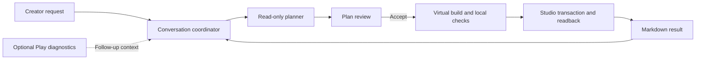

# Forge Architecture

This document describes the implemented system. [Product principles](FORGE.md)
define its invariants, [Evaluation policy](EVALS.md) defines claims, and
[Roadmap](ROADMAP.md) contains future work. Research records are supporting
material, not schema or workflow authority.

## System overview

Forge has a local React dashboard, a Node service, a provider-neutral agent
runtime, and a fixed Roblox Studio plugin. The ordinary flow is:

Accepting a plan authorizes Build and automatic Apply within that plan's exact
bounds. There is no second routine change approval and no mandatory Play or final
review step. The host derives execution authority from the plan approval; it does
not fabricate a creator approval of an unseen change set. A changed project or
uncertain transaction can require refresh, renewed approval, or recovery.

## Component boundaries

| Component                                                  | Responsibility                                                                                             |
| ---------------------------------------------------------- | ---------------------------------------------------------------------------------------------------------- |
| `dashboard`                                                | Conversation rendering, drafts, settings, activity, and exact user actions                                 |
| `creator-control`                                          | Authenticated loopback API, SSE, project workspace, durable job admission, and presentation                |
| `creator-conversation`                                     | Immutable conversation commits, turns, plans, memory, identity jobs, and compaction records                |
| `creator-session`                                          | Planner/builder tool hosts, approved contracts, mutation and source transactions, replay, and Play context |
| `agent-runtime`                                            | Model iteration, complete tool batches, budgets, journals, compaction, and completion                      |
| `model-client`                                             | One-turn provider transport and explicit model availability                                                |
| `studio-bridge`, `studio-protocol`, `studio-runtime`       | Paired sessions, typed commands, bounded transport, and evidence collection                                |
| `studio-evidence`                                          | Pinned catalog, generated capability policy, canonical values, index graphs, and pure grading              |
| `source-intelligence`, `luau-toolchain`                    | Verified source navigation, pinned analysis, and Luau checks                                               |
| `project-authority`                                        | Single-writer selection and the optional guarded Rojo adapter                                              |
| `artifact-store`, `flight-recorder`                        | Immutable artifacts, trace intervals, and content-addressed evidence                                       |
| `semantic-authority`, `semantic-map`, `context-compiler`   | Requirement provenance and bounded factual context                                                         |
| `experiments`, `proofs`, `verifier`, `studio-capabilities` | Registered treatments, local gates, and bounded runtime evidence                                           |
| `plugin/src/Forge`                                         | Fixed Studio readers, typed writers, transaction recovery, and connector UI                                |
| `examples`                                                 | Solution-free place seeds; never runtime policy or hidden builder input                                    |

There is no `apps` directory. The browser application lives in `dashboard`.
Generic harness packages do not import example mechanics or evaluator solutions.

## Project identity and conversations

A local place stores `_forgeProjectId` on `Workspace`, which is serialized with
the place. Link requires an absent ID; Fork requires an existing ID and creates a
new identity. Both are dedicated, exact-state ChangeHistory transactions with
readback, a finalization receipt, and acknowledgement. Saving a copy preserves the
ID until the creator explicitly forks it. A published place uses its universe and
place IDs. Publishing a linked local place requires an explicit continuity choice;
filenames never establish identity.

Each project can contain multiple conversations. A conversation has an immutable
commit chain and an atomically replaced head. Commits cross-bind events, turns,
episodes, jobs, citations, plans, and creator memory by hash. An episode binds one
request and its work to a particular project revision.

Pairing can prepare an empty starting conversation. An unused automatic entry is
shown only for the currently paired project. Explicit Link/Fork receipts, creator
actions, work, or a display name retain it in the workspace. Switching places does
not leave empty background pairings in the sidebar. This is a projection over
retained records, not a merge or deletion of project identities.

Cosmetic project and conversation names live in `creator/workspace-labels.json`.
The authenticated rename endpoint resolves an existing conversation to its project
ID, then atomically saves the label. Renaming changes neither the place filename
nor immutable conversation, approval, or model-context records.

## Admission, execution, and context

The dashboard submits a hash-bound turn or action against the current
`CreatorControlView`. Admission validates its exact authority and durably records
an idempotency key before scheduling foreground work. An ambiguous browser response
is resolved by observing state; an explicit transport retry preserves the original
request bytes and key.

`ForgeNativeAgentRuntime` owns the model loop. Provider transports make one request
and return normalized text, tool calls, stop reasons, usage, and opaque continuation.
SDK types stay inside adapters. The OpenRouter adapter has no SDK retries or model
fallback, preserves continuation needed by the provider, and uses medium reasoning.
The creator response deadline is 20 minutes. Other resource limits are defined by
`DEFAULT_AGENT_BUDGETS`; registered experiments may bind their own explicit budget.

The [model registry](../packages/model-client/src/model-registry.ts) is the current
allowlist and default. Availability is checked against provider tool support;
unavailable selections fail rather than silently switching models.

The host renders the exact creator request separately from history, preferences,
and observed facts. Project/source citations use host-issued handles. The model
cannot invent their authority. Older conversation history is automatically
compacted through a dedicated model handoff before it exceeds the working-context
bound. The handoff retains goals, decisions, corrections, completed work, unresolved
items, and important references; recent messages and the original immutable
transcript remain available. A summary never grants approval or proves execution.
Oversized evidence stays in artifacts and is accessed through bounded tools.

Tool batches are validated before execution. A rejected batch executes nothing.
Well-formed rejected calls retain the assistant continuation and matching tool
errors. Invalid IDs or unknown names use bounded rejection feedback without
constructing invalid provider message pairs. Diagnostics follow discriminators and
consolidate distinct actionable paths. Repeating the same unresolved semantic
failure three times without accepted host progress stops the phase. Host completion
is checked after each batch so a published result needs no extra inference to
restate it.

Independent searches and child queries support bounded batches. Source tools
support revision-bound pagination. Builder staging accepts an atomic group of
approved edits and returns combined feedback; rejected groups publish no partial
virtual draft.

## Project and source observations

Before provider work, Forge obtains a complete sharded project index and current
Script Editor source. Objects have connector-epoch handles, so duplicate names or
unsupported classes can be inventoried without gaining write authority. Targeted
objects may receive durable Forge identity inside their approved transaction.
Displayed Roblox paths use dotted notation; paths are presentation and navigation,
not a substitute for object identity.

A complete `StudioProjectIndexManifest` and verified shard/source leaves define a
`StudioProjectRevision`. Manifested classes carry the exact generated property
coverage. Missing, duplicated, unordered, or malformed coverage is incomplete
observation, not a mutation mismatch. Current editor buffers take precedence over
stored Script source when Studio exposes an editor document.

The pinned Rojo and Luau LSP toolchain supplies source symbols, references, and
static dependency analysis. Tools return bounded ranges with source hashes and
provenance. Dynamic requires remain unresolved. A `CreatorSourceConsultation`
records the source ranges and dependency closure actually returned to the planner;
the builder reads only its approved source closure. Static analysis is never a
claim that code executed successfully in Studio.

Builder `studio.read_observations` retrieves bounded pages of properties from the
immutable approved revision, scoped to authorized targets. It replaces the fixed
property whitelist; missing slices can be requested without inventing current facts.

A Studio edit notification is a dirty hint, not a revision. A callback during index
reading requires a bounded capture retry. A complete capture remains immutable
historical evidence while its bytes are transported, but current write authority
requires an unchanged detector epoch. During a transaction, queued hints are
confirmed against its authoritative post-state or recovery baseline. A hint that
precedes that baseline cannot be compared with the pre-Apply state as if it were a
post-Apply failure.

## Planning and virtual building

`game-ir` admits ordinary Luau source packages and optional exactly pinned recipe
instances, typed connections, static import/artifact dependencies and an explicit
resource policy. It requires no round, countdown, scene, UI, player mode or reset.
The planner reads `game.catalog` and proposes this `GameDesignSpec`; the host's
read-only `game-compiler` resolves the exact `GamePlan` before review. Generic source
packages provide the extension path for unfamiliar mechanics. Optional host recipes
currently provide primitive scenes, responsive UI, typed Studio edits and the
content-addressed ForgeRuntime bundle. Recipes are trusted host code, never model
supplied compiler implementations.

Plans contain every editor operation, generated parent/reference, source/value slot,
dependency, identity and capability/compiler lock. Generated three-level hierarchies
use the existing transaction topology compiler. Stable entity identities bind the
project and semantic ID, independently of display names and array order. Existing
targets still require observed identity, ownership and before hashes. Runtime objects
constructed later by ordinary installed game code are separate from editor inventory.

Plan publication and Build share approval-independent preparation validation.
The host generates mandatory instance-existence and Luau syntax checks. Behavioral
checks, preservation requirements, and creator review requests remain explicit.
The dashboard presents concise plan steps and optional review guidance; internal
check details remain accessible through Details.

Accepting the immutable plan produces a `CreatorBuildContract`. It fixes operation
IDs and kinds, exact targets, class policy, parents, paths, and preconditions. The
builder supplies only approved value and source slots through virtual tools. Locked
runtime and component bytes come from the host catalog. Source replacements arrive
as complete source and lower into the existing hash-guarded source-write contract.
New imports, objects or affected properties require a new reviewed plan. The host
materializes the candidate and checks final bytes, hashes and topology. Draft repair
remains bound to approved slots; it cannot rewrite locked package bytes.

`studio.build` fills every custom slot exactly once and checks the whole candidate.
Bounded `studio.repair` operates within that authority. Successful local completion
seals a `GameBuildGraph` and ends model work immediately. Compiler artifacts include
recursive dependency input hashes, source hashes and semantic provenance. Unchanged
artifact bytes can be reused; reuse does not grant fresh mutation authority.

The coordinator partitions the sealed graph under the existing 128-operation,
16,384-fact and 2 MiB evidence limits. The initial aggregate profile admits 8,192
operations, 64 MiB graph material and 128 partitions. These are admission limits,
not measured performance guarantees or limits on the IR's genres. Ordinary objects
and modules precede a final entrypoint partition; an activation group exceeding a
partition requires a revised staging plan. Studio writes stay serialized.

Each partition binds the same accepted plan and sealed graph, a fresh authoritative
project capture and a replayed contiguous checkpoint prefix. A checkpoint requires
matched readback/reconciliation, committed finalization and the exact consumed native
acknowledgement. Missing acknowledgements and external edits stop continuation.
Committed prefixes remain explicitly incomplete; recovery resumes the unchanged
graph only through **Continue build**. Complete graphs are published once, after
aggregate receipt verification. Loading stored sessions independently replays the
receipt evidence. No provider call reconstructs or summarizes completed partitions.

`GameDesignSpec.architecture` carries a creator-authored game name, named concepts,
their purpose, optional parent groups and labeled relationships. Leaf concepts bind
declared implementation component IDs; group hierarchies are acyclic, while semantic
feedback relationships may cycle. There is no system or genre enum. The map is part
of exact plan identity and describes intended behavior, not behavioral verification.

The dashboard opens **Game map** beside Settings in a separate expandable window.
Its canvas centers the game and shows the declared systems, their expandable
components, authored icons and meaningful relationships. Files, hashes, checkpoints
and mutation status belong to the existing Technical details panel, outside this
window. A design without architecture shows an explicit empty game map. Historical
views use only the selected immutable artifact. The separate implementation view
derives progress from each concept's component closure; applied means verified
editor writes, with gameplay evidence kept separate.

Map and list modes share selection and search context. The game window supports
keyboard pan, zoom/fit controls, branch expansion and a component inspector; narrow
screens use a full-screen window with a stacked inspector. A saved map is labeled
as such and opens from its immutable artifact preview without exposing raw JSON
first. Technical implementation details use checkpoint progress, bounded browsing
and explicit identity/source disclosures. Workspace colors and interaction states
share dashboard tokens; motion respects the reduced-motion preference.

The creator schema cutover uses `.forge/creator-compiled` as the default store. Old
`.forge/creator` evidence is retained without a compatibility reader or migration.

The local gate uses the real pinned Luau tools and a strict analysis configuration.
Staged sourcemaps include non-script objects so their represented classes reach
the analyzer input. The pinned analyzer still accepts an invalid Part.Size assignment
through tested unannotated Workspace lookup forms; explicit Part typing rejects it.
Invoked analyzer processes share a host deadline and retained
output budget; this is not an OS sandbox or proof of descendant-process isolation.
An additional pinned official `luau-ast` pass checks materialized/observed modules
against declared static imports and final topology without executing candidate
source. It rejects undeclared/dynamic imports, aliases of global `require` and effective
`--!nocheck`/`--!nonstrict` directives. Reflective environments produce an incomplete
gate. Ordinary service access, runtime Instance creation and logging remain available.
Installed source dependencies can be declared without redundant writes through
hash-bound `observed` placements. Static import closure is not runtime confinement.
Staging, local eligibility, and a source diff do not mutate Studio. A preparation
failure preserves its stage, code, readable diagnostic, and artifact before any
provider dispatch. Retry build uses a fresh execution slot and the existing approved
plan only if project revision, capability policy, and transaction inventory still
permit it. Work that never started gets no invented AgentRun or provider receipt.

## Capability policy and Studio transactions

The pinned official Roblox catalog describes classes, members, datatypes, enums,
globals, and libraries. Every entry has a coverage disposition; catalog presence
alone does not authorize a write. The authored policy and generator produce one
`StudioCapabilityManifest` shared by TypeScript and Luau. The generated report and
`forge studio capabilities` provide current counts and exact scope.

The current manifest admits only creatable classes with an explicit
`detached_instance` preflight strategy. Unproved update-only service/Terrain writes
are disabled; legal engine roots and containers remain available as parents.
Builder tools derive an exact JSON schema for each approved class and property from
the sealed manifest, including compound values and references to observed or
same-Build objects. The model never reconstructs the internal tagged value format.

A property is authorable only when validation, canonicalization, detached
preflight, writing, direct readback, projection, and comparison are all implemented.
Manifest admission is not proof that every native setter has passed conformance.
The six-field PhysicalProperties codec includes acoustic absorption. Setter-family
metadata rejects simultaneous Color/BrickColor, CFrame/Rotation and
ScreenInsets/IgnoreGuiInset applications. Each family names its canonical seed.
When an alternate setter needs existing state, detached preflight seeds from the
bound before-capture, applies the requested setter once, and reads the final aliases
without corrective writes. Derived aliases enter canonical projections without a
model-supplied expected value. Reconciliation admits their delta only when scratch,
direct readback and the complete after-index agree; unrelated changes still reject.
The ScreenGui pairing follows Roblox's documented
[inset coupling](https://raw.githubusercontent.com/Roblox/creator-docs/main/content/en-us/reference/engine/classes/ScreenGui.yaml).
Offline regressions cover these families; native conformance remains user-run.
Structural Name/Parent rules are separate. Reflection attestation compares declaring
class, engine/storage type, Luau type, enum/reference constraints, serialization,
and permissions. Missing facts are incomplete; contradictory complete facts are
rejected. The plugin does not expand policy based on reflection.

The mutation sequence is:

1. Validate current approval, capability attestation, revision, and clear transaction
   inventory. Persist the exact before-state and source blobs.
2. Receive request-bound acknowledgements for source transport. The plugin independently
   recompiles the canonical projection and runs detached round-trip preflight.
3. Persist and read back an opening cursor, open one ChangeHistory recording, and
   persist Studio's real recording ID before changing the place.
4. Execute only the typed operations, collect direct readback and a complete
   post-state, then reconcile against the allowed delta derived from the approved
   operations. There is no second supplied delta allowlist.
5. For a matched result, persist finalization intent, recheck revision and detector
   state, close the recording once, and require exact closure and acknowledgement
   before publishing the checkpoint and Markdown result.

Detached preflight reads the final scratch graph without reapplying expected
properties, attributes or source immediately before comparison. Unsupported scratch
strategies reject before allocation, and partial allocations are cleaned on failure.
Offline setter-side-effect regressions exercise this path. The separate native
conformance fixture supplies user-run engine/save-reopen evidence; offline success
does not substitute for it.

Canonical values account for Studio storage semantics, including numeric/color
quantization, compound values, enums, explicit nullable values, and class-bound
Instance references. The fixed runner interprets JSON data; it never evaluates
arbitrary code, expressions, callbacks, or generic property access supplied by the
model.

A mismatched or incomplete mutation may cancel only through the exact safe
transaction gate and must retain complete post-cancel evidence. If closure cannot
be proven, the recording remains a recovery obligation. A plugin settings write
alone is not durability: each immutable phase snapshot is read back before the
next boundary. An engine exception or ambiguous closure is not success.

Transport acknowledges canonical command identity and content separately from
execution. Duplicate deliveries replay acknowledgements without repeating effects.
Inbound Studio messages are serialized per session; notification coalescing reads
the latest snapshot inside the conversation queue so stale phases cannot overwrite
newer ones.

## Completion, Play, and recovery

Conversation completion means the approved edits were applied and acknowledged.
It does not imply gameplay correctness. The plugin can passively collect bounded
server diagnostics during ordinary Play/Stop and attach them to a later follow-up.
That listener holds no mutation recording, starts no model, and adds no mandatory
foreground step. Explicit runtime evaluation and replay retain their separate
projection and evidence contracts.

Each provider-capable phase reserves an AgentRun and hash-chained execution journal.
Request intent, response, batch validation, tool intent, tool completion, and terminal
state are durable boundaries. Restart classifies those records before offering an
action: a complete response/tool boundary can support explicit same-slot resume;
an unconfirmed provider or tool intent remains outcome unknown and requires a fresh,
creator-authorized retry. Service downtime does not consume the checkpointed active
execution budget. No restart automatically resends model or Studio work.

Pairing reconciles both possible active recordings and unacknowledged finalization
receipts. A retained receipt is persisted before acknowledgement; only the correlated
fresh inventory releases its gate. Exact open-recording proof can permit explicit
cancellation. Exact complete `not_open` evidence permits acknowledgement of a stale
cursor, not a guessed commit or cancellation. Unknown state blocks new work. A
connector build change cannot adapt an ambiguous transaction to a different contract.

Terminal publication is bound to the episode and exact outcome. Receipt cleanup
cannot duplicate a completed answer, and rewording a failure cannot turn the same
failed session into another chat result. Immutable diagnostic events remain retained.

## Optional Rojo source authority

The default writer is the open Studio document, including places originally built
with Rojo. `--project-authority` opts into a private ownership manifest. Forge
constructs its sourcemap using the pinned Rojo executable; it does not start live
sync or accept an arbitrary user-supplied map as authority.

A current aggregate plan and each change set select exactly one writer: Studio or
declared Rojo source roots. Mixed ownership is rejected before approval; plans that
combine these writer domains still need per-operation authority and corresponding
partition rules. Filesystem access permits regular Luau
files only, bounded roots, fail-closed paths/symlinks, hash-guarded replacement, and
explicit absent creation. A source-write receipt is not Studio proof: completion
requires a complete Studio capture proving the mapped hashes and allowed delta.
A pending sync stays explicit. Reversion is a separate authorized transaction.

Rojo graph checkpoints bind the guarded source attempt, exact before/after Studio
captures, authority map and independently replayed synchronization proof. They use
a distinct receipt kind, with no invented ChangeHistory acknowledgement. The next
partition requires an authority map consistent with that verified prefix.

## Registered experiments

Experiment registration binds the seed, model and transport, budgets, implementation,
requirement views, evaluator configuration, runtime plan, and evidence identities
before a run. Benchmark oracles and hidden evaluator bodies remain outside builder
context. The plugin receives typed observation requests, not evaluator assertions;
backend grading owns the verdict.

Local checks use `eligible`, `rejected`, or `incomplete`; AgentRun/candidate eligibility
uses `locally_eligible`. `runtime_verified` applies only to the exact registered
candidate and authoritative Studio evaluation. It is not general game correctness
or a model-quality score. See [Evaluation policy](EVALS.md).

## Storage and verification

The private current store is `.forge/creator-compiled`. Immutable artifacts bind source,
observations, plans, approvals, runs, traces, transactions, and checkpoints. Readers
verify regular-file safety, canonical hashes, graph bindings, and commit order.
Schema changes replace the format outright; there are no migration readers or
compatibility aliases. Preserve an external checksum-verified snapshot before an
authorized reset.

Host phase timings persist separate immutable start/completion records under
`host-timings` in the session directory, keyed by the session identity hash. The
`forge creator timings <session-id>` command reports recorded spans, incomplete
starts, distributions and limitations. Monotonic durations describe host boundaries
such as capture, analysis, transfer and transaction round trips; they do not isolate
all engine write time or attribute elapsed adapter time to provider computation.

Failed generation persistence captures an immutable `CreatorOfflineRegression`
manifest and a private discovery pointer under `offline-regressions`. It preserves
failure classifications, the session snapshot, immutable journal heads and a bounded
artifact closure. `forge creator replay-regression <manifest-artifact-hash>` verifies
the retained host contracts and raw evidence with zero provider, Studio or candidate
execution calls. It returns exit 0 for exact replay, 1 for mismatch and 2 for missing
or incomplete evidence. This is a reference-based fixture in the original artifact
store, not a portable export or gameplay rerun. It does not turn a failed run into a
successful game, and private evaluator material is never added to builder context.

Generated host/connector identity binds the evidence policy, protocol, transaction
implementation, and plugin source. The compiled runtime manifest separately checks
source/build agreement. The [development guide](DEVELOPMENT.md) defines the full
quality gate, including browser, plugin, temporary Rojo, and formal checks. Tests
use fake providers and isolated stores; live model and Studio observations are
separate evidence-producing work.
