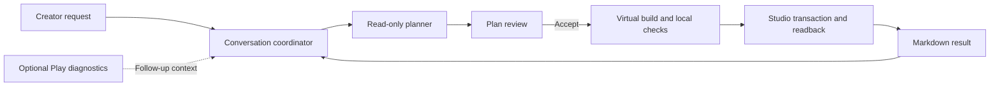

# Forge Architecture

This document describes the implemented system. [Product principles](FORGE.md)
define its invariants, [Evaluation policy](EVALS.md) defines claims, and
[Roadmap](ROADMAP.md) contains future work. [Visual generation](VISUALS.md)
collects the visual authoring and asset pipeline. Research records are supporting
material, not schema or workflow authority.

## System overview

Forge has a local React dashboard, a Node service, a provider-neutral agent
runtime, and a fixed Roblox Studio plugin. The ordinary flow is:

Accepting a plan authorizes Build and automatic Apply within that plan's exact
bounds. There is no second routine change approval and no mandatory Play or final
review step. The host derives execution authority from the plan approval; it does
not fabricate a creator approval of an unseen change set. A changed project or
uncertain transaction can require refresh, renewed approval, or recovery.

## Component boundaries

| Component                                                  | Responsibility                                                                                             |
| ---------------------------------------------------------- | ---------------------------------------------------------------------------------------------------------- |
| `dashboard`                                                | Conversation rendering, drafts, settings, activity, and exact user actions                                 |
| `creator-control`                                          | Authenticated loopback API, SSE, project workspace, durable job admission, and presentation                |
| `creator-conversation`                                     | Immutable conversation commits, turns, plans, memory, identity jobs, and compaction records                |
| `creator-session`                                          | Planner/builder tool hosts, approved contracts, mutation and source transactions, replay, and Play context |
| `agent-runtime`                                            | Model iteration, complete tool batches, budgets, journals, compaction, and completion                      |
| `model-client`                                             | One-turn provider transport and explicit model availability                                                |
| `studio-bridge`, `studio-protocol`, `studio-runtime`       | Paired sessions, typed commands, bounded transport, and evidence collection                                |
| `studio-evidence`                                          | Pinned catalog, generated capability policy, canonical values, index graphs, and pure grading              |
| `source-intelligence`, `luau-toolchain`                    | Verified source navigation, pinned analysis, and Luau checks                                               |
| `project-authority`                                        | Single-writer selection and the optional guarded Rojo adapter                                              |
| `artifact-store`, `flight-recorder`                        | Immutable artifacts, trace intervals, and content-addressed evidence                                       |
| `semantic-authority`, `semantic-map`, `context-compiler`   | Requirement provenance and bounded factual context                                                         |
| `experiments`, `proofs`, `verifier`, `studio-capabilities` | Registered treatments, local gates, and bounded runtime evidence                                           |
| `plugin/src/Forge`                                         | Fixed Studio readers, typed writers, transaction recovery, and connector UI                                |
| `examples`                                                 | Solution-free place seeds; never runtime policy or hidden builder input                                    |

There is no `apps` directory. The browser application lives in `dashboard`.
Generic harness packages do not import example mechanics or evaluator solutions.

## Project identity and conversations

A local place stores `_forgeProjectId` on `Workspace`, which is serialized with
the place. Link requires an absent ID; Fork requires an existing ID and creates a
new identity. Both are dedicated, exact-state ChangeHistory transactions with
readback, a finalization receipt, and acknowledgement. Saving a copy preserves the
ID until the creator explicitly forks it. A published place uses its universe and
place IDs. Publishing a linked local place requires an explicit continuity choice;
filenames never establish identity.

Each project can contain multiple conversations. A conversation has an immutable
commit chain and an atomically replaced head. Commits cross-bind events, turns,
episodes, jobs, citations, plans, and creator memory by hash. An episode binds one
request and its work to a particular project revision.

Conversation append captures its input before serialization, verifies the prior
history and new bindings, then returns the exact verified snapshot published with
the new head. The coordinator uses that returned snapshot instead of immediately
reading the whole history again. Explicit later loads still verify persisted
artifacts; the returned snapshot is not a durable verification cache.

Pairing can prepare an empty starting conversation. An unused automatic entry is
shown only for the currently paired project. Explicit Link/Fork receipts, creator
actions, work, or a display name retain it in the workspace. Switching places does
not leave empty background pairings in the sidebar. This is a projection over
retained records, not a merge or deletion of project identities.

Cosmetic project and conversation names live in `creator/workspace-labels.json`.
The authenticated rename endpoint resolves an existing conversation to its project
ID, then atomically saves the label. Renaming changes neither the place filename
nor immutable conversation, approval, or model-context records.

## Admission, execution, and context

The dashboard submits a hash-bound turn or action against the current
`CreatorControlView`. Admission validates its exact authority and durably records
an idempotency key before scheduling foreground work. An ambiguous browser response
is resolved by observing state; an explicit transport retry preserves the original
request bytes and key.

`ForgeNativeAgentRuntime` owns the model loop. Provider transports make one request
and return normalized text, tool calls, stop reasons, usage, and opaque continuation.
SDK types stay inside adapters. The OpenRouter adapter has no SDK retries or model
fallback, preserves continuation needed by the provider, and uses medium reasoning.
The creator response deadline is 20 minutes. Other resource limits are defined by
`DEFAULT_AGENT_BUDGETS`; registered experiments may bind their own explicit budget.
Creator response allowances use the selected model's advertised completion-token
limit from the startup catalog, recorded before dispatch in the request journal.
When the provider omits that metadata, the host retains a 32,768-token guard rather
than inventing a supported limit. Opaque continuation allows up to 4 MiB, with an
8 MiB response-journal envelope. HTTP errors preserve bounded diagnostic categories
and codes without storing raw provider error prose that might echo private inputs.
Malformed JSON tool arguments retain their original bytes and bounded syntax
diagnostics in the journal. The runtime rejects their entire batch without execution
and sends one native correction message. It does not replay SDK-synthesized empty
arguments or a second SDK tool error containing the full malformed payload. Valid
JSON values still pass through normal host schema validation without coercion.

The [model registry](../packages/model-client/src/model-registry.ts) is the current
allowlist and default. Availability is checked against provider tool support;
unavailable selections fail rather than silently switching models.

The host renders the exact creator request separately from history, preferences,
and observed facts. Project/source citations use host-issued handles. The model
cannot invent their authority. Older conversation history is automatically
compacted through a dedicated model handoff before it exceeds the working-context
bound. The handoff retains goals, decisions, corrections, completed work, unresolved
items, and important references; recent messages and the original immutable
transcript remain available. A summary never grants approval or proves execution.
Oversized evidence stays in artifacts and is accessed through bounded tools.

Tool batches are validated before execution. A rejected batch executes nothing.
Well-formed rejected calls retain the assistant continuation and matching tool
errors. Invalid IDs or unknown names use bounded rejection feedback without
constructing invalid provider message pairs. Diagnostics follow discriminators and
consolidate distinct actionable paths. Repeating the same unresolved semantic
failure three times without accepted host progress stops the phase. Host completion
is checked before a fresh run's first provider request and after each batch, so
restored eligible work and newly completed work need no inference to restate them.
Journal resumption still consumes its retained response before completion checks.
Builder context is rebased only after a build or repair changes its state. Read-only
batches and non-mutating failures remain in context, including every result within
a batch. A write checkpoint retains current operation receipts, gate diagnostics,
the complete last batch and deduplicated immutable source, import, API and initial
observation reads. The runtime retains the latest complete assistant/tool exchange
alongside that snapshot, including its exact opaque provider continuation. This
preserves pending design intent without reconstructing private reasoning or
re-executing completed calls. Older exchanges remain in the journal. Draft pages
remain explicitly historical and source-hash-bound.
If the consulted-read cache or complete checkpoint exceeds 1 MiB, the host keeps
the full conversation instead of compressing it or evicting observations.

Independent searches and child queries support bounded batches. Source tools
support revision-bound pagination. Builder staging accepts an atomic group of
approved edits and returns combined feedback; rejected groups publish no partial
virtual draft.

## Project and source observations

Before provider work, Forge obtains a complete sharded project index and current
Script Editor source. Objects have connector-epoch handles, so duplicate names or
unsupported classes can be inventoried without gaining write authority. Targeted
objects may receive durable Forge identity inside their approved transaction.
Displayed Roblox paths use dotted notation; paths are presentation and navigation,
not a substitute for object identity.

A complete `StudioProjectIndexManifest` and verified shard/source leaves define a
`StudioProjectRevision`. Manifested classes carry the exact generated property
coverage. Missing, duplicated, unordered, or malformed coverage is incomplete
observation, not a mutation mismatch. Current editor buffers take precedence over
stored Script source when Studio exposes an editor document.

Project observations preserve the native unbounded `UISizeConstraint.MaxSize`
default as `observed_vector2_f32`: each axis is an exact finite float32 or the
literal `positive_infinity`, and at least one axis must be unbounded. This shape
is admitted only for that exact manifested property. Complete captures, metadata,
persisted evidence, builder observations and unchanged topology retain it. Authored
`StudioValue`, property setters and final mutation facts remain finite-only; a
finite approved assignment can replace the observed default. No raw JSON infinity,
NaN, negative infinity or missing coverage is accepted.

The pinned Rojo and Luau LSP toolchain supplies source symbols, references, and
static dependency analysis. Tools return bounded ranges with source hashes and
provenance. Dynamic requires remain unresolved. A `CreatorSourceConsultation`
records the source ranges and dependency closure actually returned to the planner;
the builder reads only its approved source closure. Static analysis is never a
claim that code executed successfully in Studio.

Builder `studio.read_observations` retrieves bounded pages of properties from the
immutable approved revision, scoped to authorized targets. It replaces the fixed
property whitelist; missing slices can be requested without inventing current facts.
`game.source_context` resolves accepted source imports from the complete final
topology into exact lookup expressions. Pages bind the accepted plan and are capped
at 32 imports and 16 KiB including the response envelope. Relative lookups preserve
the same runtime copy; separate character/player/UI/tool copies remain explicit
when no safe static lookup can be derived. Returned data cannot stage writes or add
imports. The AST gate also rejects client/shared imports of modules physically in
server-only storage, including observed source dependencies. Declared contexts do
not make private instances replicate to clients.

Before the builder's first request, the host supplies a plan-bound source reference:
deduplicated import descriptors and per-slot lookup expressions, plus exact type,
member-function signature and return excerpts from the pinned Luau parser. This
uses accepted locked sources, never inferred exports or evaluated module code.
Navigation is bounded to 32 KiB, parsing to 32 distinct sources and 2 MiB, and
declaration material to 48 KiB. Deferred slots, pages and declarations remain explicit
and available through the existing readers. Function implementations and returned
anonymous functions are omitted; behavioral questions still require source reading.
The builder is instructed to reuse supplied facts instead of confirming them again.
API lookup misses can include bounded, provenance-bearing owner/member alternatives;
these are suggestions, not matches or substituted platform authority.

A Studio edit notification is a dirty hint, not a revision. A callback during index
reading requires a bounded capture retry. A complete capture remains immutable
historical evidence while its bytes are transported, but current write authority
requires an unchanged detector epoch. During a transaction, queued hints are
confirmed against its authoritative post-state or recovery baseline. A hint that
precedes that baseline cannot be compared with the pre-Apply state as if it were a
post-Apply failure.

## Planning and virtual building

`game-ir` admits four direct component kinds: `source_package`, `native_graph`,
`ui_graph`, and `scene_handle`. They retain typed ports and obligations, static
source/artifact dependencies, and the explicit resource policy. A `scene_handle`
binds one retained `{sceneId, revision, hash}`. The planner reads the immutable
`game.capabilities` response and proposes a `GameDesignSpec`; the fixed
`game-compiler` resolves the exact `GamePlan` before review. There is no definition
registry, model-selectable compiler, injectable expander, configuration envelope, or
catalog command. Generic source packages remain the extension path for unfamiliar
mechanics.

Declaration IDs are case-sensitive ASCII keys of at most 64 characters: a letter,
then letters, digits, underscores or hyphens. Component, source-file, port and local
graph references preserve exact spelling; IDs are never normalized into aliases.
Source paths and Studio instance names retain their separate contracts. Optional
values are not inferred unless their current schema declares a single bounded
default.

The host pins one capability profile before the planner's first model request.
`game.capabilities` exposes the four declaration schemas, fixed operation families,
compiler ABI, Studio capability-manifest identity, and exact ForgeRuntime/UI-controller
source interfaces. The response is read-only and contains no executable registration.
Those schemas and host admission use the same validators as the compiler. The
provider envelope is guidance, not semantic authority: batch admission, repair
diagnostics, draft retention, and canonical hashing use the exact host schema.
Source manifest paths expose their relative `.luau` constraint; source role and
execution context belong to each file. UI token/reference failures are collected with
their field paths and valid target IDs before instance expansion.
Planning stores structurally validated components under stable IDs and content hashes.
The model supplies a component declaration; the host resolves its stable ID to the
current private draft and guards the replacement synchronously. Model-authored
draft hash bookkeeping is not part of the tool contract. The
`creator.read_components` tool lists saved references and explicitly requested
editable declarations. Its separate `attemptId` selector reads exact rejected input,
marked as untrusted planning data without a saved reference. Unknown unsaved IDs
point to available retained attempts. Attempt reads and error replies expose schema
issue paths, current values and explicit omission counts; bounded subtree reads
provide child navigation instead of truncated JSON. Source declarations omit a
new script's class and an engine parent's class: the host derives the former from
file role/context and the latter from the exact manifest path. Resolution precedes
validation and canonical component hashing. Returned editable declarations use the
same tool format; canonical checkpoints and approved plans retain the resolved
classes. Existing instance and source-edit targets still carry exact observed
metadata. Redundant class fields in new-source declarations are rejected.
`creator.propose_plan` supplies complete design metadata, selected `componentIds`,
and an ordered implementation-step breakdown. Every step has a short title, a
substantive result-focused detail sentence, and exact component bindings. The host
requires every selected component exactly once and requires at least two steps for
two-component designs or three for larger designs. It then synchronously binds the
current validated component versions into a detached `GameDesignSpec` for full
admission and structural compilation, and resolves each step to exact compiled
change IDs. The creator reviews exact immutable plan bytes and hashes; later draft
edits cannot change that plan. Component bodies and model-copied hashes are not
accepted by the proposal tool. A failed definition or proposal leaves the retained
components intact; accepted component changes count as planner progress.

Every `GameDesignSpec` also declares `worldAuthoring`. Ordinary three-dimensional
scenes use `persistent` and bind exact `Workspace` roots. The compiler simulates the
final transaction topology and rejects a persistent root that is absent, ambiguous,
or contains no authored spatial geometry. `runtime_generated` is valid only when the
creator explicitly requested a world that exists during Play and includes a visible
rationale; `none` means no 3D world is in scope. Procedural construction means
author-time compilation into persistent instances unless that explicit runtime mode
was selected. Runtime source may still own transient effects, projectiles, remotes,
and other lifecycle-bound objects; it cannot substitute a Play-only scene for a
declared persistent world. The proposed-plan summary displays this boundary before
its ordered steps.
Draft storage is bounded by the game admission policy and grants no candidate,
source staging, creator acceptance, or Studio authority. The journal preserves the
definition calls and results for offline regression replay.
Independent component-definition batches preserve valid siblings when another
declaration fails schema validation. Malformed JSON, duplicate identities and mixed
proposal batches remain rejected as a whole; Studio Build remains atomic. A failed
component can return an immutable repair-attempt reference. `creator.repair_component`
applies explicit `replace`, `remove`, or `add` operations and reruns full admission
under the exact private draft guard. Replacement supplies a complete value; removal
addresses an existing field or array entry; addition requires an absent named field
under an existing object. Paths address the original attempt. Array removals run in
descending index order after replacements, preserving the meaning of every target.
Array insertion, implicit parent creation, overlapping paths and prototype path keys
reject. Identity or component-kind changes require a new declaration. Failed repairs provide
the current attempt's exact inspection action; no rejected input becomes accepted
without ordinary full validation.
After a changed component definition, the planner can checkpoint the complete current
draft, consulted read results including source bytes, provenance, and outstanding
proposal diagnostics. Unresolved rejected and suppressed component attempts remain
explicitly untrusted, unapproved context until a successful definition replaces that
exact component ID. Schema-invalid, suppressed, and malformed proposal inputs also
retain their exact arguments and feedback, including design intent that has not
passed admission. An unidentifiable malformed argument remains exact in the journal
and host storage. Checkpoints expose its scoped `syntaxAttemptId`, byte count, hash,
syntax diagnostic and inspection action. The separate `creator.read_components`
syntax selector reads exact UTF-8 text slices of at most 16 KiB, with explicit byte
offsets and continuation; it never infers a component identity or creates editable
authority. If retained material exceeds the existing aggregate budget, the runtime
keeps its original history instead of emitting an incomplete checkpoint. Read-cache
identity excludes activity narration; the retained input and result stay exact.
Unchanged definitions and read-only calls retain conversation
history. If the complete checkpoint or read cache exceeds the existing game JSON
bound, rebasing is disabled without evicting evidence or restricting authoring.
Creator tool results preserve complete JSON under each reader's own page bounds and
the aggregate result budget; there is no generic 64 KiB preview truncation. Locked
module and draft reads allow up to 2,000 lines per page, and final build summaries
allow up to 64 KiB of text.
Source placements can address a direct component's created parent by
`component_output`, `componentId`, and its documented `outputId`. The compiler resolves
unique aliases to exact created inventory objects and dependencies before review;
the model does not reconstruct compiler-generated identity hashes.

The optional ForgeRuntime bundle contains Scope, Event, Task, StateMachine and
Network under exact source/ABI locks. Network provides bounded closed payload
validation, finite values, per-actor sequences and per-intent rate limits. Its fixed
RemoteEvent adapter checks server context, uses the server-supplied Player and closes
with its owning scope. Game source supplies non-yielding contextual validation and
owns consequential commits; the library does not infer phase, distance, permissions
or gameplay rules. Admission is not rollback, movement anti-cheat or confinement of
arbitrary source. Native behavior still requires user-run evidence.
Task releases scheduler handles returned after settlement, including work that
closes its scope during an immediate first resume. Fixed adversarial scheduler tests
cover late cancellation and an already-fired deadline. Application code retains
explicit Scope ownership and calls Close; no self-destruction callback supplies a
general lifecycle guarantee.

`project-assembly` expands project-authored instance subtrees into independent copies
through the existing Studio patch and topology compilers. Stable copy/node IDs bind
each generated identity. Local references are remapped per copy; named shared
references retain exact observed or generated targets. Explicit placements, property
overrides, and source-package parent anchors remain direct declarations.
The current expansion profile bounds the result to 4,096 operations. Installed copies
are updated through reviewed patches/source replacements; there is no automatic
propagation or curated kit requirement.

`native_graph` dispatches only the closed `studio_objects`, `collections`, and
`lighting` schemas. `ui_graph` dispatches only the responsive UI schema. Both lower
to the common `GameComponentCompilation` contract of inventory, output aliases, and
observed sources. Their behavior, limits, and native-evidence gaps are centralized in
[Visual generation](VISUALS.md#implemented-visual-world-compiler).
Plans contain every editor operation, generated parent/reference, source/value slot,
dependency, identity and capability/compiler lock. Generated three-level hierarchies
use the existing transaction topology compiler. Stable entity identities bind the
project and semantic ID, independently of display names and array order. Existing
targets still require observed identity, ownership and before hashes. Runtime objects
constructed later by ordinary installed game code are separate from editor inventory.
Planner orientation describes both observed parent anchors and exact generated
parents; declared component-output aliases resolve to that approved topology before
review, with identity, class, path and dependency-order checks.

Plan publication and Build share approval-independent preparation validation.
The host generates mandatory instance-existence and Luau syntax checks. Behavioral
checks and preservation requirements remain explicit. Visual-direction view criteria
remain host-derived creator-verification obligations for the later evidence phase;
the proposal tool has no free-form review field and plan summaries do not display
verification guidance.
Optional existence checks admit supported descendants under allowlisted roots;
engine-container parent authority does not admit engine roots or container classes
to the fixed checks. Unsupported or unavailable optional targets return aggregate
diagnostics with their input indices and observed path/class before charter sealing.
The dashboard presents only the ordered implementation steps in the proposed-plan
section; internal check and verification details remain accessible through Details
and the later verification workflow.

Accepting the immutable plan produces a `CreatorBuildContract`. It fixes operation
IDs and kinds, exact targets, class policy, parents, paths, and preconditions. The
builder supplies only approved value and source slots through virtual tools. Locked
runtime and component bytes come from the host catalog. Source replacements arrive
as complete source and lower into the existing hash-guarded source-write contract.
New imports, objects or affected properties require a new reviewed plan. The host
materializes the candidate and checks final bytes, hashes and topology. Draft repair
remains bound to approved slots; it cannot rewrite locked package bytes.

`studio.build` fills every custom slot exactly once and checks the whole candidate.
Bounded `studio.repair` operates within that authority. Successful local completion
seals a `GameBuildGraph` and ends model work immediately. Compiler artifacts include
recursive dependency input hashes, source hashes and semantic provenance. Unchanged
artifact bytes can be reused; reuse does not grant fresh mutation authority.

Source repairs address complete line ranges against one exact draft hash. The host
adds one LF separator when a nonempty replacement lacks a final newline before a
following original line, preserving supplied LF/CRLF endings and untouched bytes.
An empty replacement deletes the range; a replacement reaching the file end keeps
its exact ending. Stale hashes, overlapping edits and invalid ranges reject the
whole batch before any source changes. Byte-range source writes retain their exact
replacement-byte contract.

Pinned analyzer reports of missing native members become hash-bound source repair
obligations. A later draft cannot clear a known invalid access merely by erasing its
receiver type, adding a cast or renaming local variables. The bounded AST check
accepts removal/replacement of the access or a supported, concretely established
receiver; ambiguous matching remains incomplete. It preserves exact diagnostic
source history through journal recovery and newly approved source proposals. This
does not ban ordinary `any` use or prove the safety of previously unreported accesses;
native runtime evaluation remains separate.

Official Luau AST parsing reuses successful output in a bounded host-process cache
keyed by exact source, parser binary and toolchain hashes. Each use revalidates source
bytes and current document metadata, consumes the active output/deadline budget and
reconstructs a fresh AST. Reused parses are recorded separately from new executions.
Current import/topology checks and strict type analysis still run. This cache is not
a persistent compiler artifact cache or incremental semantic analyzer.

The coordinator partitions the sealed graph under the existing 128-operation,
16,384-fact and 2 MiB evidence limits. The initial aggregate profile admits 8,192
operations, 64 MiB graph material and 128 partitions. These are admission limits,
not measured performance guarantees or limits on the IR's genres. Ordinary objects
and modules precede a final entrypoint partition; an activation group exceeding a
partition requires a revised staging plan. Studio writes stay serialized.

Builder AgentRun outcomes bind `game_build_graph`. Before publishing the session
bundle, the coordinator retains the exact sealed graph as an immutable artifact.
A subsequent local persistence failure preserves the coherent graph, contract,
source leaves and original approval for explicit continuation without another
model invocation. Existing native mutation recovery state is preserved.

Each partition binds the same accepted plan and sealed graph, a fresh authoritative
project capture and a replayed contiguous checkpoint prefix. A checkpoint requires
matched readback/reconciliation, committed finalization and the exact consumed native
acknowledgement. Missing acknowledgements and external edits stop continuation.
Committed prefixes remain explicitly incomplete; recovery resumes the unchanged
graph only through **Continue build**. Complete graphs are published once, after
aggregate receipt verification. Loading stored sessions independently replays the
receipt evidence. No provider call reconstructs or summarizes completed partitions.

`GameDesignSpec.architecture` carries a creator-authored game name, named concepts,
their purpose, optional parent groups and labeled relationships. Leaf concepts bind
declared implementation component IDs; group hierarchies are acyclic, while semantic
feedback relationships may cycle. There is no system or genre enum. The map is part
of exact plan identity and describes intended behavior, not behavioral verification.

Visual authoring is an optional layer over the same generic plan and transaction.
`GameDesignSpec.visualDirection` carries art direction and named review views;
creator turns can retain up to four image attachments. Direct native and UI graphs
lower admitted declarations into ordinary canonical inventory, while a scene handle
requires the exact approved visual binding chain. The dashboard's Game map renders
the declared semantic architecture separately from technical mutation state.
None of these declarations captures a frame or proves appearance. Their exact
contracts, limits, UI behavior, and Blender/Cube relationship are centralized in
[Visual generation](VISUALS.md).

`visual-world` owns strict `BlenderSceneSpec ABI 2`. The model-facing
`BlenderSceneDeclaration` excludes revision ancestry, project/request/reference
bindings, compiler identity, source/license records, budgets, provenance, and output
inventory. The host binds those fields through one strict authority envelope before
solving. Forge then resolves frames, instance distributions, placements, world
transforms, native semantics, and review framing. Admission rejects non-plain
or oversized JSON, unknown fields, invalid Unicode/numbers, duplicate or unresolved
identity, dependency cycles, incomplete partition coverage, unqualified provenance,
and unsupported operation surfaces. The geometry vocabulary is a fixed union of
indexed meshes, solids, profiles, curves, external hash-pinned GLBs, construction
operations, modifiers, deformation, collections, and bounded instance distributions.
It has no Python, `bpy`, expression, callback, URL, file-path, shader-program, driver,
add-on, or authored node-graph field.

The deterministic solver uses stable-ID ordering, finite domains, seeded tie breaks,
a 0.25-stud free-placement lattice, 15-degree default yaw candidates, and bounded
backtracking. It validates containment, separation, support, swept route clearance,
reachability, sightlines, camera framing, density, negative space, and budgets before
and after float32 transform resolution. Exhausted admitted search resources produce
`incomplete`; a completed search without an assignment produces `rejected`. Scene
coordinates are Roblox Y-up studs and map to Blender as `(x, -z, y)`.

`blender-compiler` binds Blender 5.2.1 macOS arm64, its official distribution
checksum, signed application inventory, Forge worker and inspector bytes, operation
implementation, host artifact-validation profile, export profile, and Cycles CPU
render settings. It launches only the fixed worker with factory/background/offline
arguments inside a qualified Seatbelt profile, a stripped environment, private
working directory, durable cross-process lease, process-group deadline, and bounded
output. The immutable binary store publishes verified regular files atomically. The
compiler independently parses GLB JSON/buffers/accessors/hierarchy, composes node
transforms, measures actual vertices, normals and UVs, validates extension and texture
references, and checks names, materials, partitions, envelopes, and aggregate budgets
before sealing a manifest. Its outputs
are one `.blend`, GLB visual partitions, explicit native semantics, reports, and PNG
review renders. An absent executable retains the explicit `incomplete /
missing_blender` classification. The current Mac development host has qualified the
checksum-matched, signed and notarized Blender 5.2.1 arm64 DMG without installing it,
and has produced one locally eligible predecessor Last Light bundle. `forge visual solve`,
`forge visual blender-qualify`, `forge visual blender-status`, and
`forge visual compile` expose the same strict
local contracts without accepting a Blender path or arguments from scene JSON.

Visual workflow artifacts bind proposal, acceptance, exact scene review, upload
authorization, retained operation responses, native receipts, detached inspection,
and final plan visual bindings. Canonical scene bytes are immutable JSON artifacts;
the durable scene-authority resolver reconstructs and verifies the retained chain by
exact scene hash, so an unknown or stale `scene_handle` cannot enter plan compilation. The current
Roblox asset capability profile admits GLB as an Open Cloud `Model` upload under an
exact `NativeUploadAuthorization`. The credential-bearing transport stays outside
artifacts and model context; Forge retains intent before its single dispatch, stores
the bounded raw response, and polls only the returned operation identity. A manual
packet remains available for the same reviewed GLB hashes. `native-scene` lowers an
eligible binding into one closed
`import_approved_scene` operation per visual GLB plus native collision, anchors,
interaction wrappers, and effects. The plugin loads authorized asset IDs only into
detached instances, removes the fixed package link, rejects executable or unexpected
descendants and hierarchy/name/content/material/pivot/transform/bounds mismatches,
then disables render-mesh collision. All network loading and inspection complete
before ChangeHistory recording begins. Imported descendants participate in topology,
readback, reconciliation, replay, and recovery.

`SceneRepairProposal` computes dependency closure across geometry, instances,
materials, partitions, sockets, support, collision, routes, and views. It freezes
unaffected placements, forks shared geometry for a single-instance edit, validates
neighbor interfaces, and reuses unaffected GLB and review-render bytes. A bounded
host directive tells the fixed worker which approved parent outputs to omit; the host
reads those bytes from the immutable store and revalidates them against the next spec.
A compiler-identity change conservatively invalidates every partition and view. A new
`.blend`, manifest, provenance record, affected renders, review, and native authority
remain required.

Prepared Last Light revision 14 is retained as predecessor evidence outside the clean
seed. Its 192×144-stud, seed-42017 scene solves 28 fixed objects in 28 candidates with
no backtracking. The current ABI 2 qualification produced one inspected `.blend`, 12
partitioned visual GLBs, native semantics, three reports, and four named Cycles
renders under manifest
`d6dc495e6735b433e954f4020a975f26e8edfe16afd5024651de785d9d755f4e`.
An earlier compiler identity also retained a targeted warning-camera repair that
reused unchanged artifacts; it remains historical evidence and is not promoted into
the current workflow. `examples/last-light/default.project.json` is now an empty seed,
while the prepared scene and Luau live under `examples/last-light/predecessor` and are
excluded from ordinary creator context. No fresh creator AgentRun, scene approval,
upload authority, asset receipt, native import, save/reopen capture, Play cycle, or
creator visual judgment exists for the product proof, so it remains `incomplete`.

The compiler ABI `forge-game-compiler@6` visual-world cutover uses
`.forge/creator-compiled-v5` as the default store. Earlier stores have no reader or
migration. Accepted plans from an earlier compiler require a new current plan and
acceptance.

The local gate uses the real pinned Luau tools and a strict analysis configuration.
Staged sourcemaps include non-script objects so their represented classes reach
the analyzer input. The pinned analyzer still accepts an invalid Part.Size assignment
through tested unannotated Workspace lookup forms; explicit Part typing rejects it.
Invoked analyzer processes share a host deadline and retained
output budget; this is not an OS sandbox or proof of descendant-process isolation.
An additional pinned official `luau-ast` pass checks materialized/observed modules
against declared static imports and final topology without executing candidate
source. Declared imports are an approved upper bound: actual static edges must be a
subset. Unused declarations produce nonblocking warnings and remain conservative
build-order and content-reuse dependencies. They do not require a module to execute.
The `approved-static-imports@2` evidence profile rejects undeclared/dynamic imports,
aliases of global `require` and effective
`--!nocheck`/`--!nonstrict` directives. Reflective environments produce an incomplete
gate. Ordinary service access, runtime Instance creation and logging remain available.
Installed source dependencies can be declared without redundant writes through
hash-bound `observed` placements. Static import closure is not runtime confinement.
Staging, local eligibility, and a source diff do not mutate Studio. A preparation
failure preserves its stage, code, readable diagnostic, and artifact before any
provider dispatch. Retry build uses a fresh execution slot and the existing approved
plan only if project revision, capability policy, and transaction inventory still
permit it. A terminal unsealed builder can retain its completed virtual work in a
content-addressed `CreatorBuildRecovery`. Recovery verifies the accepted authority,
originating AgentRuns and complete execution journals, then replays only recorded
`studio.build` and `studio.repair` inputs through the fixed virtual writer. Operation
and source receipts must match; the current analyzer supplies fresh diagnostics.
Unknown tool outcomes, changed project evidence, or any native/Rojo mutation prevent
this retry. The new run receives current draft receipts and diagnostics, and can
read and repair the retained sources. It does not replay provider requests or
manufacture a prior continuation. Successive retries retain their exact source
lineage. Work that never started gets no invented AgentRun or provider receipt.

An explicit refresh can recompile retained intent without a planner request when
all original observed project facts are preserved and the plan only creates
objects beneath engine or generated parents. This comparison resolves ephemeral
identities through unique observed paths, rejects duplicate paths, and preserves
durable identities and all represented properties, coverage, attributes, tags and
source facts. Added objects and attributes are retained as exact, bounded review
evidence, with separate before/after observation hashes. Changes or removals of
original facts, new source-bearing objects, and new property references reject
the shortcut. The comparison does not establish identity continuity or attribute
the additions to a particular author.
Observed-instance/source dependencies and any native/Rojo mutation prefix exclude
this shortcut. The compiler uses the fresh topology and produces a new plan and
immutable `CreatorPlanRecompilation`; the previous approval is not reused.
The dashboard publishes that review with Forge attribution and records the reserved
planner as never dispatched. Publication retains its successor identity across
interruption. Equivalent custom source slots can retain journal-verified bytes as
a `CreatorBuildProposal`. Only the new plan's approval allows the fixed builder to
stage and check those bytes; later repairs retain that proposal in their lineage.
Plans outside this deterministic path use ordinary planning against fresh evidence.
An explicitly retried interrupted refresh can recover accepted intent through at
most 32 immutable predecessor snapshots with the exact same request and no intervening
plan or mutation. It binds the current successor's refresh action instead of replaying
the consumed action. The fresh review retains the entire lower-session lineage;
the abandoned provider request's unknown outcome remains unknown.

## Capability policy and Studio transactions

The pinned official Roblox catalog describes classes, members, datatypes, enums,
globals, and libraries. Every entry has a coverage disposition; catalog presence
alone does not authorize a write. The authored policy and generator produce one
`StudioCapabilityManifest` shared by TypeScript and Luau. The generated report and
`forge studio capabilities` provide current counts and exact scope.

The current manifest admits only creatable classes with an explicit
`detached_instance` preflight strategy. Unproved update-only service/Terrain writes
are disabled; legal engine roots and containers remain available as parents.
Builder tools derive an exact JSON schema for each approved class and property from
the sealed manifest, including compound values and references to observed or
same-Build objects. The model never reconstructs the internal tagged value format.

A property is authorable only when validation, canonicalization, detached
preflight, writing, direct readback, projection, and comparison are all implemented.
Manifest admission is not proof that every native setter has passed conformance.
The six-field PhysicalProperties codec includes acoustic absorption. Setter-family
metadata rejects simultaneous Color/BrickColor, CFrame/Rotation and
ScreenInsets/IgnoreGuiInset applications. Each family names its canonical seed.
When an alternate setter needs existing state, detached preflight seeds from the
bound before-capture, applies the requested setter once, and reads the final aliases
without corrective writes. Derived aliases enter canonical projections without a
model-supplied expected value. Reconciliation admits their delta only when scratch,
direct readback and the complete after-index agree; unrelated changes still reject.
Directed setter effects describe properties that a setter changes without treating
all affected properties as interchangeable. For UICorner, CornerRadius writes the
four independent radii; TopLeftRadius also changes the CornerRadius read alias.
Overlapping write footprints reject, while four independent corner assignments
remain legal. Effects are read from the final scratch graph and never recursively
applied as setters. Offline tests cover asymmetric updates and unrelated-corner
preservation; the expanded native/save-reopen fixture remains a separate proof gate.
Explicit properties and attributes use the exact canonical expected values from
the independently recompiled projection in all three checks. Numeric storage
canonicalization never introduces an approximate comparison or ignores a changed value.
The ScreenGui pairing follows Roblox's documented
[inset coupling](https://raw.githubusercontent.com/Roblox/creator-docs/main/content/en-us/reference/engine/classes/ScreenGui.yaml).
Offline regressions cover these families. A user-run native fixture on Studio
0.737.0.7371584 passed allocation for all 125 admitted classes, targeted physical
and setter-family readback, and save/reopen of five samples. The
[evidence record](RESEARCH.md#native-conformance-september-5) binds the exact fixture,
manifest and saved place. It does not establish every setter/value range or the
connector's full recorded Apply/reconciliation path.
The fixed conformance place runs through the Command Bar, stages only its own new
sample subtree and reads final properties after publication. It does not acquire or
finish plugin-owned recordings. A completed receipt gates same-session reopen checks;
fatal fixture failures clean only fixture-owned output and leave the run retryable.
This characterization is separate from the connector's recorded transaction path.
Structural Name/Parent rules are separate. Reflection attestation compares declaring
class, engine/storage type, Luau type, enum/reference constraints, serialization,
and permissions. Missing facts are incomplete; contradictory complete facts are
rejected. The plugin does not expand policy based on reflection.

The mutation sequence is:

1. Validate current approval, capability attestation, revision, and clear transaction
   inventory. Persist the exact before-state and source blobs.
2. Receive request-bound acknowledgements for source transport. The plugin independently
   recompiles the canonical projection and runs detached round-trip preflight.
3. Persist and read back an opening cursor, open one ChangeHistory recording, and
   persist Studio's real recording ID before changing the place.
4. Execute only the typed operations, collect direct readback and a complete
   post-state, then reconcile against the allowed delta derived from the approved
   operations. There is no second supplied delta allowlist.
5. For a matched result, persist finalization intent, recheck revision and detector
   state, close the recording once, and require exact closure and acknowledgement
   before publishing the checkpoint and Markdown result.

Detached preflight reads the final scratch graph without reapplying expected
properties, attributes or source immediately before comparison. Unsupported scratch
strategies reject before allocation, and partial allocations are cleaned on failure.
Offline setter-side-effect regressions exercise this path. The separate native
conformance fixture supplies user-run engine/save-reopen evidence; offline success
does not substitute for it.

Canonical values account for Studio storage semantics, including numeric/color
quantization, compound values, enums, explicit nullable values, and class-bound
Instance references. The fixed runner interprets JSON data; it never evaluates
arbitrary code, expressions, callbacks, or generic property access supplied by the
model.

The internal mutation monitor uses the same property-bound observation reader for
an exact unbounded size-constraint before-state. Its private comparison marker
never becomes an authored value or final mutation fact. A before-state read failure
names the class and property. Offline tests cover exact finite/unbounded axis
matching, transport and persisted capture, unchanged topology and finite replacement,
and rejection at write/final-evidence boundaries. The September 6 fixed native
fixture passed 139 before-save and seven reopen checks, including the unbounded
default, exact mutation matchers, finite assignment and saved readback. This is
property conformance evidence, not a completed creator transaction or demonstrated
recording cancellation; see the [speed-run ledger](RESEARCH.md#visual-brief-trials-september-6).

A mismatched or incomplete mutation may cancel only through the exact safe
transaction gate and must retain complete post-cancel evidence. If closure cannot
be proven, the recording remains a recovery obligation. A plugin settings write
alone is not durability: each immutable phase snapshot is read back before the
next boundary. An engine exception or ambiguous closure is not success.

Transport acknowledges canonical command identity and content separately from
execution. Duplicate deliveries replay acknowledgements without repeating effects.
Inbound Studio messages are serialized per session; notification coalescing reads
the latest snapshot inside the conversation queue so stale phases cannot overwrite
newer ones.

## Completion, Play, and recovery

Conversation completion means the approved edits were applied and acknowledged.
It does not imply gameplay correctness. The plugin can passively collect bounded
server diagnostics during ordinary Play/Stop and attach them to a later follow-up.
That listener holds no mutation recording, starts no model, and adds no mandatory
foreground step. Explicit runtime evaluation and replay retain their separate
projection and evidence contracts.

Each provider-capable phase reserves an AgentRun and hash-chained execution journal.
Request intent, response, batch validation, tool intent, tool completion, and terminal
state are durable boundaries. Restart classifies those records before offering an
action: a complete response/tool boundary can support explicit same-slot resume;
an unconfirmed provider or tool intent remains outcome unknown and requires a fresh,
creator-authorized retry. Service downtime does not consume the checkpointed active
execution budget. No restart automatically resends model or Studio work.

Pairing reconciles both possible active recordings and unacknowledged finalization
receipts. A retained receipt is persisted before acknowledgement; only the correlated
fresh inventory releases its gate. Exact open-recording proof can permit explicit
cancellation. Exact complete `not_open` evidence permits acknowledgement of a stale
cursor, not a guessed commit or cancellation. Unknown state blocks new work. A
connector build change cannot adapt an ambiguous transaction to a different contract.
An explicit recording-recovery request first compares its recording binding against
the durable cursor, then captures and retains fresh project observations before
publishing the recovery receipt. It does not require a prior recovery capture to
collect the first one. A failed capture or retention publishes no recovery authority.
The recovery inventory distinguishes a still-open cursor from a displaced ordinary
finalization intent. Either can grant one explicit cancellation against the retained
fresh capture; only the latter carries a replaced action. An uncertain recovery
cancellation grants no additional Finish. The host persists the exact inventory
artifact with the active mutation before dispatch, and reload verifies that record's
transaction and complete capture before accepting a recovered cancellation receipt.
The receipt cannot supply its own expected gate.

Terminal publication is bound to the episode and exact outcome. Receipt cleanup
cannot duplicate a completed answer, and rewording a failure cannot turn the same
failed session into another chat result. Immutable diagnostic events remain retained.

## Optional Rojo source authority

The default writer is the open Studio document, including places originally built
with Rojo. `--project-authority` opts into a private ownership manifest. Forge
constructs its sourcemap using the pinned Rojo executable; it does not start live
sync or accept an arbitrary user-supplied map as authority.

A current aggregate plan and each change set select exactly one writer: Studio or
declared Rojo source roots. Mixed ownership is rejected before approval; plans that
combine these writer domains still need per-operation authority and corresponding
partition rules. Filesystem access permits regular Luau
files only, bounded roots, fail-closed paths/symlinks, hash-guarded replacement, and
explicit absent creation. A source-write receipt is not Studio proof: completion
requires a complete Studio capture proving the mapped hashes and allowed delta.
A pending sync stays explicit. Reversion is a separate authorized transaction.

Rojo graph checkpoints bind the guarded source attempt, exact before/after Studio
captures, authority map and independently replayed synchronization proof. They use
a distinct receipt kind, with no invented ChangeHistory acknowledgement. The next
partition requires an authority map consistent with that verified prefix.

## Registered experiments

Experiment registration binds the seed, model and transport, budgets, implementation,
requirement views, evaluator configuration, runtime plan, and evidence identities
before a run. Benchmark oracles and hidden evaluator bodies remain outside builder
context. The plugin receives typed observation requests, not evaluator assertions;
backend grading owns the verdict.

Local checks use `eligible`, `rejected`, or `incomplete`; AgentRun/candidate eligibility
uses `locally_eligible`. `runtime_verified` applies only to the exact registered
candidate and authoritative Studio evaluation. It is not general game correctness
or a model-quality score. See [Evaluation policy](EVALS.md).

## Storage and verification

The optional creator asset service prepares, dispatches, reopens, reconciles,
previews, and reviews exact pinned Cube/CubePart jobs. It persists immutable
installation, source, diagnostic, geometry, fit, and creator-review evidence;
uncertain dispatch remains recoverable and never auto-retries. Reviewed bindings
still report native import as `incomplete` and cannot instantiate Studio content.
The visual pipeline, OBJ review limits, remote worker, commands, and Blender reuse
boundary are centralized in [Visual generation](VISUALS.md#cube-and-cubepart).
The private current store is `.forge/creator-compiled-v5`. Immutable artifacts bind source,
observations, plans, approvals, runs, traces, transactions, and checkpoints. Readers
verify regular-file safety, canonical hashes, graph bindings, and commit order.
Schema changes replace the format outright; there are no migration readers or
compatibility aliases. Preserve an external checksum-verified snapshot before an
authorized reset.

Host phase timings persist separate immutable start/completion records under
`host-timings` in the session directory, keyed by the session identity hash. The
`forge creator timings <session-id>` command reports recorded spans, incomplete
starts, distributions and limitations. Monotonic durations describe host boundaries
such as capture, analysis, transfer and transaction round trips; they do not isolate
all engine write time or attribute elapsed adapter time to provider computation.

Failed generation persistence captures an immutable `CreatorOfflineRegression`
manifest and a private discovery pointer under `offline-regressions`. It preserves
failure classifications, the session snapshot, immutable journal heads and a bounded
artifact closure. `forge creator replay-regression <manifest-artifact-hash>` verifies
the retained host contracts and raw evidence with zero provider, Studio or candidate
execution calls. It returns exit 0 for exact replay, 1 for mismatch and 2 for missing
or incomplete evidence. This is a reference-based fixture in the original artifact
store, not a portable export or gameplay rerun. It does not turn a failed run into a
successful game, and private evaluator material is never added to builder context.

Generated host/connector identity binds the evidence policy, protocol, transaction
implementation, and plugin source. The compiled runtime manifest separately checks
source/build agreement. The [repository guide](../README.md#develop-and-verify) defines the full
quality gate, including browser, plugin, temporary Rojo, and formal checks. Tests
use fake providers and isolated stores; live model and Studio observations are
separate evidence-producing work.
