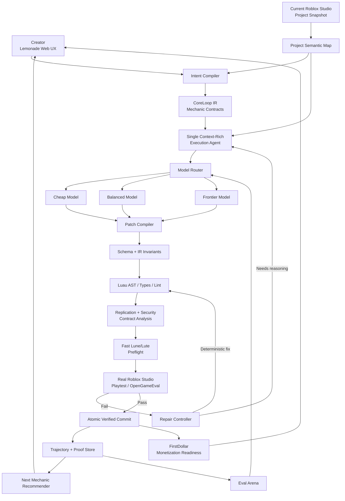
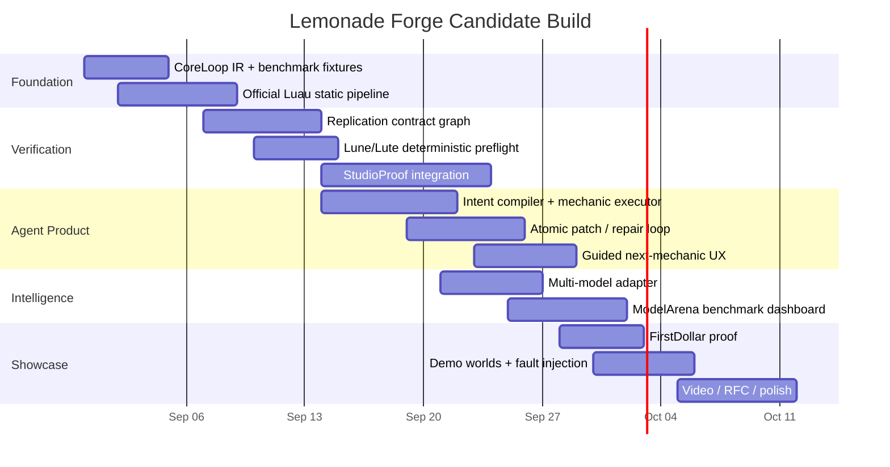

# Lemonade Forge: The Verified Game Compiler That Could Make You an Obvious Founding AI Engineer Hire

## Executive summary

The strongest product you can build for Nicolas Vizioli is **not another Roblox coding agent, another multi-agent wrapper, or even a better Luau linter**.

It is **Lemonade Forge** — a working-name for a **verified, model-agnostic game compiler that takes an inexperienced creator from vague intent → coherent core loop → tested Roblox mechanic → safe progression/monetization → publish-ready game**.

Your existing **LoopEngine + Luau-Shield** concept is the right technical seed: guided core-loop generation plus static AST checks, replication-contract analysis, and dynamic verification. fileciteturn0file0 The key research conclusion is that it should be expanded in two important ways:

1. **LoopEngine becomes a typed intermediate representation for game design**, not merely a workflow DAG. Every generated mechanic gets explicit preconditions, postconditions, authority boundaries, persistence semantics, UI dependencies, economy effects, instrumentation, and executable tests.
2. **Luau-Shield should stop treating a Lune-style mock sandbox as authoritative Roblox physics.** Keep that layer as a cheap preflight, but make actual Roblox Studio execution the final truth. Roblox created OpenGameEval precisely because credible game-agent evaluation needs the real Studio environment, including hierarchy, multiplayer client/server behavior, and stateful world changes. Roblox's own public evaluation tooling now provides a foundation for this. citeturn21view4turn21view5turn22search10

That distinction matters enormously. A candidate who arrives with “I made a linter” is interesting. A candidate who arrives with **“I built the missing reliability and product-control layer between an LLM and a teenager publishing a Roblox game”** is presenting a plausible piece of Lemonade's core architecture.

This direction aligns unusually closely with what Nicolas has said publicly. In his April 21, 2026 Naavik interview, he identified **deconstructing poorly articulated user intent as one of Lemonade's hardest problems**, described guiding first-time developers through sequentially connected mechanics and core loops instead of one-shot generation, said Lemonade is **100% model-agnostic**, emphasized proprietary Roblox evals, argued that coding-agent intelligence is becoming commoditized, and said raw agent trajectories are especially valuable future post-training data. He also said Lemonade's mission is to help teenagers make their **first dollar online**. citeturn21view0

There is an additional 2026 strategic shift that makes this proposal stronger: Roblox itself now has a built-in Studio MCP server and agentic Assistant, allowing products such as Claude Code, Cursor, Codex, Gemini CLI, and other MCP clients to inspect and manipulate Studio. Roblox says 44% of its top 1,000 creators were already using Assistant or third-party AI through MCP as of April 2026. Therefore, **“we can connect an LLM to Studio” is no longer much of a moat**. citeturn21view3

The moat should instead be:

> **Lemonade knows what a first-time Roblox creator is trying to make, knows what mechanic should come next, knows whether the generated game actually works, knows whether it is secure and economically coherent, and can prove all of that before committing the change.**

That is what Forge should demonstrate.

My recommended product hierarchy is:

**Lemonade Forge**  
→ **LoopEngine**: intent and core-loop compiler  
→ **Luau-Shield**: deterministic semantic verifier  
→ **StudioProof**: authoritative in-engine playtest system  
→ **ModelArena**: continuous model routing/evaluation layer  
→ **FirstDollar**: safe monetization-readiness compiler  
→ **Trajectory Lake**: proprietary verified creation data

The result would directly attack Nicolas's stated problems rather than merely showing skills adjacent to them. citeturn21view0

The north-star engineering metric should be **Verified Core Loop Completion Rate**:

\[
\text{VCLR} =
\frac{\text{new creators who complete a Studio-verified playable core loop}}
{\text{new creators who begin creating}}
\]

Secondary metrics should include time-to-first-playable mechanic, first-pass verified-generation rate, repair rate, pre-commit defect containment, publish conversion, creator return rate, variable cost per verified mechanic, and eventually post-publish D1/D7 retention, session time, payer conversion, and revenue. Those downstream game KPIs match Roblox's own creator analytics framework. citeturn14search0turn14search13

**The candidate-grade goal is not to implement the whole company.** Build enough of this system that Nicolas can see the architecture running rather than read about it:

> vague prompt → LoopEngine contract → generated delta → intentional exploit/fault appears → Luau-Shield catches it → automatic repair → real Studio agent plays the mechanic → executable assertions pass → proof artifact appears → next mechanic is recommended → alternate model is benchmarked on the same task.

A polished six-minute live version of that demonstration would showcase virtually every capability Lemonade could reasonably want from a Founding AI Engineer: Roblox internals, Luau analysis, agent-tool design, evaluation science, model routing, infrastructure, security, product judgment, economics, and founder-level systems thinking.

## Strategic product thesis and value proposition

**Lemonade's public product positioning makes the target unusually clear.** Its current homepage says “Your First Business Starts Here” and “Join +500K Creators,” while Nicolas describes Lemonade as a Roblox Studio-connected coding agent primarily aimed at people making their first games. The +500K homepage figure should not be confused with the “almost 100,000 monthly active creators” figure Nicolas gave in April 2026; those are different measures and the latter is four months old. citeturn21view2turn21view0 Nicolas's own site describes his current work as building tools to make game creation accessible to millions of teenagers. citeturn21view1

The research therefore points to a product that optimizes **completion rather than generation**.

A first-time creator does not fundamentally need 5,000 lines of Luau. They need to cross a sequence of states:

> “I have an idea” → “I understand my game's loop” → “one mechanic works” → “the mechanics connect” → “other players can play it” → “I published it” → “someone chose to spend Robux in it.”

Nicolas explicitly describes this distinction. He says Lemonade does not want a user to ask for an entire game such as “Steal a Brainrot” and receive a one-shot result; the intended experience is to expose possible mechanics, build one, let the creator inspect it, then progress through mechanics connected to a coherent core loop. citeturn21view0

**Forge makes that philosophy executable.**

Instead of:

```text
prompt → agent → arbitrary code → hope
```

the product becomes:

```text
dream
  ↓
intent reconstruction
  ↓
typed CoreLoop IR
  ↓
one bounded mechanic contract
  ↓
candidate game delta
  ↓
deterministic verification
  ↓
real Studio playtest
  ↓
atomic verified commit
  ↓
next mechanic
  ↓
publish / iterate / monetize
```

The central object is therefore not the chat message or source file. It is a **Mechanic Contract**.

For a fruit-selling mechanic, for example, the internal representation might conceptually say:

```json
{
  "mechanic": "sell_inventory",
  "player_goal": "convert collected fruit into progression currency",
  "preconditions": [
    "player is inside sell zone",
    "inventory.fruit > 0"
  ],
  "postconditions": [
    "inventory.fruit == 0",
    "coins increases by authoritative server-calculated sale value"
  ],
  "authority": "server",
  "client_inputs": ["interaction_request"],
  "persistent_state": ["coins", "upgrades"],
  "ui_outputs": ["inventory_count", "coin_balance"],
  "abuse_invariants": [
    "client never specifies reward amount",
    "duplicate requests cannot duplicate value"
  ],
  "tests": [
    "collect 10 fruit",
    "enter sell region",
    "verify fruit becomes 0",
    "verify coins increase by expected amount"
  ]
}
```

This becomes **Game IR**, analogous to an intermediate representation in a compiler. Natural-language intent can change. Models can change. Generated implementation can change. The contract remains the stable semantic truth.

That gives Lemonade a product moat much harder to reproduce through a generic coding assistant.

| Product direction | Immediate wow factor | Nicolas alignment | Durability as models improve | Reliability moat | Hiring signal |
|---|---:|---:|---:|---:|---:|
| Better generic Roblox coding agent | 4/5 | 2/5 | 1/5 | 1/5 | 3/5 |
| One-prompt whole-game generator | 5/5 | 1/5 | 1/5 | 1/5 | 3/5 |
| Luau verification SDK alone | 3/5 | 4/5 | 5/5 | 5/5 | 5/5 |
| Multi-agent planner/executor framework | 3/5 | 2/5 | 2/5 | 2/5 | 3/5 |
| **Forge: intent → verified core loop → publish** | **5/5** | **5/5** | **5/5** | **5/5** | **5/5** |

The scoring is my product assessment, but its rationale follows Nicolas's public views: coding-agent loops are increasingly commoditized; user-intent reconstruction, first-time-developer UX, connected core loops, product-specific functionality, evaluation, and model agnosticism are where Lemonade is concentrating. He also said Lemonade had rebuilt its agent architecture more than five times and expects increasingly capable models to reduce the usefulness of rigid planner/executor separation. citeturn21view0

That last point should materially change how you present your autonomous-agent background. **Do not pitch “I know multi-agent systems, therefore Lemonade needs eight agents.”** Your eight-agent work proves that you understand autonomous systems. The architectural conclusion for Lemonade should instead be:

> “I know enough about multi-agent orchestration to know where not to use it.”

Use one high-capability, context-rich execution agent by default, with deterministic services surrounding it. Parallel candidate agents are an optimization for particularly difficult tasks, not the product's ontology. This fits Nicolas's observation that planning and execution are converging back into a single context as frontier models improve. citeturn21view0 Research likewise suggests that agent performance depends heavily on the environment and agent-computer interface rather than merely decomposing work among agents; SWE-agent found large performance gains from a purpose-built software interface, while ReAct established the utility of interleaving reasoning with environment actions. citeturn16academia3turn16academia2

**The most defensible long-term asset is the verified trajectory.** Nicolas specifically highlighted full trajectories as extremely valuable raw data for eventual post-training. Forge should collect the entire causal chain—subject to privacy controls—from user intent through game state, model calls, tool use, generated patch, verifier failures, repair steps, Studio outcomes, creator acceptance/rejection, and eventually game outcomes. citeturn21view0

That data is much more valuable than a pile of generated Luau because it answers questions such as:

- Which interpretation of an ambiguous teen prompt eventually produced a finished game?
- Which candidate patch passed deterministic checks but failed in Studio?
- Which repair fixed a replication race?
- Which model is best specifically at UI, physics, persistence, or debugging?
- Which mechanic sequence gets novice creators through a coherent core loop?
- Which verification failures predict future regressions?
- Which generated changes users immediately undo?

This creates the flywheel:

```text
more creators
   ↓
more real game-building trajectories
   ↓
more verified success/failure examples
   ↓
better evals + routing + repair rules
   ↓
higher core-loop completion
   ↓
more published games
   ↓
more creators
```

It is also significantly more defensible than “we prompted Claude better.”

**FirstDollar should be the final compiler pass rather than an early gimmick.** Roblox currently supports several monetization mechanisms, including one-time passes, repeatable developer products, subscriptions, and other methods; Roblox distinguishes passes from repeatable developer products explicitly. citeturn14search3turn14search8 Nicolas has publicly said Lemonade wants to help teenagers make their first dollar and is interested in helping creators add purchases, perks, subscriptions, and related monetization. citeturn21view0

Forge could therefore tell a creator:

> “Your core loop now works: collect → sell → upgrade. You have enough progression for monetization to make sense. Would you like to add a permanent +1 inventory-slot pass or a repeatable cosmetic effect?”

The critical distinction is that the system should **verify and explain**, not aggressively maximize spending. Monetization is attached only after the free gameplay loop is coherent, transactions remain server-authoritative, and the creator explicitly approves the feature.

The product outcome is not “AI wrote Roblox code.”

It is:

> **“Lemonade reliably converts unstructured teenage imagination into tested, publishable game businesses.”**

## Technical architecture, data flows, APIs, security, and scale

Your handoff describes a Lemonade-oriented TypeScript/Next.js/Convex/Fly-style stack and a current LoopEngine/Luau-Shield implementation direction. Treat those internal-stack assumptions as provisional until Nicolas confirms them, but they are reasonable integration targets for the proof-of-work. fileciteturn0file0

The system should be designed as a **control plane around models**, not a model-centric application.



The architectural insight worth emphasizing to Nicolas is that **the model is deliberately almost boring**. It is one replaceable component. The valuable machinery lives before and after it.

**The Intent Compiler** consumes the user's words, existing game state, project memory, and—where legitimately available and consented—the external signals Lemonade already uses to understand creator preferences. Nicolas specifically described using Roblox integration data such as a creator's favorite games to help interpret underspecified prompts. citeturn21view0 The output is not prose. It is validated CoreLoop IR.

The compiler should classify proposed mechanics into a compact Roblox taxonomy such as:

```text
Acquisition:
collect / harvest / kill / craft / race / discover

Conversion:
sell / deposit / complete / exchange

Progression:
upgrade / unlock / prestige / level / expand

Social:
trade / battle / cooperate / spectate / leaderboard

Retention:
quest / daily objective / collection / event

Monetization:
pass / repeatable product / subscription / cosmetic
```

That taxonomy should be **descriptive rather than genre-copying**. “Grow a Garden” may help infer that “farm” implies planting/harvesting/progression, but Forge should not turn that into cloned assets, layouts, names, or proprietary game implementation.

**The Project Semantic Map** is the compact representation of the existing Roblox project: relevant instances, scripts, modules, remote objects, services, data schemas, UI graph, tags, dependencies, and current mechanic contracts. Nicolas already described Lemonade maintaining a project memory bank and selectively retrieving project information. citeturn21view0 Forge extends the idea by making much of the memory machine-checkable.

**The Patch Compiler** should not let an LLM casually rewrite whole files whenever possible. Give it typed operations:

```text
create_script(...)
replace_function(...)
insert_statement(...)
create_remote(...)
create_instance(...)
bind_ui(...)
declare_persistent_field(...)
add_assertion(...)
```

Each operation carries a source-model identifier and expected semantic effect. That enables rollback, provenance, smaller context, deterministic diffing, and targeted re-verification.

**Luau-Shield Tier One should use actual Luau tooling, not an approximate Lua parser in production.** Roblox's open-source Luau repository contains its AST and analysis stack and ships `luau-analyze` as a type checker/linter. Lute's programmable linter is built on the official Luau language stack and explicitly uses the same parser rather than a separate approximation. citeturn22search0turn22search7

For a fast candidate MVP, invoke `luau-analyze` and Lute rules as child processes. For production, embed the official AST/analysis libraries or create a long-running native sidecar to eliminate process startup overhead. That is a better demonstration of engineering rigor than a JavaScript Lua parser pretending to understand all Luau syntax.

Static rules should include:

| Rule family | Example failures |
|---|---|
| Language | syntax/type errors, unknown globals, invalid requires |
| Runtime boundary | LocalScript accessing server-only resources; wrong execution context |
| Scheduler/lifecycle | unsafe/deprecated scheduling patterns, runaway loops, leaked connections |
| Persistence | client DataStore access, unsafe production-store use during tests |
| Remote use | missing handlers, impossible direction, suspicious synchronous client callbacks |
| Economy | client-supplied reward/price amounts, negative-value paths |
| Structure | orphan scripts, missing referenced instances, duplicate remote names |
| Performance | pathological per-frame allocations/loops, obvious unbounded work |

Roblox's documentation states that DataStore access belongs on the server and that client-side attempts fail; it also specifically warns against enabling Studio access to a live game's stores because Studio can touch the same production data, recommending a separate test version instead. citeturn15search2

**Tier Two is the genuinely differentiated part: semantic replication-contract analysis.** Roblox is multiplayer by default, RemoteEvents and RemoteFunctions cross the client/server boundary, and Roblox explicitly says the server should be the source of truth and should validate every piece of client-supplied data before acting on it. citeturn14search5turn14search6

Build a cross-script graph such as:

```text
StarterPlayerScripts/Harvest.client.luau
    FireServer(HarvestRequest, plotId)

                   ↓

ReplicatedStorage/Remotes/HarvestRequest

                   ↓

ServerScriptService/Harvest.server.luau
    OnServerEvent(player, plotId)
       ├─ validates plotId type
       ├─ checks player owns plot
       ├─ checks distance
       ├─ rate-limits interaction
       ├─ calculates reward server-side
       └─ updates inventory
```

The verifier can then prove not just that a handler exists, but that the contract is sensible.

For every client→server state-changing remote, require:

\[
\text{safe remote} =
T \land C \land P \land R \land A
\]

where:

- \(T\): type/value validation,
- \(C\): context validation,
- \(P\): permission/ownership validation,
- \(R\): rate control where appropriate,
- \(A\): authoritative state mutation remains on the server.

This is especially valuable because network ownership in Roblox creates non-obvious security implications: clients can have authoritative physics control over nearby unanchored assemblies, so gameplay-critical physics requires explicit server-side validation or appropriate ownership handling. citeturn15search0

**Tier Two-and-a-half is where I would modify your current Luau-Shield proposal.** Keep Lune if you already have useful test infrastructure around it, or migrate pieces to the official Lute runtime, but treat that environment as:

- compilation preflight,
- deterministic pure-Luau unit tests,
- mocked service tests,
- economy simulation,
- property/state-machine checks,
- fuzzing,
- fault injection.

Do **not** claim it proves Roblox physics or replication. A standalone Luau runtime is not Roblox Studio. Roblox's own decision to build OpenGameEval around reproducible Studio-native execution is strong evidence that authentic environment behavior matters. citeturn21view4turn22search10

That correction alone could impress a technically serious founder because it demonstrates that you are willing to invalidate a convenient part of your own architecture.

**Tier Three is StudioProof.** Roblox's OpenGameEval was specifically built to evaluate agents in Studio, including tasks requiring reasoning over 3D object hierarchies, multiplayer client/server interactions, stateful world changes, tool use, and long-horizon behavior. citeturn21view4 Its public release history included 47 code-generation evaluations in October 2025, 30 debugging evaluations in March 2026, and another 40 coding evaluations in April 2026—117 released evaluations across those batches. citeturn21view5

Forge should use two Studio execution modes:

**Interactive mode:** in the creator's currently open Studio session, run changed-mechanic assertions immediately through Lemonade's Studio connection/MCP-style tooling.

**Benchmark mode:** use OpenGameEval-compatible isolated places and the Studio Evaluation Service for reproducible offline model comparisons.

The public OpenGameEval workflow is not a sub-500-millisecond operation; public documentation describes multi-minute end-to-end evaluations. That means Forge should offer immediate static/preflight feedback while deeper authoritative playtests run asynchronously rather than pretending all test levels share the same latency envelope. citeturn5search0

**Tier Four should monitor real performance rather than merely correctness.** Roblox's MicroProfiler exposes frame-level engine timing, and Roblox now notes that MicroProfiler data can be accessed through Studio MCP for automated agent feedback loops. citeturn15search4 Therefore a high-end verifier can compare a before/after MicroProfiler trace and reject or warn on a patch that creates severe frame-time regressions.

The key APIs could remain deliberately small:

| API | Responsibility |
|---|---|
| `POST /intent/resolve` | Vague creator language → candidate CoreLoop IR |
| `POST /mechanics/compile` | One mechanic contract → proposed transactional patch |
| `POST /verify/static` | AST/type/policy diagnostics |
| `POST /verify/contracts` | replication, persistence, economy, security checks |
| `POST /verify/preflight` | deterministic pure-Luau/mock tests |
| `POST /eval/studio` | enqueue authoritative Studio playtest |
| `GET /proofs/:buildId` | aggregated machine-readable verification certificate |
| `POST /commits/:id/accept` | atomically accept verified delta |
| `POST /commits/:id/rollback` | revert transactional change |
| `GET /models/scorecard` | current per-domain model routing evidence |

Every build gets a **Proof Bundle**:

```text
Build 7fe0a4
─────────────────────────────────────
Intent contract             PASS
Luau syntax/type            PASS
Client/server policy        PASS
Remote security             PASS
Persistence contract        PASS
Pure Luau tests             12 / 12
Studio playtest             8 / 8
Exploit probes              14 / 14 rejected
Physics assertions          PASS
Frame regression            +0.3 ms
Economic invariants         PASS
Model                       claude-sonnet-5
Generation cost             $0.14 nominal
Repair attempts             1 deterministic
─────────────────────────────────────
VERIFIED
```

That certificate itself is a compelling UI artifact.

**Security should follow capability-based boundaries.** The generation model should never receive unrestricted infrastructure credentials. Project tools get only project-scoped capabilities; secrets stay in the orchestration layer; dynamic workers are ephemeral; filesystem and network access are denied unless explicitly required; test DataStores live in non-production universes; each generated patch has a bounded diff; destructive operations require an explicit capability; and every tool operation is logged into the trajectory. These controls are consistent with Roblox's own warning that external MCP clients can read and modify Studio projects and should therefore only be trusted deliberately. citeturn21view3

Scalability follows naturally because only Tier Three is intrinsically expensive. Cache everything else by:

\[
H(\text{source hash},\ \text{dependency hash},\ \text{rule version})
\]

When one mechanic changes, verify its dependency cone rather than the entire game. Static verification scales horizontally. Pure-Luau tests scale horizontally. Studio workers are queued and prioritized by risk. A CSS tweak does not receive the same dynamic budget as a new currency RemoteEvent.

That gives Forge **risk-based verification depth**:

```text
UI text diff               → static only
local visual UI change     → static + local preview
new server mechanic        → static + contracts + Studio
currency/purchase mechanic → all tiers + exploit tests
physics/network change     → all tiers + multiplayer + profiler
```

This is how you make correctness economically viable rather than turning every generation into a five-minute integration test.

## Verification, evaluation, and model strategy

Nicolas's strongest public technical signal is arguably his evaluation philosophy. He says Lemonade maintains Roblox-specific tasks, automatically runs them when new models arrive, and can measure whether a model is stronger at areas such as physics or UI; his example is an agent entering Roblox Studio and actually trying a generated punch mechanic. citeturn21view0

Forge should turn this into a first-class **ModelArena** rather than a hidden collection of tests.

I would build **Lemonade CoreLoopBench**, initially around 150 private tasks:

| Category | Tasks | Representative test |
|---|---:|---|
| Core mechanic generation | 40 | collect object → inventory state increments correctly |
| Networking/security | 25 | malicious client cannot award itself currency |
| Persistence | 20 | progression survives reconnect and duplicate writes |
| UI/state binding | 20 | upgrade purchase updates UI and replicated state |
| Physics/spatial | 15 | moving platform remains physically/playably correct |
| Monetization | 10 | repeat purchases do not double-grant from duplicate processing |
| Repair/live-ops | 20 | fix a broken existing feature without regressions |
| **Total** | **150** | |

These task allocations are a recommended benchmark design, not current Lemonade data. The public benchmark foundation can come from Roblox's OpenGameEval, while Lemonade-specific private tasks should concentrate on novice creator workflows and exactly the classes of failure seen in production. Roblox itself positions OpenGameEval as reproducible Studio-native evaluation for agentic assistants. citeturn21view4turn21view5

Each fixture should contain:

```text
initial place
creator request
CoreLoop/Mechanic contract
allowed tool surface
deterministic assertions
adversarial assertions
performance budget
maximum model/tool cost
maximum wall-clock budget
expected observable behavior
hidden assertions
```

Do not score models primarily using an LLM judge.

The evaluation hierarchy should be:

| Verification method | Strength | Main weakness | Role in Forge |
|---|---|---|---|
| LLM critic | Understands fuzzy intent | nondeterministic; can share generator blind spots | supplemental only |
| Static AST/type checks | extremely fast, reproducible | cannot prove runtime behavior | mandatory |
| Replication-contract analysis | Roblox-specific semantic security | requires good whole-project graph | mandatory |
| Pure-Luau/mock runtime | fast deterministic execution | not authentic Roblox engine behavior | mandatory preflight |
| Studio-native playtest | real engine/network/world behavior | slower and costlier | authoritative |
| Human creator acceptance | captures taste/fun | expensive and subjective | product feedback |
| **Hybrid pipeline** | strongest coverage | engineering complexity | **recommended** |

Roblox security documentation makes this hybrid approach particularly important. Merely seeing an `OnServerEvent` handler does not establish security: all client data still needs server-side validation, and non-Remote instances such as proximity prompts can also be abused from the client. citeturn14search5

A meaningful benchmark should deliberately run adversarial clients:

```text
FireServer(-math.huge)
FireServer(10^12)
FireServer(wrong_type)
FireServer(other_players_plot)
FireServer(valid_request × 1,000)
FireServer(outside_interaction_range)
```

A mechanic is only secure when these requests cannot corrupt authoritative state.

The primary engineering metrics should therefore be multidimensional:

\[
\text{Verified Success Rate}
=
\frac{\text{tasks satisfying every required deterministic assertion}}
{\text{attempted tasks}}
\]

\[
\text{First-Pass Rate}
=
\frac{\text{verified mechanics with zero repair iterations}}
{\text{attempted mechanics}}
\]

\[
\text{Repair Efficiency}
=
\frac{\text{initial failures repaired within one retry}}
{\text{initial failures}}
\]

\[
\text{Exploit Rejection}
=
\frac{\text{malicious test cases safely rejected}}
{\text{malicious test cases attempted}}
\]

\[
\text{Verified Success / \$}
=
\frac{\text{verified task completions}}
{\text{model + dynamic-eval variable cost}}
\]

And track:

| Dimension | Metric |
|---|---|
| Correctness | Studio pass rate, invariant pass rate, first-pass rate |
| Safety | adversarial remote rejection, unauthorized mutation rate |
| Regression | pre-commit defect catch rate, rollback frequency |
| Performance | frame-time delta, memory delta, network/event rate |
| Product | creator accepts patch without manual rewrite |
| Latency | p50/p95 first preview; p50/p95 authoritative verification |
| Agent efficiency | tool calls, tokens, repair attempts |
| Economics | cost/attempt, cost/verified mechanic, frontier escalation rate |
| Model quality | performance by domain rather than one aggregate leaderboard |

A hidden test set is essential. Otherwise model prompts and repair rules will quietly overfit the benchmark. Production failures should be anonymized and transformed into new regression fixtures, creating a continuously moving benchmark rather than a frozen leaderboard.

**The model router should optimize verified outcomes, not model prestige.**

As of August 29, 2026, OpenAI lists GPT-5.6 Luna at $0.20/$1.20 per million input/output tokens, Terra at $2/$12, and Sol at $4/$20; the current Sol price is promotional through at least November 21, 2026. citeturn18search0turn18search1 Anthropic lists Claude Sonnet 5 at $2/$10 and Claude Opus 5 at $5/$25 per million tokens. citeturn19search0turn19search4 Google lists Gemini 3.1 Flash-Lite at $0.25/$1.50 and Gemini 3.1 Pro Preview at $2/$12 below 200,000 input tokens, with higher long-context pricing; Google currently labels the Gemini 3 family as preview. citeturn19search1

Using an illustrative 40,000-input/6,000-output-token mechanic attempt, before cache discounts or additional tool calls:

| Model | Current published input/output $/MTok | Nominal 40k/6k cost | Best Forge role |
|---|---:|---:|---|
| GPT-5.6 Luna | $0.20 / $1.20 | **$0.015** | classification, extraction, summarization, trivial transforms |
| Gemini 3.1 Flash-Lite | $0.25 / $1.50 | **$0.019** | cheap high-volume secondary route |
| Claude Sonnet 5 | $2 / $10 | **$0.140** | default coding candidate if evals justify it |
| GPT-5.6 Terra | $2 / $12 | **$0.152** | balanced coding/reasoning candidate |
| Gemini 3.1 Pro Preview | $2 / $12* | **$0.152** | alternate reasoning route; evaluate preview stability |
| GPT-5.6 Sol | $4 / $20 | **$0.280** | difficult cross-system reasoning/debugging |
| Claude Opus 5 | $5 / $25 | **$0.350** | hardest repairs/architecture/physics candidates |

\*Below Google's 200k threshold. These arithmetic examples hold tokens constant and therefore are **not empirical cost-per-task comparisons**; different models tokenize and reason differently. Current prices are from the providers and can change. citeturn18search0turn19search0turn19search1turn19search4

The routing policy should look approximately like:

```text
Can a deterministic compiler/rule solve it?
        ├── yes → $0 model cost
        └── no
             ↓
Is it classification / extraction / boilerplate?
        ├── yes → cheap model
        └── no
             ↓
Normal bounded mechanic?
        ├── yes → benchmark-best balanced model
        └── no
             ↓
Cross-system / physics / repeated verifier failure?
        └── frontier model
```

More importantly, escalation should be **evidence driven**:

```python
if confidence_high and risk_low:
    cheap_model()
elif normal_mechanic:
    best_cost_adjusted_model(domain)
elif previous_attempt_failed or risk == "critical":
    frontier_model()
```

The router should maintain per-domain posterior estimates such as:

```text
Claude Sonnet 5:
    UI              93%
    ordinary Luau   91%
    replication     86%
    complex physics 74%

GPT-5.6 Sol:
    UI              91%
    ordinary Luau   94%
    replication     92%
    complex physics 88%
```

Those numbers are illustrative, not measured results. The point is that **no permanent “best model” exists**. Nicolas already operates according to this philosophy. citeturn21view0

The router's optimization target can be:

\[
\arg\max_m
\left[
P(\text{verified success}\mid m,d)
-
\lambda_c C_m
-
\lambda_l L_m
\right]
\]

where \(d\) is task domain, \(C_m\) expected variable cost and \(L_m\) latency.

**Fine-tuning should explicitly not be phase one.** This is another place where demonstrating restraint is more impressive than claiming an elaborate ML program. Nicolas says Lemonade has substantial labeled trajectory data but deliberately has not focused on post-training yet because frontier labs continue moving rapidly and strong eval infrastructure lets Lemonade swap in better models. citeturn21view0

Forge should make that future decision better by collecting clean training material now.

Every trajectory should record:

```text
anonymized creator / project cohort
initial project state hash
user intent
resolved CoreLoop IR
retrieved context
model + model configuration
tool calls
candidate diff
static diagnostics
contract diagnostics
Studio execution events
repair feedback
final verified diff
creator accept / reject / modify
latency
cost
```

Only after this dataset is large and clean should Lemonade consider:

**Supervised fine-tuning** for high-volume stable transforms such as intent→IR translation, test synthesis, diagnostic classification, and common Roblox repair patterns.

**Imitation learning** for successful tool trajectories. DAgger-style dataset aggregation is conceptually valuable because deployed agents encounter states not represented in clean demonstrations; subsequent recovery examples can explicitly cover those states. Recent DAgger-family research continues to focus on precisely this compounding-error/OOD-state problem. citeturn16academia0

**Reinforcement learning** only where rewards are strongly grounded:

\[
R =
w_1(\text{tests passed})
-
w_2(\text{security violations})
-
w_3(\text{regressions})
-
w_4(\text{cost})
-
w_5(\text{latency})
\]

The beautiful thing about Luau-Shield is that it supplies much better rewards than “another LLM thought this code looked good.”

Execution feedback has repeatedly improved code agents in research. Self-Debugging showed that generated programs can be improved through execution/error feedback; Reflexion uses environmental feedback and episodic memory to improve subsequent attempts; Voyager similarly built a game-environment agent around executable skills, environment feedback, errors, and self-verification. citeturn17academia3turn17academia0turn17academia2

The architecture I would therefore recommend is:

> **one primary agent + excellent tools + machine-verifiable environment feedback + selective memory + occasional parallel candidates**

—not a fashionable forest of agents talking to one another.

## Demo, MVP roadmap, and required artifacts

A hiring artifact has a different objective from a startup's complete production rollout. You need the smallest system that proves the **entire thesis vertically**.

The best candidate MVP is a six-week build beginning Monday, August 31, 2026, although a compelling rough version should exist by the end of the third week.



**The first week** should create the semantic foundation. Define `GameIntent`, `CoreLoop`, `MechanicContract`, `PatchSet`, `VerificationIssue`, `StudioAssertion`, `ProofBundle`, and `TrajectoryEvent`. Build 10 carefully chosen benchmark tasks before optimizing the generator. That demonstrates the critical eval-first mentality Nicolas has publicly described. citeturn21view0turn21view4

Ship official Luau parsing/type/lint support and 10–15 high-value policies.

By the end of week one, this command should work:

```bash
forge verify ./examples/insecure-tycoon
```

and produce structured diagnostics.

**The second week** should make replication-contract analysis the standout technical artifact. Construct whole-project remote graphs and intentionally vulnerable games. Demonstrate detection of client-controlled currency, missing permission checks, impossible remote bindings, DataStore context mistakes, unsafe physics ownership patterns, and duplicate event bindings. These classes are grounded directly in Roblox's documented client/server security model. citeturn14search5turn14search6turn15search0turn15search2

**The third week is the hiring inflection point:** integrate real Studio execution. Create three tiny benchmark worlds:

```text
Fruit Islands
collect → sell → upgrade

Punch Arena
attack → damage → cooldown → knockout

Mini Tycoon
dropper → collection → upgrade → faster generator
```

At this point you have a credible artifact worth showing Nicolas even if every later feature remains incomplete.

**Weeks four and five** turn the verifier into the product. Add Intent Compiler, CoreLoop IR, transactional commits, automatic repair, and multi-model evaluation. The UI should present friendly mechanic cards, while an engineering drawer exposes the underlying contract and proofs.

**Week six** is showcase quality: FirstDollar, performance checks, benchmark dashboard, threat model, polished documentation, fault injection, demo recording.

The minimum artifact set should be:

| Artifact | Why it matters |
|---|---|
| Public GitHub repository | shows actual engineering rather than a concept deck |
| 3-minute product video | founder can understand thesis asynchronously |
| Hosted web control plane | proves full-stack/product ability |
| Roblox Studio plugin/connection | proves actual ecosystem integration |
| Three example places | repeatable end-to-end demos |
| 25+ deterministic evals | demonstrates evaluation discipline |
| Model scorecard | proves model-agnostic architecture |
| Security threat model | distinguishes you from ordinary AI-app candidates |
| Engineering RFC | demonstrates founding-level architecture communication |
| Benchmark results JSON | makes claims reproducible |
| Fault-injection mode | turns correctness into something visually compelling |
| Cost dashboard | demonstrates production economics |
| `ARCHITECTURE.md` | lets Nicolas inspect reasoning quickly |

The killer live demo should take **approximately six minutes**.

**Opening — vague intent.**

Type:

> “make a fruit game on floating islands where you can get richer”

Forge should not begin writing an entire game.

It replies:

```text
I think your core loop could be:

[Collect rare fruit]
       ↓
[Sell fruit]
       ↓
[Upgrade basket / island]
       ↓
[Reach rarer islands]

Start with Collect?
```

That directly demonstrates the intent/core-loop philosophy Nicolas describes. citeturn21view0

**Generate the first mechanic.**

Click Collect.

Show the internal contract briefly:

```text
Goal: CollectFruit
Authority: Server
Client may request interaction
Server validates fruit identity + distance + ownership
Postcondition: inventory.fruit += 1
```

Then the agent edits Studio.

**Inject a failure.**

Use a visible `Inject Vulnerability` development toggle—not a staged fake model failure—to mutate the implementation into:

```lua
CollectFruit:FireServer(fruitId, 999999)
```

with an unsafe server handler trusting the amount.

Luau-Shield should show:

```text
CRITICAL REMOTE_AUTHORITY_VIOLATION

Client-controlled field `amount` reaches authoritative
Inventory mutation without server recomputation.

Exploit proof:
  requested amount: 999,999
  allowed state delta: 1

Suggested repair:
  remove `amount` from client contract
  calculate reward from server-owned FruitDefinition
```

Roblox's security guidance explicitly requires the server to validate client data and remain authoritative, so this is not invented lint theater. citeturn14search5turn14search6

Click **Repair**.

No frontier call should be required if the patch is deterministic.

That one detail is powerful: you have demonstrated correctness **and zero-token repair**.

**Run StudioProof.**

A test player spawns, walks to a fruit, interacts, and the assertion pane changes:

```text
✓ fruit disappears
✓ inventory moves 0 → 1
✓ second player cannot collect destroyed fruit
✓ spoofed fruit ID rejected
✓ impossible-distance request rejected
✓ server remains authoritative
```

Now you have shown something an AST linter cannot prove.

**Build Sell and Upgrade.**

The next mechanic is automatically recommended from the CoreLoop IR. Build both. The system runs only affected verification cones.

Then deliberately compare models.

```text
Task: implement basket upgrade

Model             Verified?   Attempts   Variable LLM cost
Luna              no          2          $...
Sonnet 5          yes         1          $...
Sol               yes         1          $...

Router choice: Sonnet 5
Reason: same verification outcome at lower expected cost
```

Do not hard-code expected winners. Run the actual benchmark and let whatever happens be the result.

**Finish with FirstDollar.**

After collect→sell→upgrade is proven:

```text
Your free core loop is complete.

Optional business mechanic:
Permanent +1 basket slot

[Preview] [Add] [Not yet]
```

The monetization implementation should then receive the strictest verification tier. Roblox's product taxonomy supports passes for one-time permanent benefits and developer products for repeatable purchases. citeturn14search3turn14search8

**Final frame:**

```text
GAME READINESS
────────────────────────
Core loop                 VERIFIED
Client/server security    VERIFIED
Persistence               VERIFIED
Physics                    VERIFIED
Performance               VERIFIED
Exploit suite             VERIFIED
Monetization              VERIFIED

4 mechanics
37 assertions passed
1 vulnerability prevented
1 deterministic repair
0 unresolved regressions
```

Then say, verbally:

> “The interesting part isn't that the model wrote the game. The interesting part is that the model is disposable and the game contract isn't.”

That is the thesis.

A production roadmap after the candidate MVP would look like:

| Horizon | Product outcome |
|---|---|
| First month | verified code/replication pipeline running in shadow mode |
| Second month | real Studio regression suite + private CoreLoopBench |
| Third month | guided CoreLoop IR integrated into generation flow |
| Months four to six | model routing, FirstDollar, production telemetry, automated regression mining |
| Months six to twelve | creator-outcome learning, selective post-training experiments, deeper UI/game-design compiler passes |

The early rollout should initially run verifiers in **shadow mode** rather than blocking users. Compare verifier warnings against actual failures, tune false positives, then graduate rules to warnings, auto-fixes, and eventually hard pre-commit gates.

## Resource plan, economics, scalability, and hiring

For the **candidate proof-of-work**, the correct team size is one: you.

That is strategically important. Your value proposition is precisely that your Roblox/Luau background and autonomous-agent engineering allow you to span the product without needing separate people for engine semantics and LLM orchestration. The handoff already frames those two domains as the unusual intersection in your candidacy. fileciteturn0file0

A realistic six-week personal prototype budget is roughly:

| Item | Planning range |
|---|---:|
| Frontier/medium/cheap model APIs | $300–$2,000 |
| Web/backend/DB | $50–$500 |
| Test runners/CI/log storage | $100–$500 |
| Domains/misc tooling | <$200 |
| Deliberately wasteful benchmark sweeps | $100–$1,500 |
| **Total** | **~$550–$4,700** |

These are planning estimates, not vendor quotes. The model portion can be controlled aggressively using the published per-token pricing described above. citeturn18search0turn19search0turn19search1turn19search4

At production scale, the important insight is that deterministic computation is cheap relative to repeated frontier inference. A plausible routing distribution for one million mechanic attempts might be:

```text
30% solved / transformed without an LLM
45% cheap-model work
20% balanced-model work
 5% frontier escalation
```

Using illustrative per-call costs of about $0.02, $0.15 and $0.35 for the three model tiers yields roughly:

\[
450{,}000(0.02)+200{,}000(0.15)+50{,}000(0.35)
\approx \$56{,}500
\]

per million attempts before retries, dynamic test infrastructure, cache effects, provider discounts, multimodal/tool costs, and long-context surcharges. This is a **scenario calculation**, not a Lemonade forecast. The approximate per-call assumptions are directionally consistent with current provider list prices at the sample token volume used earlier. citeturn18search0turn19search0turn19search1turn19search4

The model router therefore has real economic leverage. Moving an ordinary job from a $0.35 frontier route to a $0.02 cheap route saves roughly 94% of model cost for that job. More importantly, a deterministic repair costs effectively zero inference tokens.

The economic KPI I would obsess over is:

\[
\textbf{Cost Per Verified Mechanic}
=
\frac{
C_\text{inference}+
C_\text{Studio}+
C_\text{infra}
}{
N_\text{mechanics passing authoritative verification}
}
\]

Not cost per message.

Not tokens per user.

Not raw generations.

**Verified output per dollar.**

Production infrastructure should separate three pools:

```text
Control Plane
Next.js / TypeScript / state DB / queues
             │
             ├── Static Worker Pool
             │   Luau analyzer + semantic graph
             │   cheap Linux containers
             │
             ├── Pure-Luau Worker Pool
             │   Lute/Lune + fuzzing/economy simulation
             │
             └── Studio Evaluation Pool
                 expensive / scarce
                 isolated real-engine execution
```

For the first two pools, ordinary container infrastructure is inexpensive and horizontally scalable. Fly.io, for example, bills Machines by resources/time and supports small shared instances at single-digit monthly-dollar list prices when continuously running; AWS Fargate similarly bills CPU and memory by usage. Actual Lemonade deployment should be selected based on operational simplicity and existing stack rather than saving tiny amounts on a verifier worker. citeturn12search0turn13search6

The Studio pool is where capacity engineering matters. Therefore:

- deduplicate identical tests,
- only run tests affected by a patch,
- cache immutable results,
- prioritize security/economy/physics changes,
- batch offline model benchmarks,
- keep interactive checks small,
- separate product playtests from exhaustive nightly evals.

A production Forge team should begin at **six people**, including you:

| Role | Core ownership |
|---|---|
| **Founding AI / Roblox Systems Lead — you** | architecture, agent loop, model routing, Roblox semantics, evaluation |
| Roblox Runtime/Security Engineer | replication, engine behavior, performance, exploit corpus |
| AI/Evals Engineer | benchmarks, experiment infrastructure, trajectory analytics |
| Product/Full-stack Engineer | creator UX, Studio/web integration, observability |
| Infrastructure Engineer | Studio runner fleet, queues, isolation, SRE |
| Product Designer / Creator Systems | first-time creator UX, game-design ontology, usability |

The next hires should be a data/ML engineer for post-training and trajectory infrastructure, another product engineer, and someone with explicit privacy/trust-and-safety ownership as the data and creator surface expands.

A realistic fully loaded planning range for that initial technical team is approximately **$1.5M–$2.8M per year**, depending heavily on geography, equity/cash mix, and seniority. That is an internal planning estimate rather than a claim about Lemonade compensation.

A serious 12-month Forge program could reasonably budget:

| Category | Planning range |
|---|---:|
| 6–10 person engineering/product team | $2.0M–$4.5M |
| Model inference / benchmark experimentation | $300k–$2.0M |
| Studio/compute/data infrastructure | $100k–$500k |
| Observability/security/tooling | $50k–$250k |
| External testing/research/creator programs | $50k–$300k |
| **Total planning envelope** | **~$2.5M–$7.6M/year** |

“No budget limit” should not mean indiscriminate frontier-model use. An excellent Founding AI Engineer demonstrates that **more money buys experiment breadth, not architectural laziness**.

## Go-to-market, Lemonade metrics, risks, IP, and ethics

Forge should **not** launch as a separate enterprise “code quality” product. Its value is highest when invisible inside Lemonade's existing first-time-creator funnel.

That follows directly from Lemonade's positioning. Nicolas says the company's differentiation comes from being extremely intentional about first-time creators and Roblox-specific product experiences rather than merely building the most intelligent coding loop. citeturn21view0 Lemonade's current homepage likewise centers starting a first business and building a game rather than professional software-engineering tooling. citeturn21view2

The rollout should be:

```text
Stage A — Shadow
Generate exactly as today.
Forge observes and scores every delta.

Stage B — Explain
Show warnings and proof cards.
No hard blocking except severe security failures.

Stage C — Repair
Auto-fix deterministic problems before model retries.

Stage D — Verified Commit
Mechanics commit transactionally only after required gates.

Stage E — CoreLoop Guidance
Next-mechanic recommendations become part of creator UX.

Stage F — FirstDollar
Monetization is offered after a functional core loop exists.

Stage G — Learning Flywheel
Production failures become eval fixtures;
verified trajectories improve routing and future training.
```

The go-to-market metric hierarchy should mirror that funnel.

**Creator activation metrics**

\[
\text{Time to First Verified Mechanic}
\]

\[
\text{Verified Core Loop Completion Rate}
\]

\[
\text{First-Session Publish Readiness Rate}
\]

**Quality metrics**

\[
\text{Generation Retry Rate}
\]

\[
\text{Post-Commit Regression Rate}
\]

\[
\text{Deterministic Repair Share}
\]

**Creator retention**

Measure creator return after first build, continued project iteration, and percentage of creators who progress from one mechanic to a complete loop.

**Business formation**

Measure the share of completed games whose creators voluntarily configure an appropriate monetization mechanic, then—subject to privacy and product-policy constraints—the path to first legitimate platform earnings. This matches Nicolas's stated first-dollar mission without promising users that they will earn money. citeturn21view0

**Game quality**

Roblox recommends monitoring D1/D7 retention, average session time, payer conversion, ARPPU/revenue, acquisition, and related metrics following game updates. Roblox's analytics dashboard also supports similar-game benchmarks for several metrics. citeturn14search0turn14search13

Over time this creates an extraordinary research question:

> Which creation sequences help a novice both **finish** a game and build something players actually enjoy?

That is a much more valuable product-learning problem than “which LLM gets the highest generic code benchmark?”

Several major risks need explicit treatment.

| Risk | Why it matters | Mitigation |
|---|---|---|
| Frontier models obsolete orchestration | Nicolas already sees model capability changing agent architecture rapidly | very thin execution harness; model adapters; permanent eval suite citeturn21view0 |
| Roblox MCP commoditizes Studio access | generalist agents can now operate inside Studio | compete on intent, game IR, verification, trajectories, creator UX—not connectivity citeturn21view3 |
| False confidence from mocks | mocked Luau runtime cannot prove actual engine semantics | make real Studio execution authoritative citeturn21view4turn22search10 |
| Client/server exploits | generated code may look correct but trust hostile input | semantic remote contracts + adversarial client tests + server authority citeturn14search5turn15search0 |
| Production-data corruption | autonomous tests can touch real persistence | separate test universes; scoped credentials; never test against production stores citeturn15search2 |
| Benchmark overfitting | models/rules can improve on fixed tests without improving creators | hidden cases, rotating production regressions, held-out projects |
| Model/vendor concentration | capability/pricing/access can shift | model-agnostic interface and continuous routing, already consistent with Lemonade's philosophy citeturn21view0 |
| Cost explosion | autonomous repair loops can recursively spend tokens | attempt budgets, deterministic-first repair, per-task cost ceilings |
| IP imitation | vague requests often reference popular games | infer mechanics, not protected assets/code/branding; provenance and similarity review |
| Monetization ethics | teenagers are both creators and often players | gameplay-first monetization, explicit creator approval, avoid manipulative optimization |
| Minor privacy | trajectories can contain persistent identifiers and behavioral data | strict minimization, pseudonymization, retention limits, legal/privacy review |
| Provider leakage | project source may be commercially sensitive | provider controls, minimization/redaction, project-scoped retention policy |

Minor privacy is particularly important because the FTC's COPPA framework can impose notice, parental-consent, security, minimization, retention, and deletion obligations on covered services that collect personal information from children under 13; the FTC strengthened aspects of the rule in 2025. Whether and how those requirements apply to Lemonade's exact product should be determined by qualified counsel rather than inferred by an engineer. citeturn23search0turn23search1turn23search2

For trajectory data, therefore, “collect everything” is the wrong interpretation of Nicolas's point about valuable trajectories. The correct approach is:

> **retain everything necessary to reproduce model behavior; retain as little creator-identifying information as possible.**

Project code and tool traces can often be detached from direct identity. Raw chat should have an explicit retention policy. Creator-preference signals should be purpose-limited. Training exports should undergo a separate privacy transformation.

On IP, the safest proof-of-work strategy is clean-room development from public Roblox/Luau documentation and your own examples. Luau itself is open source under the MIT license and asks downstream users to honor its attribution requirements. citeturn22search0 Public benchmark fixtures can use Roblox's published eval infrastructure consistent with its repository terms, while any eventual Lemonade production trajectories should remain completely outside your candidate project unless Lemonade gives explicit authorization.

I would open-source **the technical core of Luau-Shield and 20–30 public CoreLoopBench tasks** because that maximizes hiring signal. Keep nothing that pretends to be Lemonade proprietary. The architectural moat is not secrecy around a rule saying “don't trust currency from a RemoteEvent”; it is the scale of production contracts, trajectories, product integration, and outcome data that Lemonade could accumulate after deployment.

The candidate repo should therefore have a conspicuous notice:

```text
Independent proof-of-work.
Not affiliated with Lemonade Labs or Roblox Corporation.
Built from public documentation and candidate-owned code.
No Lemonade user data or proprietary systems are included.
```

That makes you look more, not less, senior.

## Tactical package for Nicolas and primary-source map

Your current outreach state matters. According to your handoff, Nicolas asked which project you were most proud of, you answered substantively, and he has not yet replied. The handoff's “do not anxiously double-text” rule remains sound. fileciteturn0file0

Therefore **do not send Nicolas the architecture above as an unsolicited essay**.

The product's power comes from being executable.

The best next message is the one you can send **after a meaningful vertical slice actually works**:

> **Built something after thinking about your point on core loops + evals: a verified Roblox game compiler. Vague prompt → typed mechanic contract → Luau patch → static/replication security checks → real Studio playtest → atomic commit. The model is intentionally swappable. I can show the failure/repair loop live in ~5 min. [demo] [repo]**

That message uses his language without pretending you invented his thesis. It says what is technically new in one breath.

A more provocative version, suitable once you have the real Studio proof:

> **The interesting result from the prototype: I think Roblox MCP makes “agent connected to Studio” increasingly commodity. The harder moat looks like intent → core-loop IR → deterministic proof → verified commit. I built that path end-to-end, including adversarial RemoteEvent tests and model benchmarking. [demo]**

That conclusion is well grounded: Roblox's April 2026 agentic Studio release explicitly expands MCP access for external AI tools, while Nicolas separately argues that Lemonade's differentiation should be product-specific rather than raw coding-agent intelligence. citeturn21view3turn21view0

If he asks what you would do at Lemonade, the strongest 20-second answer is:

> **“I'd own the layer between model intelligence and creator success. Models are getting better for free; I wouldn't spend our moat fighting that. I'd turn every Lemonade generation into a typed Roblox mechanic with deterministic security/replication checks, real Studio playtests, and a persistent eval. Then I'd use those verified trajectories to route whatever model works best and eventually train cheaper specialist models. The north star is creators finishing a working core loop, not tokens generated.”**

If he challenges why this is not simply OpenGameEval:

> **“OpenGameEval proves whether an agent can perform benchmark tasks in Studio. Forge makes verification part of the product transaction: it reconstructs creator intent, defines the mechanic contract, verifies the delta before commit, repairs failures, recommends the next core-loop node, and records the trajectory. I'd use OpenGameEval as part of the authoritative evaluation substrate, not reinvent it.”**

That is technically accurate to Roblox's published purpose for OpenGameEval. citeturn21view4turn21view5

If he challenges the Lune sandbox:

> **“I changed my mind on that part. Lune/Lute is useful as a fast deterministic preflight, but I wouldn't call it Roblox physics verification. Real Studio needs to be authoritative. The public OpenGameEval architecture makes that pretty clear.”**

That may be the highest-signal sentence in the entire proposal. It shows technical honesty, fast updating, and ability to distinguish a demo shortcut from a production invariant. citeturn21view4turn22search10

If he asks about your eight-agent background and his preference for consolidated agents:

> **“I don't think Lemonade needs an eight-agent graph. My multi-agent system taught me where orchestration adds coordination tax. Here I'd keep one context-rich executor, make tools typed, push criticism into deterministic verifiers, and parallelize only when the eval says multiple candidates are worth the cost.”**

That directly reconciles your experience with his stated architectural direction. citeturn21view0turn16academia3

And if you get only five minutes with him, the demo sequence should be:

**vague prompt → guided core loop → insecure generated remote → deterministic detection → auto-repair → real Studio test → green proof bundle → model scorecard.**

Everything else is supporting material.

The most valuable primary and direct sources behind this recommendation are:

| Source | Why it matters | Link |
|---|---|---|
| Lemonade homepage | Current public mission/positioning and +500K creator claim | [lemonade.gg](https://lemonade.gg/) citeturn21view2 |
| Nicolas Vizioli's site | His explicit focus on making game creation accessible to millions of teenagers | [nicolas.vc](https://nicolas.vc/) citeturn21view1 |
| Nicolas's Naavik interview, Apr. 21 2026 | The core source for intent, core loops, model agnosticism, evals, trajectories, architecture, monetization and first-dollar mission | [Naavik — Building AI Tools for Roblox Creators](https://naavik.co/podcast/building-ai-tools-for-roblox-creators/) citeturn21view0 |
| Roblox agentic Studio announcement | Shows Studio MCP/general-agent connectivity is becoming commodity | [Roblox — Studio Is Going Agentic](https://about.roblox.com/newsroom/2026/04/roblox-studio-going-agentic) citeturn21view3 |
| OpenGameEval announcement | Studio-native deterministic agent-evaluation foundation | [Roblox — Using OpenGameEval](https://about.roblox.com/newsroom/2025/12/opengameeval-benchmark-agentic-ai-assistants-roblox-studio) citeturn21view4 |
| OpenGameEval repository/release log | Actual public evaluation releases and implementation surface | [Roblox/open-game-eval](https://github.com/Roblox/open-game-eval) citeturn21view5 |
| Roblox client/server security | Canonical basis for replication-contract verifier | [Securing the client-server boundary](https://create.roblox.com/docs/scripting/security/client-server-boundary) citeturn14search5 |
| Roblox remote-event documentation | Canonical client/server event semantics | [Remote events and callbacks](https://create.roblox.com/docs/scripting/events/remote) citeturn14search6 |
| Roblox network ownership | Basis for generated physics/exploit verification | [Network ownership, movement validation, and physics](https://create.roblox.com/docs/scripting/security/network-ownership) citeturn15search0 |
| Roblox DataStore documentation | Persistence and test-environment boundaries | [Data stores](https://create.roblox.com/docs/cloud-services/data-stores) citeturn15search2 |
| Roblox Analytics | Downstream creator-game KPIs | [Analytics dashboard](https://create.roblox.com/docs/production/analytics/analytics-dashboard) citeturn14search0 |
| Roblox monetization | FirstDollar mechanism taxonomy | [Monetize your games](https://create.roblox.com/docs/monetize-experiences) citeturn14search3 |
| Official Luau implementation | AST, analyzer, type checker/linter foundation | [luau-lang/luau](https://github.com/luau-lang/luau) citeturn22search0 |
| Lute programmable linter | Official-stack programmable Luau analysis | [Lute lint](https://lute.luau.org/cli/lint/index.html) citeturn22search7 |
| ReAct | Reasoning + environment action architecture | [ReAct paper](https://arxiv.org/abs/2210.03629) citeturn16academia2 |
| SWE-agent | Evidence that purpose-built agent-computer interfaces materially matter | [SWE-agent paper](https://arxiv.org/abs/2405.15793) citeturn16academia3 |
| Self-Debugging | Execution feedback for program repair | [Self-Debugging paper](https://arxiv.org/abs/2304.05128) citeturn17academia3 |
| Reflexion | Environmental feedback and episodic repair | [Reflexion paper](https://arxiv.org/abs/2303.11366) citeturn17academia0 |
| Voyager | Game-environment execution, feedback and reusable executable skills | [Voyager paper](https://arxiv.org/abs/2305.16291) citeturn17academia2 |
| OpenAI current model/API pricing | ModelArena economic baseline | [OpenAI API](https://openai.com/api/) citeturn18search0 |
| Anthropic Sonnet 5 | Current balanced-agent candidate and pricing | [Claude Sonnet 5](https://www.anthropic.com/news/claude-sonnet-5) citeturn19search0 |
| Anthropic Opus | Current frontier-agent candidate and pricing | [Claude Opus](https://www.anthropic.com/claude/opus) citeturn19search4 |
| Google Gemini 3 | Current Pro/Flash-Lite candidates and pricing | [Gemini 3 developer guide](https://ai.google.dev/gemini-api/docs/gemini-3) citeturn19search1 |
| FTC COPPA guidance | Privacy constraints relevant to products involving young users | [FTC COPPA guidance](https://www.ftc.gov/business-guidance/resources/complying-coppa-frequently-asked-questions) citeturn23search1 |

The deepest conclusion from these sources is that your best proof-of-work should **not compete with Nicolas's team on an idea he has already rejected—better generic agent intelligence**. It should take several things he has already said are important and fuse them into a system that is difficult to build without exactly your background.

Your Roblox experience gives you the ability to understand why a generated game can compile yet still be wrong: authority boundaries, replication, physics, persistence, event lifecycles, performance, and in-engine state.

Your autonomous-agent experience gives you the ability to build the closed-loop machine around those semantics: tools, state, rollback, repair, model routing, trajectory collection, and evaluation.

**Forge is the product where those two histories multiply rather than merely coexist.**

The final hiring pitch is therefore not:

> “I'm an AI engineer who also knows Roblox.”

It is:

> **“The foundation models will keep changing. I know how to build the Roblox-specific system around them that turns their probabilistic output into a teenager's reliably working, publishable first game—and eventually their first dollar.”**

That is much closer to a **Founding AI Engineer thesis** than a portfolio project.