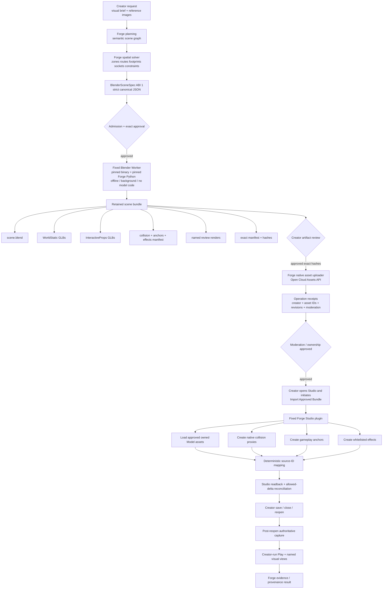

# Forge Visual-World Architecture Decision

## Executive decision

**Decision: ship the near-term demonstration with strategy B — a reviewed, creator-owned or clearly licensed visual substrate, with Forge building and repairing the gameplay, UI, interaction, anchors, feedback, and evidence around it. Do not attempt a full Blender→Roblox native pipeline before that demonstration.** The reason is not that Blender is the wrong architecture. It is that Forge does not presently have the native-import half required to make a Blender-generated world a truthful Forge result: no admitted Blender compiler, no upload authorization, no moderation/ownership proof, no mesh/package loading contract, no imported-object reconciliation, and no save/reopen evidence. fileciteturn0file5

That gap is material. The September 6 procedural trial produced 410 native creates after 47 model requests and about 2,022 seconds of model-client time, then failed its first native reconciliation and proved neither a completed game nor visual quality. Expanding that primitive/procedural approach is therefore the wrong center of gravity for an urgent visual demo. fileciteturn0file6

**After the demo, make Blender the one generated-world architecture.** The model authors only a strict `BlenderSceneSpec`; a pinned, Forge-owned worker interprets it; output is a retained `.blend`, partitioned **GLB** assets, review renders, and a cryptographic manifest; Forge uploads exact approved GLBs through Roblox Open Cloud, waits for creator/ownership/moderation evidence, and a fixed Studio plugin loads only approved asset IDs and materializes native collision/gameplay semantics. Roblox officially supports Blender/glTF workflows, Open Cloud asset creation, and loading numeric asset IDs into Studio. citeturn10search0turn20search1turn23search9

**Cube/CubePart is not on the fast demo path.** Its current repository license still says research-only, despite conflicting broader language on Roblox's Hugging Face model cards; that ambiguity must be resolved before portfolio/commercial use. citeturn12view0turn12view1turn12view2

## Ranked decision and evidence

| Rank  | Horizon            | Decision                                                                                                                                                                                    | Why                                                                                                                                                                                                                                                                                                                                                                                   |
| ----- | ------------------ | ------------------------------------------------------------------------------------------------------------------------------------------------------------------------------------------- | ------------------------------------------------------------------------------------------------------------------------------------------------------------------------------------------------------------------------------------------------------------------------------------------------------------------------------------------------------------------------------------- |
| **1** | **Ship now**       | **B. Use a reviewed curated visual substrate; Forge finishes the game around it.**                                                                                                          | It produces a truthful, visually competitive result without pretending that current Forge generated mesh art it cannot yet import or reconcile. The current visual pipeline explicitly stops at reviewed source geometry, while the latest full procedural trial failed native reconciliation. fileciteturn0file5 fileciteturn0file6                                            |
| **2** | **Build next**     | **A, narrowly scoped: strict `BlenderSceneSpec` → fixed Blender compiler → reviewed GLBs → Open Cloud upload → fixed-plugin load/readback.**                                                | Roblox has the necessary platform pieces: glTF/GLB authoring, cloud asset upload, ownership/moderation metadata, and native asset loading. What is missing is Forge's admitted bridge and evidence model, not a fundamental platform impossibility. citeturn10search0turn20search0turn23search9                                                                                  |
| **3** | **Research later** | Scene critics, vision-guided render-and-repair, richer spatial grammars, navigation/physics optimization, image-conditioned composition, and Cube/CubePart **after licensing is resolved**. | Modern systems consistently separate coarse semantic/layout reasoning from visual/physical refinement; that is directly useful to Forge once the deterministic compiler/import loop exists. citeturn14search2turn14search1turn14academia24                                                                                                                                       |
| **4** | **Reject for now** | C as the primary strategy; whole-world Cube generation; NeRF/3DGS worlds; arbitrary Geometry Nodes or `bpy`; Studio MCP as model authority; giant baked map meshes.                         | Roblox itself recommends separate map assets rather than one large import because imports do not deduplicate repeated meshes; NeRF/3DGS are primarily radiance/view-synthesis representations rather than gameplay-semantic mesh structures; Cube's public roadmap still lists scene-layout generation as upcoming. citeturn18search4turn21academia12turn21search2turn13search0 |

**Fact — current implementation.** Forge already has useful spatial infrastructure: transformed bounds, arrangements, stable arrangement/member identities, containment and collision-adjacent checks, visual-direction declarations, named views, responsive UI, source-geometry review, sockets, fit, hashes, and a strong transaction/evidence model. It does **not** have `BlenderSceneSpec`, a Blender compiler, a GLB scene-bundle path, or an admitted native mesh importer. Its reviewed Cube bindings deliberately return `nativeImport.status: "incomplete"` and `mayInstantiate: false`. fileciteturn0file0 fileciteturn0file5

**Inference — architectural consequence.** These foundations should be reused as the control plane around a new visual compiler, not extended into an ever-larger primitive art language. A model specifying hundreds of wedges, parts, lights, and positions is asking the language model to do the least reliable part of world building — high-frequency geometric authoring — while also creating a large native mutation surface. The recorded procedural trial is unusually strong project-specific evidence for that conclusion: millions of input tokens, hundreds of native creates, substantial retry/repair work, and still no completed native result. fileciteturn0file6

**Clean-break decision.** When `BlenderSceneSpec ABI 1` lands, it becomes Forge's **only generated visual-world authoring path**. `scene-primitives` remains an internal/native facility for collision proxies, debug geometry, simple gameplay structures, and other engine-native needs; it should no longer compete as an alternate world-generation architecture. There should be no converter from old scene recipes, no old-spec reader, and no mode that silently falls back from Blender to primitives. That is consistent with Forge's existing clean-break philosophy. fileciteturn0file2

## Recommended architecture and BlenderSceneSpec

The core hypothesis is sound: **Blender can serve as a reviewed visual-world compiler**, provided Forge treats Blender as a bounded build tool rather than as another agent-controlled editor.

This architecture deliberately keeps **generation, upload, Studio mutation, and gameplay authority separate**. Open Cloud can automate asset creation, but the Studio mutation remains an explicit creator-initiated fixed-plugin operation. Roblox's current Assets API can create or update assets by HTTP and returns long-running operation records containing the resulting asset identity and moderation state; the API's creation/update endpoints are currently Beta, so Forge must record that capability status rather than treating it as an eternal platform guarantee. citeturn20search0turn20search11

**The Blender worker.** Pin **Blender 5.2 LTS**, rather than tracking the newest Blender build, for the first ABI. Blender supports UI-less background execution and factory startup; its command line also supports disabling automatic Python execution and disabling network access. The only Python Forge should execute is a versioned, audited Forge worker supplied with the product. The model never supplies a Python path, expression, text block, driver, callback, add-on, node script, URL, or filesystem path. citeturn17search3turn17search4turn17search5

A hardened launch profile should conceptually be equivalent to: background mode, factory startup, auto-execution disabled, offline mode, a Forge-owned worker file, an isolated working directory, explicit resource limits, and an allowlist of hash-pinned local asset-library roots. This is a **Forge security proposal**, not a Blender guarantee.

Blender's asset system is appropriate for curated modules because assets can be linked, appended, or packed; packing produces a self-contained `.blend` that does not depend on the original library remaining available. For retained build artifacts, Forge should either append hash-pinned assets or pack them into the final source `.blend`, while preserving the original library identity and license separately in the manifest. citeturn16search0turn16search6

**Geometry Nodes are useful, but only as fixed compiler intrinsics.** Collection Info and Instance on Points make bounded repeated motifs, modular architecture, vegetation clusters, cables, pipes, facade elements, debris families, and dressing rules natural to express without duplicating source mesh data inside Blender. citeturn22search7turn22search11 The model should select a Forge-owned node-group ID and parameters; it must never manufacture arbitrary node graphs. The same rule applies to modifiers: allow a closed vocabulary such as bevel, mirror, array, curve, solidify, boolean against declared operands, and approved Geometry Node templates; evaluate/apply them before export where required.

**Materials follow the same rule.** A Forge material is a role plus bounded parameters, not arbitrary shader code. Blender's glTF exporter is designed around glTF-compatible material data and can export custom object properties as glTF `extras`. citeturn16search14 Roblox supports basic and PBR textures, but its import/runtime constraints are narrower: Roblox documents one material per mesh object, a single UV set, OpenGL tangent-space normals, and PBR maps for albedo/color, normal, roughness, metalness, and emissive appearance. citeturn22search0 A Blender material that cannot be reduced to that target profile is a compiler error, not an invitation to approximate silently.

**Use GLB as Forge's one required transfer format.** This is a deliberate clean break.

Roblox's Blender guidance supports glTF 2.0 `.glb/.gltf`, and specifically notes that glTF avoids the additional FBX scale configuration Blender users otherwise need. Roblox's Open Cloud asset path also admits GLB/glTF model uploads. citeturn10search0turn0search9 Blender has a first-party glTF exporter with PBR, hierarchy, transforms, textures, cameras/lights where supported by glTF, and custom-property `extras`. citeturn16search14

GLB is preferable to textual `.gltf` for Forge because one binary gives one exact review/upload hash rather than a JSON file plus sidecar buffers and textures. OBJ is inadequate for the required hierarchy/material/semantic workflow, and FBX adds a scale-configuration branch Roblox itself says glTF does not require. citeturn10search0

That does **not** mean every world becomes one GLB. GLB is the file format; **partitioning is the unit of editability**.

| Partition          | Recommended native representation                                                                                                           | Granularity                                                                                                  |
| ------------------ | ------------------------------------------------------------------------------------------------------------------------------------------- | ------------------------------------------------------------------------------------------------------------ |
| `WorldStatic`      | GLB/Roblox Model assets containing purely visual MeshParts                                                                                  | Multiple zone/chunk assets, typically one architectural cluster or nearby set per asset; never the whole map |
| `WorldCollision`   | Prefer native Forge-created Parts/Wedges from proxy specifications; use simple imported mesh proxies only where primitives are insufficient | Independently mapped to the static object/zone they protect                                                  |
| `GameplayAnchors`  | Manifest-only semantic data materialized as native Forge instances/attachments/markers                                                      | One stable ID per spawn, objective, interaction, hazard, route point, socket, etc.                           |
| `InteractiveProps` | Separate GLB/Model assets or small coherent groups, each wrapped by a Forge-owned native Model                                              | Independently replaceable doors, pickups, consoles, containers, machinery                                    |
| `Effects`          | Manifest-only locations and bounded parameters materialized as whitelisted Roblox lights/effects/emitters/sounds                            | Independent semantic anchors, not imported authority                                                         |

This split is stronger than exporting five giant files. Roblox's own performance guidance warns that importing an entire map causes repeated geometry to be imported as distinct assets rather than deduplicated; it recommends importing/reusing map assets separately and reusing the same mesh and texture asset IDs. citeturn18search2turn18search4 Streaming guidance likewise recommends breaking large container models into smaller physically or logically related models rather than forcing huge persistent units. citeturn19search5

**Conceptual `BlenderSceneSpec`.** This is a schema-level contract, not implementation code.

| Field group           | Conceptual fields and semantics                                                                                                                                                              |
| --------------------- | -------------------------------------------------------------------------------------------------------------------------------------------------------------------------------------------- |
| **Identity**          | `abi`, `sceneId`, `projectId`, `revisionId`, `requestArtifactHash`, `visualBriefHash`, `seed`, exact parent revision                                                                         |
| **Compiler contract** | required Blender/compiler identity, coordinate convention, unit convention, numeric precision policy, allowed recipe-set version, export-profile version                                     |
| **Visual direction**  | palette/material roles, silhouette language, density bands, detail hierarchy, lighting intent, atmosphere intent, forbidden motifs, reference-image artifact hashes                          |
| **Zones**             | stable zone IDs, polygonal/volumetric footprints, vertical layers, local frames, semantic role, adjacency, containment, density/detail targets                                               |
| **Landmarks**         | stable IDs, hierarchy level, required viewing routes/views, silhouette envelope, target visual dominance, landmark-to-route relations                                                        |
| **Routes**            | stable IDs, ordered splines/segments, width and clearance envelope, start/end semantics, route class, visibility requirements, optional branches                                             |
| **Assets**            | content-addressed asset references, source URI/ledger identity, local artifact hash, license identifier/terms snapshot, author/vendor, permitted use, native scale/bounds/socket metadata    |
| **Generators**        | Forge-owned generator or Geometry Node recipe ID, version, bounded typed parameters, deterministic seed; **never executable code or graph definitions**                                      |
| **Objects**           | stable ID, role, source asset/generator, owning zone, transform, footprint, expected bounds, pivot policy, material-role assignments, LOD/importance tag                                     |
| **Instances**         | deterministic repetition rule, explicit member IDs, source object, seed, spacing/density rules, exclusion regions, per-instance transforms                                                   |
| **Sockets**           | stable socket ID, owner, local transform, accepted semantic type, snap/clearance rules                                                                                                       |
| **Collision**         | proxy stable ID, owner stable ID, primitive/convex type, local transform, dimensions, intended `CanCollide/CanTouch/CanQuery` semantics, fidelity policy where a MeshPart is required        |
| **Gameplay anchors**  | stable ID, semantic type, zone/route relation, world transform, extent if volumetric, gameplay binding name; never inferred later from visual geometry                                       |
| **Interactive props** | logical stable ID, visual asset, authoritative pivot, independent native wrapper, interaction sockets, allowed gameplay binding IDs                                                          |
| **Effects**           | stable anchor ID, effect role, transform, bounded native effect template and parameters; no scripts                                                                                          |
| **Review views**      | named camera ID, position/orientation or target framing, FOV, target landmark/interaction, required visibility predicates, intended device/aspect state                                      |
| **Constraints**       | containment, separation, support, alignment, socket compatibility, route clearance, vertical clearance, landmark sightline, camera framing, density/negative-space limits, budget predicates |
| **Partitions**        | stable partition/chunk IDs, contained logical IDs, local origin/pivot, dependency set, expected export file                                                                                  |
| **Budgets**           | maximum source triangles, per-mesh triangles, material/texture counts, file size, object count, collision complexity, expected target-device performance policy                              |
| **Provenance**        | source/license ledger references, generated-asset job IDs, prompt/input hashes where applicable, creator edits, compiler receipts                                                            |
| **Expected outputs**  | `.blend`, GLB files, manifest, review renders, geometry reports, expected object/tree inventory and hashes                                                                                   |

**Coordinate and pivot policy must be explicit.** Roblox documents that Blender is Z-up while Studio is Y-up, and recommends Unit System `None`, World Forward `Front`, World Up `Top`, and Scale Unit `Stud` when moving Blender-authored content into Studio. citeturn10search0 Forge should nevertheless avoid trusting importer pivots as gameplay authority. Normalize each exported chunk or interactive asset around a declared local origin, preserve its expected world transform in the manifest, and let the fixed Studio plugin place the loaded Model at that transform. For an interactive prop, the gameplay pivot belongs to its Forge-native wrapper Model, not implicitly to a mesh origin whose import behavior could change.

**Stable-ID rule.** Put the full Forge stable ID into Blender custom properties and glTF `extras` for retained provenance, and place a short collision-resistant stable-ID token in the glTF node/object name. Blender explicitly supports exporting custom properties into glTF `extras`. citeturn16search14 **Unknown:** Roblox's public import documentation does not establish that arbitrary glTF `extras` become Studio attributes, so Forge must not depend on that. The importer bridge instead maps the imported hierarchy by the expected unique name/path plus expected class and bounds; after one-to-one reconciliation, the fixed plugin writes the authoritative Forge stable-ID attribute onto the Studio wrapper/instance. If naming or hierarchy is rewritten so that mapping becomes ambiguous, the result is `incomplete/mapping_ambiguous`, not a heuristic success.

**Determinism needs a precise claim boundary.** Forge can make the _compiler contract_ deterministic: fixed Blender build, fixed worker, fixed recipe library, fixed source assets, fixed seed, offline operation, and immutable outputs. It should not claim cross-OS or cross-GPU bit-identical Blender exports until it has measured that property. Each successful run simply records the bytes it actually produced and their hashes. Repeatability can later be measured by rebuilding the same fixture in the same pinned environment.

One licensing detail matters to Forge's software architecture. Blender is GPL software, while Blender states that artwork, `.blend` files, images, and other data files produced by Blender remain the creator's property and may be used commercially. Blender also states that published Python scripts using its API must use a GPL-compatible license. citeturn22search9 **Legal-risk inference:** keep the Blender-facing worker as an isolated component with an intentionally GPL-compatible licensing strategy, while the Forge host communicates with it only through the declarative JSON/file boundary. This deserves counsel before product distribution; it does not prevent commercial use of generated game artwork.

## Roblox-native bridge and reviewed artifact chain

Roblox now provides enough individual pieces to make the target architecture technically credible, but they do **not** erase Forge's current gap.

**Current Roblox capabilities and their consequences:**

| Platform capability          | Current fact                                                                                                                                                                                                                                                              | Forge consequence                                                                                                                                |
| ---------------------------- | ------------------------------------------------------------------------------------------------------------------------------------------------------------------------------------------------------------------------------------------------------------------------- | ------------------------------------------------------------------------------------------------------------------------------------------------ |
| **3D authoring formats**     | Roblox documents Blender export/import through OBJ, FBX, and glTF 2.0, including `.glb/.gltf`; multi-object glTF/FBX workflows can carry hierarchy/transforms and supported material/texture data. citeturn10search0turn0search0                                      | Standardize Forge on GLB; no reason to invent a proprietary mesh transfer format.                                                                |
| **Scale/orientation**        | Official Blender guidance describes the Blender↔Studio axis difference and a Stud-scale setup; glTF avoids FBX's extra scale configuration. citeturn10search0                                                                                                          | Encode axis/unit policy in ABI and prove expected imported bounds.                                                                               |
| **Mesh geometry**            | An individual Roblox mesh cannot exceed 20,000 triangles; Roblox also documents watertight/non-zero-volume requirements. citeturn22search2                                                                                                                             | Hard pre-upload gate per exported mesh.                                                                                                          |
| **PBR**                      | Roblox supports PBR/`SurfaceAppearance`; mesh objects have one material, one UV set, and defined PBR map conventions. citeturn22search0                                                                                                                                | Compiler validates/bakes supported material roles; split geometry where one logical Blender object needs incompatible materials.                 |
| **Asset upload**             | Open Cloud Assets can create/update assets through HTTP; creation/update is Beta, a request is asynchronous, and successful operations return asset/revision/creator/moderation metadata. Upload content is limited to 20 MB per call. citeturn20search0turn20search1 | Exact approved GLB hash can be bound to an upload operation and resulting Roblox asset ID. Chunking also keeps uploads below the platform limit. |
| **Ownership**                | Asset creation specifies a user or group creator; Roblox requires appropriate permissions for group asset management. citeturn9search4                                                                                                                                 | Approval must bind exact creator identity and target universe/group.                                                                             |
| **Moderation**               | Imported assets are moderated; pending assets may not be visible/usable to players until approved. citeturn9search0turn20search6                                                                                                                                      | `moderation_pending` is incomplete, never success. Record final moderation state.                                                                |
| **Studio asset load**        | `AssetService:LoadAssetAsync()` is the modern model-loading method; returned models are sandboxed by default, and third-party loading is disabled unless explicitly enabled. citeturn23search9                                                                         | Forge uploads under the experience creator and leaves third-party loading disabled. Fixed plugin loads only approved Forge asset IDs.            |
| **Older owned-asset path**   | `InsertService:LoadAsset()` loads creator-owned/shared assets but Roblox now points developers toward `AssetService:LoadAssetAsync()`. citeturn23search0turn23search9                                                                                                 | Do not make the deprecated/older path the new architecture.                                                                                      |
| **Collision**                | MeshParts support several collision-fidelity modes; more precise modes cost more memory/physics resources, and Roblox recommends simple collision geometry where practical. citeturn2search3turn18search2                                                             | World render geometry and gameplay collision must remain separate.                                                                               |
| **Streaming**                | Instance streaming dynamically manages Workspace content; Roblox advises smaller logically/physically related models and warns against excessive persistent models. citeturn19search2turn19search5                                                                    | Chunk static world by spatial locality; do not make one persistent orbital station Model.                                                        |
| **Lighting/atmosphere/post** | Roblox supports global lighting, Atmosphere, and post effects such as bloom, color correction, depth of field, and sun rays. citeturn18search1turn18search12turn18search3                                                                                            | Blender expresses visual intent; Studio uses bounded native effects. Do not rely on imported Blender lights being authoritative.                 |
| **Terrain**                  | Roblox has native voxel terrain, while Forge's current capability policy does not yet expose a general generated-terrain mutation path. fileciteturn0file0                                                                                                             | Useful future macro-surface backend, but not required to close Blender scene import.                                                             |
| **ProceduralModel**          | Roblox ProceduralModels can generate Models through developer-defined Luau generators and can be invoked by Studio tooling. citeturn4search0                                                                                                                           | Potential future fixed native recipe backend; model-authored generators violate Forge's authority rule and should not be admitted.               |
| **EditableMesh**             | Editable mesh workflows carry special permission/security and runtime memory considerations and do not themselves provide Forge's missing external GLB upload/reconciliation pipeline. citeturn3search1                                                                | Not the fast world-import solution.                                                                                                              |
| **Studio MCP**               | The official Studio MCP surface includes asset search/insertion and native generation tools, among many other Studio operations. citeturn23search2turn6view0                                                                                                          | Useful as evidence that Studio can insert uploaded numeric assets, but its broad agent authority is the wrong trust boundary for Forge.          |
| **Official Blender plugin**  | Roblox's open-source MIT reference plugin uploads selected Blender objects/collections using Open Cloud; its current release line supports package/version workflows and stores a Roblox package ID in Blender custom properties. citeturn23search1                    | Strong validation of the Open Cloud route. Do not embed or drive the interactive plugin; reuse the API pattern in Forge's own fixed uploader.    |

The **official Roblox Blender plugin is a reference implementation, not Forge's architecture**. It asks the Blender user to log in, select creator identity, select Blender objects, upload them, and then find the resulting package in Studio. citeturn23search1 Forge instead needs approval bound to exact hashes, identity, manifest and target project. Its uploader should therefore be a Forge host capability with no Blender UI authority.

Similarly, **do not make package AutoUpdate part of Forge's first implementation**. Roblox's Blender plugin demonstrates that AutoUpdate can overwrite package modifications when a new version is uploaded. citeturn23search1 That is the opposite of Forge's transaction/approval model. The clean first design is: an approved visual revision creates immutable new asset IDs; the Forge logical stable ID maps to the new Roblox asset ID only after a new approved transaction. Asset version updates can be reconsidered later if Forge can pin and prove exact versions.

**The exact gap today is therefore eight separate missing proofs, not one “import mesh” function:**

| Missing bridge           | What closure means                                                                                                                                                    |
| ------------------------ | --------------------------------------------------------------------------------------------------------------------------------------------------------------------- |
| **Upload authority**     | Forge has an explicit creator-granted credential/capability for the exact user/group and does not expose it to the model or provenance payload.                       |
| **Source admission**     | Every GLB comes from an exact approved Blender scene bundle, satisfies geometry/material/file budgets, and has immutable hashes.                                      |
| **Roblox ownership**     | The resulting asset operation states the expected creator; group/user mismatch aborts.                                                                                |
| **Moderation**           | The resulting asset's moderation state is approved before native completion can be claimed.                                                                           |
| **Native loading**       | The fixed Studio plugin accepts only an allowlisted `{assetId, expectedSourceHash, logicalId}` plan and uses the bounded load path.                                   |
| **Imported mapping**     | Every expected source object maps exactly once to an allowed Studio object; ambiguous/missing/extra objects fail reconciliation.                                      |
| **Native semantics**     | Forge separately installs collision proxies, gameplay anchors, interactable wrappers, transforms, and permitted effects from canonical data.                          |
| **Persistence evidence** | After the creator saves and reopens the place, the fixed plugin captures the same stable IDs, asset mappings, transforms, collision semantics, and allowed hierarchy. |

That is why the repository is correct to call its present native-import state incomplete. fileciteturn0file5

**The safe native-import transaction should be:**

`exact reviewed bundle` → local eligibility → explicit asset-upload approval → Open Cloud upload outside any Studio ChangeHistory recording → poll operations → require creator identity and approved moderation → publish a fixed `NativeSceneImportPlan` → creator initiates import in Studio → fixed plugin begins transaction → load only listed assets → reject unexpected scripts/children → map source IDs → create native proxies/anchors/effects → apply transforms → read back complete expected state → reconcile allowed delta → finalize recording → creator saves → creator reopens → capture again.

Generation, moderation polling, network upload and Blender execution must all happen **before** the Studio write transaction. A network timeout or moderation delay must never leave a ChangeHistory recording open.

`AssetService:LoadAssetAsync()` returning loaded models sandboxed by default is useful defense in depth. citeturn23search9 Forge should still reject any imported script descendant because a generated visual-world bundle has no reason to contain native executable behavior.

**Artifact chain.** Retain all of these, linked by hashes:

`CreatorRequest`
→ `VisualBrief`
→ `SpatialDesign`
→ `BlenderSceneSpec`
→ `AdmissionReceipt`
→ `BlenderCompilerIdentity`
→ `scene.blend`
→ `export/*.glb`
→ `review/*.png`
→ `SceneBundleManifest`
→ `ArtifactReviewDecision`
→ `NativeUploadAuthorization`
→ `OpenCloudOperationReceipt[]`
→ `RobloxAssetBinding[]`
→ `ModerationReceipt[]`
→ `NativeSceneImportPlan`
→ `StudioTransactionReceipt`
→ `ImportedObjectMapping`
→ `NativeReadback`
→ `SaveReceipt`
→ `ReopenReadback`
→ `PlayEvidence`
→ `VisualReviewDecision`
→ `FinalProvenanceClaim`.

The final claim should identify separately what Forge planned, what the Blender compiler produced, what Roblox admitted, what the plugin installed, what the creator actually played/reviewed, and what was creator-curated.

**Cube/CubePart.** Forge's own current worker integration is much more disciplined than a typical “call text-to-3D and hope” pipeline: it retains the exact job, source OBJ, topology/bounds, shared fit, sockets, review, output hash and composition binding, and deliberately refuses Studio instantiation. fileciteturn0file5 That boundary should remain.

The present public Cube repository is not a world generator. Its README lists **scene layout generation as upcoming**, while the released CubePart code takes an existing mesh plus requested part names and decomposes it into per-part geometry; the CubePart paper/project presents the broader open-vocabulary part-controllable goal. citeturn13search0turn13search3turn11search5 The technical consequence is straightforward: **Cube is suitable, at most, for a hero object or a small number of distinct props, not the map.**

There is also a significant license blocker. The current `Roblox/cube` repository's top-level license explicitly names `Cube3d-v0.1 and related inference code`, calls the license **CUBE3D RESEARCH-ONLY RAIL-MS**, and defines the permitted purpose as academic/research purposes only. The CubePart README says its CubePart-specific code uses the same license. citeturn12view0turn13search3 At the same time, Roblox's Hugging Face cards label the models `openrail`, and the Cube3D card says the latest release is accessible to individuals, creators, researchers and businesses. citeturn12view1turn12view2

**Unknown / blocker:** those statements do not give me enough basis to tell Forge that the exact pinned code/checkpoints are commercially safe. Until Roblox resolves that discrepancy for the exact artifacts Forge uses, **do not put Cube-generated geometry in the recruiting demo**.

After licensing is cleared, the exact Cube chain should be:

`CubeAssetRequest`
→ exact Cube3D checkpoint/code/license identity
→ generation receipt
→ exact source OBJ
→ geometry inspection
→ creator source review
→ CubePart request with a small gameplay-relevant part schema
→ exact per-part outputs in the **same source coordinate frame**
→ union/seam/overlap/silhouette review
→ one shared fitted transform
→ sockets and gameplay binding review
→ ingest as a content-addressed `assetRef` into `BlenderSceneSpec`
→ Blender placement/material/scene review
→ GLB compiler output
→ native Open Cloud asset
→ moderation/ownership
→ Studio mapping
→ Forge stable-ID binding
→ save/reopen.

A later repair creates a **new artifact revision** for that logical prop, recompiles only the affected `InteractiveProps` asset and any directly dependent scene chunk, creates new Roblox asset IDs under the immutable-first policy, replaces the stable-ID wrapper inside one Forge transaction, revalidates its sockets/collision/neighbors, and reruns the same named views. Unrelated world chunks do not regenerate.

## Scene composition and vertical slice

The most important research result is not that a newer generative model will magically solve layout. It is that successful scene-generation systems increasingly make **layout and semantics explicit before visual refinement**.

| Method                                               | Research consequence                                                                                                                                                                                                                    | Forge placement                                                                                                                                |
| ---------------------------------------------------- | --------------------------------------------------------------------------------------------------------------------------------------------------------------------------------------------------------------------------------------- | ---------------------------------------------------------------------------------------------------------------------------------------------- |
| **Semantic scene graphs**                            | InstructScene makes object relations explicit rather than relying on an implicit joint distribution; newer systems similarly use semantic graphs to control scene relations. citeturn14academia25turn14search12                     | **Immediate.** Make zones, landmarks, routes, objects and typed spatial relations canonical.                                                   |
| **Zone / route / footprint / socket representation** | ATISS represents room objects with category, size, orientation and location rather than unstructured mesh soup. citeturn14search4                                                                                                    | **Immediate.** These are the right variables for Forge's existing bounds/containment machinery.                                                |
| **Layout-first generation**                          | Layout2Scene explicitly argues that text alone gives insufficient fine-grained positional control and uses semantic 3D layout to constrain generation. citeturn14academia24                                                          | **Immediate.** Do not let Blender detail generation precede route/landmark placement.                                                          |
| **Coarse-to-fine**                                   | SceneTesis drafts a coarse scene, adds visual guidance, optimizes spatial placement, then judges/refines it. citeturn14search2                                                                                                       | **Immediate architecture; next implementation for automated visual repair.**                                                                   |
| **Constraint solving**                               | Physics-guided and human-aware scene work shows visually plausible placements can still fail physical stability or navigability. citeturn14academia26turn14search9                                                                  | **Immediate for containment/separation/clearance; next for richer navigation and sight-line optimization.**                                    |
| **Shape grammars**                                   | Split grammars and CGA demonstrated that context-sensitive, parameterized grammar rules can generate high-detail architectural families while preserving structured controls. citeturn15search3turn15search0                        | **Build next.** Fixed Forge architectural recipes are more scalable than enumerating every beam/window/panel.                                  |
| **Spatial dataflow**                                 | Unreal's PCG framework explicitly represents spatial data such as volumes, surfaces, lines and points flowing through procedural graphs. citeturn15search9turn15search13                                                            | **Build next.** Adopt the representation idea, not arbitrary user/model-authored procedural graphs.                                            |
| **Image/reference guidance**                         | SceneTesis uses image guidance to refine spatial layouts; SAGE also supports reference-image-conditioned semantic scene generation while acknowledging it is not pixel-aligned. citeturn14search2turn14search1                      | **Immediate as non-authoritative targets.** Reference images constrain mood/composition, never object identity or coordinates.                 |
| **Vision-language scene critics**                    | SAGE and SceneTesis both include visual/physical critique/refinement loops. citeturn14search1turn14search2                                                                                                                          | **Build after deterministic rendering works.** A critic may recommend a repair; it never approves native state.                                |
| **Physics-aware optimization**                       | SceneTesis explicitly optimizes dimensions/poses for physical plausibility after visual placement. citeturn14search2                                                                                                                 | **Next.** Apply deterministic support/penetration/clearance checks to Forge proxy geometry before considering learned critics.                 |
| **Navigation-aware optimization**                    | Human-aware scene optimization research shows plausible arrangements can be functionally unsuitable because they omit usable free space. citeturn14search9                                                                           | **Immediate concept, next implementation.** Negative space and route clearance are first-class, not leftover space.                            |
| **NeRF**                                             | NeRF learns a volumetric radiance field primarily for novel-view rendering from posed images. citeturn21academia12                                                                                                                   | **Reject as playable-world authority.** It does not naturally supply MeshParts, sockets, collision proxies or independently addressable props. |
| **Gaussian splatting**                               | 3D Gaussian methods excel at radiance-field reconstruction/rendering and have been extended to very large scenes, but remain rendering representations rather than Roblox's ordinary mesh/instance gameplay model. citeturn21search5 | **Research/reference only.** Useful for visual capture/reconstruction experiments, not Forge's canonical editable world now.                   |
| **Radiance-field editing**                           | NeRFshop explicitly motivates its work by noting that implicit radiance representations are difficult to edit interactively. citeturn21search2                                                                                       | Reinforces **reject-now** for Forge's repairable semantic world.                                                                               |
| **Text/image-to-3D assets**                          | Current research can produce impressive individual geometry, while CubePart specifically targets semantic part decomposition. citeturn11search5turn14search10                                                                       | **Hero props later**, after rights, performance and import quality are established. Not scene layout.                                          |
| **World models**                                     | Current visual/world-model research is valuable as a prior for appearance and behavior, but it does not remove Forge's need for a canonical, editable, reconciled Roblox instance model.                                                | **Longer-term research.** No role in the immediate authority path.                                                                             |
| **Render-and-repair**                                | SceneTesis/SAGE demonstrate iterative judge/refinement patterns rather than assuming first-pass spatial output is sufficient. citeturn14search2turn14search1                                                                        | **Core next step.** Render fixed cameras, score constraints/appearance, issue bounded JSON repairs, recompile affected partitions.             |

The practical Forge composer should therefore use five deterministic stages:

**Design → Layout → Population → Presentation → Review.**

In **Design**, the model chooses intent: visual hierarchy, major zones, route, landmarks, focal moments, palette, motif families, gameplay-spatial relationships and named cameras.

In **Layout**, Forge owns the geometry. It solves or rejects containment, zone adjacency, route width, intersection, clearance, landmark visibility, interaction approach regions, spawn-to-objective connectivity and negative-space requirements.

In **Population**, Blender's fixed recipes add repeated architecture and dressing. Variation should be **bounded and seeded**: density ranges, selected motif families, material-role variants, scale/rotation envelopes, exclusion masks and minimum spacing. Random placement that passes only collision is not visual diversity; it is clutter.

In **Presentation**, the compiler uses material-role groups, lights-as-intent, atmospheric anchors, focal contrast and a detail hierarchy. Detail density should peak around the player's route, interactive objects, hero landmarks and video moments; peripheral regions can spend far fewer triangles and textures.

In **Review**, each named camera is rendered at fixed settings. Offline reviewers check silhouette, focal hierarchy, route readability, accidental tangencies, repetition, dead space, landmark occlusion, scale, object penetrations and budget violations. The creator then reviews the same views after native import. A Blender render proves a Blender artifact; it does **not** prove Studio appearance.

### The vertical slice: Last Light

The strongest concrete slice is the project's existing **Last Light** direction, because it already couples a visually legible spatial concept to a short gameplay loop rather than asking Forge to produce a generic showcase. It is demo-specific; none of its genre, timings or mechanics belong in the general Forge kernel. fileciteturn0file5

**Ship-now environment:** a creator-owned or correctly licensed failing orbital-station environment with one memorable central reactor atrium, three visually distinct cell bays, a readable shuttle/extraction landmark, industrial conduit hazards, layered vertical machinery, windows or deep-space vistas, and a restrained dark/metal material language. The visual substrate must be explicitly marked in provenance as **creator-curated / not Forge-generated**.

The environment should be composed around one readable loop:

**enter reactor atrium → identify depleted reactor → follow the next lit route → collect one energy cell → return while a conduit telegraphs danger → deposit cell → world visibly powers up → repeat → shuttle unlocks → escape.**

The project brief already defines a compact 192×144-stud target, three power cells, three dangerous conduits, a central reactor and shuttle, a 120-second run, a three-second start, two integrity, cell deposits, hazard timing and a short extraction sequence. fileciteturn0file5 Those values are excellent **demo content**, but they should remain ordinary game data, not new Forge-kernel vocabulary.

The visual hierarchy should be deliberately asymmetric:

| Hierarchy                                | Visual job                                                                                                                                          |
| ---------------------------------------- | --------------------------------------------------------------------------------------------------------------------------------------------------- |
| **Primary landmark — reactor**           | Visible or inferable from most route segments; large silhouette; starts dormant and becomes progressively brighter/animated as cells are deposited. |
| **Secondary landmark — shuttle**         | Visually distinct shape/color temperature; obvious locked state; becomes the completion target after reactor restoration.                           |
| **Tertiary landmarks — three cell bays** | Each bay has a different shape language or vertical composition, not merely a different hue.                                                        |
| **Hazard language — conduits**           | Red is reinforced by geometry/motion/warning rhythm, so hazard readability does not depend on color alone.                                          |
| **Interaction language**                 | Amber or another consistent accent identifies things the player can act on.                                                                         |
| **Power language**                       | A cool/cyan state provides world-scale feedback after successful deposits.                                                                          |

The short video should have at least four authored beats: an establishing reactor/shuttle approach; a close pickup with visible carry state; a conduit warning transitioning into danger while the player crosses; and the final reactor power surge followed by the shuttle opening/extraction. These shots also become fixed Forge review cameras.

**UI:** keep the current responsive Forge UI path. The HUD needs only time, cells restored, integrity and score/progress; interaction feedback should appear in-world where possible rather than turning the demo into a dashboard. The project's existing visual brief specifies phone/desktop states, touch/gamepad support and 48-pixel primary targets as its own policy. fileciteturn0file5

**Truthful provenance is part of the demo.** A visible build/result page should be able to say, in substance:

> Environment art: creator-curated source, not generated by Forge.  
> Gameplay plan, canonical anchors, scripts, responsive UI, interaction binding, bounded Studio mutation, repair trace and evidence: Forge.  
> Blender-generated scene: not claimed until the reviewed Blender/native-import pipeline passes its evidence gates.

That is much stronger than claiming a mediocre generated map. It demonstrates the harder product skill the Lemonade context points toward: taking spatial content and actually finishing a coherent playable game.

## Evaluation, evidence, risks, and quality gates

Forge already has the right high-level principle: local eligibility, native state, runtime evidence and creator review are different evidence classes. fileciteturn0file1 The Blender architecture should strengthen that distinction.

### Evaluation matrix

| Claim                                                   | Required evidence                                                                                                                          | Gate                                                                                                                                  | Failure / non-success state                                                                             |
| ------------------------------------------------------- | ------------------------------------------------------------------------------------------------------------------------------------------ | ------------------------------------------------------------------------------------------------------------------------------------- | ------------------------------------------------------------------------------------------------------- |
| **`BlenderSceneSpec` is locally eligible**              | Canonical schema hash; source identities; constraints; license ledger; budget report                                                       | All required fields resolve; no unknown asset; no constraint or hard budget violation                                                 | `rejected / scene_spec_invalid`                                                                         |
| **Spatial layout is structurally valid**                | Zone/footprint graph; transformed bounds; route-clearance samples; containment/separation/sightline results                                | Zero hard containment/collision/clearance failures; every required route/landmark relation satisfied                                  | `rejected / spatial_constraint_failed`                                                                  |
| **Blender compilation completed**                       | Exact Blender build identity; worker hash; invocation policy; exit status; `.blend`; GLBs; compiler manifest                               | Every declared output exists and hashes; object inventory equals manifest; no undeclared files/resources                              | `incomplete / compiler_failed`                                                                          |
| **Generated geometry meets Roblox source requirements** | GLB parser report for each primitive/mesh: triangle counts, bounds, UV/material inventory, texture dimensions                              | Every individual mesh ≤ Roblox's documented 20,000-triangle limit; material/UV conventions valid; upload file within documented limit | `rejected / source_geometry_ineligible` citeturn22search2turn20search1                              |
| **Artifact was visually reviewed**                      | Named Blender renders at fixed cameras/settings; artifact hashes; creator decision                                                         | Creator approves the exact bundle hash, not merely the spec                                                                           | `incomplete / artifact_review_required` or `rejected / artifact_review_rejected`                        |
| **Roblox upload is authorized**                         | Approval binding creator identity, universe/project, source hashes and asset purpose; credential capability record without secret material | Exact approved creator and bundle                                                                                                     | `rejected / upload_authority_denied`                                                                    |
| **Roblox upload succeeded**                             | Open Cloud request hash, operation ID, response, asset ID, revision, creator                                                               | Operation `done` with expected asset identity                                                                                         | `incomplete / upload_pending` or `incomplete / upload_failed` citeturn20search0                      |
| **Asset is usable in the target ownership context**     | Operation/asset creator ID and expected group/user                                                                                         | Exact identity match                                                                                                                  | `mismatched / ownership_mismatch`                                                                       |
| **Asset cleared moderation**                            | Moderation result from authoritative Roblox response                                                                                       | Approved before native completion                                                                                                     | `incomplete / moderation_pending` or `rejected / moderation_rejected` citeturn20search0turn9search0 |
| **Studio loaded only approved assets**                  | Fixed plugin request/receipt; approved asset-ID set; DataModel delta                                                                       | No unapproved asset ID and no undeclared script/native content                                                                        | `mismatched / unexpected_native_delta`                                                                  |
| **Source objects map one-to-one**                       | `{stableId → export node → expected path/bounds → Studio path}` table                                                                      | Exactly one native object/wrapper per expected stable ID; no ambiguity                                                                | `mismatched / mapping_ambiguous`                                                                        |
| **Transforms and scale survived**                       | Expected world CFrames/bounds from manifest vs plugin readback                                                                             | Within Forge's explicitly declared float/import tolerance                                                                             | `mismatched / transform_or_scale_mismatch`                                                              |
| **Materials imported acceptably**                       | Expected material role + observed MeshPart/SurfaceAppearance/content references and named-view image                                       | All required roles represented; unsupported/broken texture is a failure, not silent fallback                                          | `mismatched / material_mismatch`                                                                        |
| **Collision is correct**                                | Proxy mapping; native class/size/CFrame/flags/fidelity readback; route overlap tests                                                       | Every gameplay surface has expected proxy; render-only meshes do not accidentally own gameplay collision                              | `mismatched / collision_mismatch`                                                                       |
| **Gameplay anchors are correct**                        | Stable-ID anchor readback and spatial relationship report                                                                                  | Every required spawn/objective/hazard/socket/interaction maps exactly once and remains inside expected zone/interface                 | `mismatched / gameplay_anchor_mismatch`                                                                 |
| **Studio transaction finalized safely**                 | Forge recording/transaction receipt and complete-state capture                                                                             | No unresolved provisional recording                                                                                                   | `recovery_required`                                                                                     |
| **Save/reopen persisted state**                         | Creator-run save; creator-run reopen; second authoritative capture                                                                         | Stable IDs, asset IDs, transforms, collision and anchor mappings agree with the saved expected projection                             | `mismatched / save_reopen_mismatch`                                                                     |
| **Native gameplay works**                               | Creator initiates Play; authoritative Play observations/telemetry from the fixed harness                                                   | Required win, failure and replay paths complete without stale/duplicate state                                                         | `not_run`, `incomplete / play_evidence_missing`, or `runtime_verified` only after evidence              |
| **Visual quality is acceptable**                        | Same named Studio views, exact viewport/device/graphics settings, creator ratings/notes                                                    | Every mandatory view approved; no missing landmark, route obstruction or interaction-readability failure                              | `incomplete / visual_review_required` or `rejected / visual_review_rejected`                            |
| **Performance is acceptable**                           | User-run target-device frame-time, memory, physics/render stats and repeat-run traces                                                      | Project-defined device policy met without regressions beyond declared envelope                                                        | `incomplete / performance_not_run` or `mismatched / performance_gate_failed`                            |
| **Repair is bounded**                                   | Before/after manifests, affected stable-ID closure, Studio delta, repeated named views/play tests                                          | Only declared partition plus justified interface dependencies change; unaffected stable mappings remain                               | `mismatched / repair_scope_violation`                                                                   |
| **Provenance claim is truthful**                        | Complete chain from request/source licenses through native/runtime evidence                                                                | Every public claim maps to an evidence tier                                                                                           | `incomplete / provenance_incomplete`                                                                    |

The top-level status vocabulary should continue to use Forge's existing concepts such as `rejected`, `incomplete`, `matched`, `mismatched`, `recovery_required`, `outcome_unknown`, `not_run` and `runtime_verified`; the suffixes above are reason codes rather than a parallel result system. fileciteturn0file1

### Performance gates

There are a few real Roblox limits or platform facts Forge can enforce directly. An individual mesh is capped at 20,000 triangles. Open Cloud asset content creation/update has a 20 MB per-call limit. Roblox supports textures up to 4096×4096 generally, while its own guidance recommends substantially smaller resolutions based on on-screen/object size and documents additional texture-map constraints. citeturn22search2turn20search1turn22search0

Roblox's normal game target is 60 FPS, or roughly 16.67 ms per frame, but that is not a guarantee that every device will achieve it. Roblox explicitly highlights lower-end mobile memory pressure as a major concern. citeturn18search0

Everything beyond the documented hard limits should therefore be labeled **Forge policy**, not “Roblox limit.” A reasonable evaluation policy is:

| Proposed Forge gate                                                                                                                                                         | Status                                                                                                             |
| --------------------------------------------------------------------------------------------------------------------------------------------------------------------------- | ------------------------------------------------------------------------------------------------------------------ |
| Every source mesh ≤20,000 triangles                                                                                                                                         | **Official Roblox limit**. citeturn22search2                                                                    |
| Every Open Cloud upload ≤20 MB                                                                                                                                              | **Official current API limit**. citeturn20search1                                                               |
| No `PreciseConvexDecomposition` for ordinary decorative world meshes; use a simpler proxy unless explicitly justified                                                       | **Forge policy based on Roblox performance guidance.** citeturn18search2                                        |
| Repeated props must reuse the same Roblox mesh/texture asset IDs where visual geometry is identical                                                                         | **Forge policy based on Roblox's explicit deduplication guidance.** citeturn18search2turn18search4             |
| Static chunks are physically local; no whole-world Persistent Model                                                                                                         | **Forge policy based on streaming guidance.** citeturn19search5                                                 |
| Reference desktop: target 60 FPS for the demo's named route; selected low-end/mobile reference: user-defined published target recorded before evaluation                    | **Forge policy**, not a platform guarantee.                                                                        |
| p95 frame time, peak client memory and physics memory are recorded for the same scripted route before/after a repair                                                        | **Forge evaluation policy**.                                                                                       |
| Ten consecutive win/loss/replay cycles show no monotonically growing gameplay-side instance/listener count and no visible memory trend attributable to stale gameplay state | **Forge regression policy**, consistent with the project's existing Last Light requirements. fileciteturn0file5 |
| Named visual views get a creator score ≥4/5 on focal hierarchy, cohesion, readability and absence of obvious geometry defects                                               | **Forge subjective-quality policy**, explicitly not machine proof.                                                 |

Performance must be tested on the **imported native state**, not extrapolated from Blender. Roblox's engine dynamically adjusts texture quality based on resources, and rendering/physics cost depends on the actual native asset and scene structure. citeturn18search2turn22search0

### Hard blockers, unknowns and risks

| Type                                | Issue                                                                                                                                                                         | Required response                                                                                                                                                |
| ----------------------------------- | ----------------------------------------------------------------------------------------------------------------------------------------------------------------------------- | ---------------------------------------------------------------------------------------------------------------------------------------------------------------- |
| **Hard implementation blocker**     | No `BlenderSceneSpec`, compiler or GLB bundle exists in current Forge. fileciteturn0file5                                                                                  | Must be built and fixture-tested before claiming Blender generation.                                                                                             |
| **Hard implementation blocker**     | Current asset binding cannot instantiate Roblox-native mesh content. fileciteturn0file5                                                                                    | Add the explicit Open Cloud + Studio load bridge; do not bypass the existing incomplete boundary.                                                                |
| **Hard evidence blocker**           | No imported-object mapping/save-reopen proof currently exists for Blender/Cube assets. fileciteturn0file5                                                                  | Add conformance fixtures and complete-state readback.                                                                                                            |
| **Platform stability risk**         | Open Cloud Create/Update Asset endpoints are Beta. citeturn20search0turn20search11                                                                                        | Version/capability attest the API, retain raw operation responses, fail closed on changed schemas.                                                               |
| **Unknown**                         | Public Roblox documentation does not establish that arbitrary glTF `extras` become Studio attributes.                                                                         | Treat `extras` as redundant provenance only; prove mapping by imported names/tree/bounds, then write Forge attributes natively.                                  |
| **Unknown**                         | Exact name, hierarchy and pivot preservation for Forge's intended Open-Cloud-upload→AssetService-load combination has not been demonstrated by the current repository.        | Create synthetic conformance GLBs covering nested nodes, transforms, off-origin pivots, multiple materials, mirrored transforms and names before production use. |
| **Scale risk**                      | Blender and Studio use different axes; FBX in particular has scaling pitfalls. citeturn10search0                                                                           | GLB only, explicit unit/axis ABI, normalized chunk origins and post-import bounds validation.                                                                    |
| **Material risk**                   | Arbitrary Blender shaders cannot be represented by Roblox's supported imported PBR model; Roblox limits a mesh object to one material and one UV set. citeturn22search0    | Fixed glTF-compatible material groups, compiler rejection/baking, no silent shader approximation.                                                                |
| **Geometry risk**                   | Individual mesh >20k triangles is ineligible. citeturn22search2                                                                                                            | Pre-upload GLB inspection; automatic partitioning only where it preserves intended semantics, otherwise reject.                                                  |
| **Performance risk**                | One giant map import duplicates repeated meshes and harms asset reuse/draw/memory behavior. citeturn18search4                                                              | Zone chunks + reusable modular asset IDs.                                                                                                                        |
| **Collision risk**                  | High-fidelity mesh collisions consume more resources. citeturn18search2                                                                                                    | Native primitive proxies by default, complex mesh proxies only by exception.                                                                                     |
| **Streaming risk**                  | Large persistent/container models reduce streaming effectiveness. citeturn19search5                                                                                        | Spatially local chunks; gameplay code tolerant of streaming where appropriate.                                                                                   |
| **Moderation risk**                 | Imported assets can remain pending or be rejected and are not usable by players while pending. citeturn9search0                                                            | Moderation approval is a separate gate; retain reason/state.                                                                                                     |
| **Ownership risk**                  | Cloud upload/load access is bound to creator/group permissions. citeturn9search4turn23search0                                                                             | Bind approval to exact creator; never upload “wherever current login points.”                                                                                    |
| **Credential risk**                 | Open Cloud credentials authorize real creator resources. citeturn9search6                                                                                                  | Secrets remain local, out of model prompts/artifacts; minimum permission; explicit capability grant and revocation.                                              |
| **Studio security risk**            | Loaded external Models could theoretically contain executable descendants; `LoadAssetAsync` sandboxing helps but is not sufficient for Forge's contract. citeturn23search9 | Forge-generated visual bundles must contain zero scripts; enumerate/reject unexpected executable instances.                                                      |
| **MCP authority risk**              | Studio MCP exposes a broad mutation/generation surface. citeturn23search2turn6view0                                                                                       | Do not connect the Forge planning model directly to Studio MCP. Fixed plugin remains sole Studio writer.                                                         |
| **Package-update risk**             | Roblox packages can auto-update and overwrite local modifications. citeturn23search1                                                                                       | Disable/unuse AutoUpdate; immutable new asset IDs per approved revision initially.                                                                               |
| **Cube license blocker**            | Repository license says research-only, while Hugging Face messaging is broader. citeturn12view0turn12view1turn12view2                                                    | No demo/commercial dependency until exact license is clarified.                                                                                                  |
| **Cube scope risk**                 | Current public Cube repository still lists scene layout generation as upcoming. citeturn13search0                                                                          | Cube only individual props after qualification; never whole-world generation today.                                                                              |
| **Blender code-license risk**       | Blender says API-based Python scripts distributed to others must be GPL-compatible, while generated artwork itself remains the artist's property. citeturn22search9        | Isolate/license the worker appropriately and obtain counsel before distributing it as part of Forge.                                                             |
| **Third-party art license risk**    | Curated meshes/textures may have incompatible commercial, redistribution or attribution terms.                                                                                | Every `assetRef` requires source URL/creator/license snapshot/hash/rights declaration; unknown rights = rejected.                                                |
| **Generated-asset provenance risk** | Model outputs may depend on checkpoint/code licenses and third-party inputs.                                                                                                  | Preserve exact generator/checkpoint/code/license IDs, prompts/input hashes and creator review; do not infer commercial rights from “open weights.”               |
| **Visual-evidence risk**            | A successful import, a clean schema or a Blender render does not prove attractive native output. fileciteturn0file5                                                        | Named native Studio views + creator review remain mandatory.                                                                                                     |
| **Gameplay-evidence risk**          | Static eligibility does not prove native Play behavior. fileciteturn0file1                                                                                                 | Only user-initiated Studio Play evidence can establish runtime claims.                                                                                           |

The user's Studio boundary should remain absolute: **the user launches Studio, opens the target place, initiates the approved import, saves, reopens, starts Play, chooses device/graphics settings, and initiates visual captures.** Forge and its fixed plugin may observe and return authoritative data after those actions, but neither this research nor a future planning model should claim those checks occurred without the corresponding Studio evidence.

## Delivery plan and source ledger

**Primary-source ledger.** Dates below are publication/release dates where the source exposes one; otherwise they are marked as accessed on **September 6, 2026**.

| Source                                                                       |                      Date | Direct link                                                                                                                                                                                                  |
| ---------------------------------------------------------------------------- | ------------------------: | ------------------------------------------------------------------------------------------------------------------------------------------------------------------------------------------------------------ |
| Roblox — Blender workflow, axes, units, Studio import/export settings        |       Accessed 2026-09-06 | [create.roblox.com/docs/art/blender](https://create.roblox.com/docs/art/blender)                                                                                                                             |
| Roblox — General 3D specifications, including 20k triangles/mesh             |       Accessed 2026-09-06 | [create.roblox.com/docs/art/modeling/specifications](https://create.roblox.com/docs/art/modeling/specifications)                                                                                             |
| Roblox — Texture/PBR specifications                                          |       Accessed 2026-09-06 | [create.roblox.com/docs/art/modeling/texture-specifications](https://create.roblox.com/docs/art/modeling/texture-specifications)                                                                             |
| Roblox — Assets, ownership and moderation                                    |       Accessed 2026-09-06 | [create.roblox.com/docs/projects/assets](https://create.roblox.com/docs/projects/assets)                                                                                                                     |
| Roblox — Open Cloud Assets usage guide                                       |       Accessed 2026-09-06 | [create.roblox.com/docs/cloud/guides/usage-assets](https://create.roblox.com/docs/cloud/guides/usage-assets)                                                                                                 |
| Roblox — Open Cloud asset API reference                                      |       Accessed 2026-09-06 | [create.roblox.com/docs/cloud/reference/features/assets](https://create.roblox.com/docs/cloud/reference/features/assets)                                                                                     |
| Roblox — Open Cloud API keys                                                 |       Accessed 2026-09-06 | [create.roblox.com/docs/cloud/auth/api-keys](https://create.roblox.com/docs/cloud/auth/api-keys)                                                                                                             |
| Roblox — `AssetService`, including `LoadAssetAsync` sandbox/loading behavior |       Accessed 2026-09-06 | [create.roblox.com/docs/reference/engine/classes/AssetService](https://create.roblox.com/docs/reference/engine/classes/AssetService)                                                                         |
| Roblox — `InsertService` owned-asset loading                                 |       Accessed 2026-09-06 | [create.roblox.com/docs/reference/engine/classes/InsertService](https://create.roblox.com/docs/reference/engine/classes/InsertService)                                                                       |
| Roblox — Performance optimization                                            |       Accessed 2026-09-06 | [create.roblox.com/docs/performance-optimization](https://create.roblox.com/docs/performance-optimization)                                                                                                   |
| Roblox — Improve performance / asset reuse / collision guidance              |       Accessed 2026-09-06 | [create.roblox.com/docs/performance-optimization/improve](https://create.roblox.com/docs/performance-optimization/improve)                                                                                   |
| Roblox — Instance streaming                                                  |       Accessed 2026-09-06 | [create.roblox.com/docs/workspace/streaming](https://create.roblox.com/docs/workspace/streaming)                                                                                                             |
| Roblox — Lighting                                                            |       Accessed 2026-09-06 | [create.roblox.com/docs/environment/lighting](https://create.roblox.com/docs/environment/lighting)                                                                                                           |
| Roblox — Atmosphere                                                          |       Accessed 2026-09-06 | [create.roblox.com/docs/environment/atmosphere](https://create.roblox.com/docs/environment/atmosphere)                                                                                                       |
| Roblox — Studio MCP                                                          |       Accessed 2026-09-06 | [create.roblox.com/docs/studio/mcp](https://create.roblox.com/docs/studio/mcp)                                                                                                                               |
| Roblox — official Blender/Open Cloud reference plugin                        |        v1.0.5, 2026-04-20 | [github.com/Roblox/roblox-blender-plugin](https://github.com/Roblox/roblox-blender-plugin)                                                                                                                   |
| Blender — license / API-script and artwork terms                             |       Accessed 2026-09-06 | [blender.org/about/license](https://www.blender.org/about/license/)                                                                                                                                          |
| Blender 5.2 LTS — command-line operation                                     | Manual current 2026-09-06 | [docs.blender.org/manual/en/5.2/advanced/command_line](https://docs.blender.org/manual/en/5.2/advanced/command_line/index.html)                                                                              |
| Blender — glTF 2.0 exporter                                                  |          5.3 manual, 2026 | [docs.blender.org/manual/en/5.3/addons/scene_gltf2.html](https://docs.blender.org/manual/en/5.3/addons/scene_gltf2.html)                                                                                     |
| Blender 5.2 LTS — Asset Libraries                                            |                      2026 | [docs.blender.org/manual/en/5.2/editors/preferences/asset_libraries.html](https://docs.blender.org/manual/en/5.2/editors/preferences/asset_libraries.html)                                                   |
| Blender 5.2 LTS — Instance on Points                                         |     2026-09-06-era manual | [docs.blender.org/manual/en/5.2/modeling/geometry_nodes/instances/instance_on_points.html](https://docs.blender.org/manual/en/5.2/modeling/geometry_nodes/instances/instance_on_points.html)                 |
| Cube repository / current public scope                                       |           May 2026 update | [github.com/Roblox/cube](https://github.com/Roblox/cube)                                                                                                                                                     |
| Cube repository license                                                      |       Accessed 2026-09-06 | [github.com/Roblox/cube/blob/main/LICENSE](https://github.com/Roblox/cube/blob/main/LICENSE)                                                                                                                 |
| CubePart released-code README                                                |                      2026 | [github.com/Roblox/cube/blob/main/cubepart/README.md](https://github.com/Roblox/cube/blob/main/cubepart/README.md)                                                                                           |
| CubePart paper/project                                                       |                2026-05-27 | [arxiv.org/abs/2605.28763](https://arxiv.org/abs/2605.28763)                                                                                                                                                 |
| Roblox CubePart announcement                                                 |                2026-05-28 | [about.roblox.com/newsroom/2026/05/cubepart-roblox-open-vocabulary-part-controllable-3d-generator](https://about.roblox.com/newsroom/2026/05/cubepart-roblox-open-vocabulary-part-controllable-3d-generator) |
| SceneTesis — language/vision planning, physics optimization, scene judge     |                 ICLR 2026 | [research.nvidia.com/labs/dir/scenethesis](https://research.nvidia.com/labs/dir/scenethesis/)                                                                                                                |
| SAGE — agentic scene generation and physical critic                          |                 CVPR 2026 | [research.nvidia.com/labs/cosmos-lab/sage](https://research.nvidia.com/labs/cosmos-lab/sage/)                                                                                                                |
| Layout2Scene                                                                 |                2025-01-05 | [arxiv.org/abs/2501.02519](https://arxiv.org/abs/2501.02519)                                                                                                                                                 |
| InstructScene                                                                |                2024-02-07 | [arxiv.org/abs/2402.04717](https://arxiv.org/abs/2402.04717)                                                                                                                                                 |
| ATISS                                                                        |                 CVPR 2021 | [research.nvidia.com/labs/toronto-ai/ATISS](https://research.nvidia.com/labs/toronto-ai/ATISS/)                                                                                                              |
| CGA Shape — Procedural Modeling of Buildings                                 |                   2006-07 | [doi.org/10.1145/1179352.1141931](https://doi.org/10.1145/1179352.1141931)                                                                                                                                   |
| Instant Architecture / split grammars                                        |                   2003-07 | [cg.tuwien.ac.at/research/publications/2003/Wonka-2003-Ins](https://www.cg.tuwien.ac.at/research/publications/2003/Wonka-2003-Ins/)                                                                          |
| NeRF                                                                         |                2020-03-19 | [arxiv.org/abs/2003.08934](https://arxiv.org/abs/2003.08934)                                                                                                                                                 |
| NeRFshop — difficulty of editing implicit radiance representations           |                  I3D 2023 | [repo-sam.inria.fr/fungraph/nerfshop](https://repo-sam.inria.fr/fungraph/nerfshop/)                                                                                                                          |

The project-local source of truth remains the uploaded implementation/evaluation material, particularly the current architecture, evaluation policy, visual-generation boundary and September 6 fresh trial. fileciteturn0file0 fileciteturn0file1 fileciteturn0file2 fileciteturn0file3 fileciteturn0file4 fileciteturn0file5 fileciteturn0file6

**Decisive 48-hour plan — Ship now**

| Window              | Action                                                                                                                                                                                                                                                                                                                                                                                                                                   | Required gate                                                                                                                              |
| ------------------- | ---------------------------------------------------------------------------------------------------------------------------------------------------------------------------------------------------------------------------------------------------------------------------------------------------------------------------------------------------------------------------------------------------------------------------------------- | ------------------------------------------------------------------------------------------------------------------------------------------ |
| **First block**     | Freeze the demo claim: **the visual environment is creator-curated, not Forge-generated**. Select one creator-owned or clearly commercially usable orbital-station substrate and record its provenance/license. Lock four named camera views and the Last Light route/landmark hierarchy before gameplay work.                                                                                                                           | No ambiguous source/license. Visual substrate already looks strong from the mandatory views.                                               |
| **Day one, early**  | Import/prepare that substrate through ordinary creator-run means. Treat it as pre-existing Studio state. Give reactor, shuttle, cell bays, conduit lanes and interaction locations explicit Forge-observed/stable gameplay bindings rather than inferring behavior from mesh geometry.                                                                                                                                                   | Forge can resolve every required gameplay anchor against observed Studio state.                                                            |
| **Day one, middle** | Use the **existing** Forge path for the thing it is already designed to own: server-authoritative gameplay, interaction contracts, responsive HUD/menu/result UI, feedback, bounded native changes and provenance. Do not ask the model to regenerate hundreds of decorative primitives.                                                                                                                                                 | Local eligibility and plan review pass with a much smaller world-mutation surface than the failed September 6 trial. fileciteturn0file6 |
| **Day one, late**   | Creator initiates the Studio apply. Reconcile native state immediately. Fix native transaction/reconciliation defects before visual polish; never proceed from an unresolved recording.                                                                                                                                                                                                                                                  | `matched`, with no open recording or unexplained native delta.                                                                             |
| **Day two, early**  | Complete one full loop: cell pickup/carry, deposit, conduit warning/impact, progressive reactor restoration, three-cell completion, shuttle extraction, timeout/integrity failure, restart.                                                                                                                                                                                                                                              | User-run Play proves at least win, loss and replay paths.                                                                                  |
| **Day two, middle** | Polish only high-leverage presentation: reactor state changes, shuttle state change, conduit warning language, carry/deposit feedback, restrained Atmosphere/bloom/color correction where the current Forge capability allows it, plus UI readability. Do not redesign the substrate. Roblox supports these native atmospheric/post tools, but their native appearance still requires creator review. citeturn18search1turn18search3 | Four named views all improve or remain accepted; gameplay route stays unobstructed.                                                        |
| **Day two, late**   | Run the evidence pass: save/reopen, target desktop and phone/device checks, performance observations, repeated win/loss/replay cycles, four fixed visual shots, final provenance artifact, and a short capture emphasizing the reactor power-up and extraction.                                                                                                                                                                          | No claim exceeds its evidence tier. The public demo explicitly distinguishes curated art from Forge-authored game completion.              |

**Do not spend those 48 hours** building a general Blender importer, extending primitives into a richer modeling language, wiring Studio MCP to the planning model, standing up Cube GPU generation, testing NeRF/3DGS, building a procedural-city system, designing a universal curated kit architecture, or making a vision critic. None addresses the immediate credibility requirement as directly as finishing a visually strong game around honest visual input.

**Decisive two-to-three-week architecture plan — Build the one generated-world path**

| Period          | Build                                                                                                                                                                                                                                                                                                                                                                                                                                                                | Exit criterion                                                                                                                                                                                                                                                                                                                                                                                                |
| --------------- | -------------------------------------------------------------------------------------------------------------------------------------------------------------------------------------------------------------------------------------------------------------------------------------------------------------------------------------------------------------------------------------------------------------------------------------------------------------------- | ------------------------------------------------------------------------------------------------------------------------------------------------------------------------------------------------------------------------------------------------------------------------------------------------------------------------------------------------------------------------------------------------------------- |
| **First week**  | Define `BlenderSceneSpec ABI 1`; build the fixed Blender-worker boundary; pin Blender 5.2 LTS/compiler/recipe identities; implement closed Geometry Node/modifier/material recipes; retain `.blend`, zone-chunked GLBs, render views and exact manifest; add offline GLB geometry/material/license/budget inspection. Do **not** add a compatibility reader for existing scene recipes.                                                                              | Identical fixture specs compile successfully in the pinned environment; all artifacts/hash inventories are retained; malformed/unsafe specs fail before Blender; no network/model-authored code can enter the worker.                                                                                                                                                                                         |
| **Second week** | Implement the native bridge: explicit creator upload authorization; Open Cloud GLB Model upload; long-running operation polling; creator/ownership/moderation evidence; immutable asset IDs; new fixed-plugin `ImportApprovedSceneBundle` capability using the modern bounded asset-load path; reject scripts/unexpected descendants; map names/bounds to Forge stable IDs; create native collision proxies/gameplay anchors/effects; complete-state reconciliation. | Synthetic fixtures prove one-to-one mapping, axes/scale, off-origin pivots, nested hierarchy, PBR cases, separate interactables, rejected moderation/ownership cases, native rollback/recovery, and zero unapproved writes.                                                                                                                                                                                   |
| **Third week**  | Add save/reopen evidence, partition repair, neighbor-interface revalidation, named Blender-vs-Studio visual review, streaming/chunk conformance, performance captures, and one **actually Forge-generated** Last Light environment. Retire `scene-arrangement` as a generated visual-world product path; retain primitives only as the internal backend for native semantic/proxy geometry.                                                                          | A creator can request the scene, approve one exact `BlenderSceneSpec`, review one exact scene bundle, authorize upload, initiate Studio import, save/reopen, run Play and review the named views; Forge can trace every native object back to a source stable ID and every public generation claim back to evidence. Only at this point is “Forge generated this visual Roblox world” a defensible statement. |
